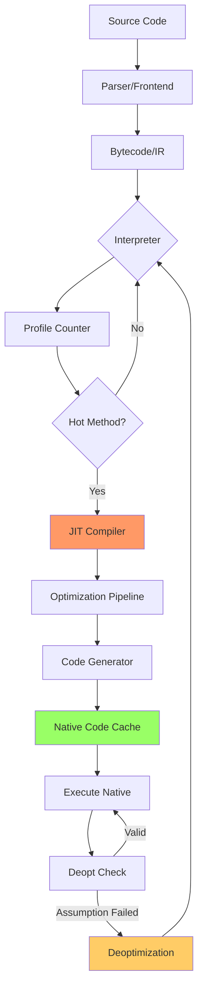

**JIT Compiler: Runtime translation of bytecode/IR to native machine code with profile-guided optimization, bridging interpretation speed and native performance.**

## Core Concepts

### What is JIT Compilation?

JIT (Just-In-Time) compilation is a hybrid execution strategy that compiles code **at runtime** rather than ahead-of-time (AOT). It observes program behavior during execution and generates optimized native machine code for hot paths, combining interpreter flexibility with native code performance.

**Key Characteristics:**
- **Runtime compilation**: Code → Native during execution
- **Profile-guided optimization**: Uses runtime data for optimization decisions
- **Adaptive optimization**: Recompiles based on changing behavior
- **Tiered compilation**: Multiple optimization levels based on hotness

---

## Architecture Overview



---

## JIT Compilation Pipeline

### 1. **Execution Stages**

```
┌─────────────┐
│ Source Code │
└──────┬──────┘
       │ Parse
       ▼
┌─────────────────┐
│ Bytecode/IR     │  (Platform-independent intermediate representation)
└──────┬──────────┘
       │
       ▼
┌─────────────────┐
│ Interpreter     │  (Slow but immediate execution)
│ + Profiler      │  (Collect: call counts, type info, branch data)
└──────┬──────────┘
       │ Hot method detected (threshold crossed)
       ▼
┌─────────────────┐
│ JIT Compiler    │
│  ├─ Tier 1 (C1) │  (Quick compile, light optimization)
│  └─ Tier 2 (C2) │  (Aggressive optimization)
└──────┬──────────┘
       │
       ▼
┌─────────────────┐
│ Native Code     │  (Cached in code cache, directly executed)
└──────┬──────────┘
       │
       ▼
┌─────────────────┐
│ Deoptimization  │  (Fall back to interpreter if assumptions violated)
└─────────────────┘
```

### 2. **Profiling & Hotness Detection**

**Profiling Mechanisms:**
- **Invocation counters**: Track method call frequency
- **Backedge counters**: Track loop iterations
- **Type feedback**: Record observed types at call sites
- **Branch prediction data**: Which branches taken

**Threshold Strategy:**
```
HotMethod = (InvocationCount > Threshold_Invoke) || 
            (BackedgeCount > Threshold_Loop)

Typical thresholds:
- Interpreter → Tier1: 2000 invocations
- Tier1 → Tier2: 10000 invocations
```

### 3. **Optimization Techniques**

**Speculative Optimizations** (key JIT advantage):
```
// Runtime profile shows 'x' is always integer
function add(x, y) {
  return x + y;  // JIT assumes integer addition
}

// Generated native code (x86-64):
mov eax, [x]          ; Load x
add eax, [y]          ; Add y (integer op)
mov [result], eax     ; Store result
; Guard: if (type(x) != int) deoptimize
```

**Common Optimizations:**

| Optimization | Description | Example |
|-------------|-------------|---------|
| **Inlining** | Embed function body at call site | `f(x)` → inline f's code |
| **Escape Analysis** | Stack allocate non-escaping objects | `new Object()` → stack |
| **Dead Code Elimination** | Remove unreachable code | `if(false) {...}` → remove |
| **Loop Unrolling** | Reduce loop overhead | `for(4 iter)` → 4 statements |
| **Type Specialization** | Generate type-specific code | Generic → int-specific |
| **Devirtualization** | Direct call instead of vtable lookup | monomorphic call sites |
| **Range Check Elimination** | Remove redundant bounds checks | proven safe accesses |
| **Lock Elision** | Remove unnecessary synchronization | single-threaded access |

### 4. **Intermediate Representations**

**Typical IR Layers:**
```
High-level IR (HIR)
    ├─ Language semantics preserved
    ├─ Platform-independent
    └─ Examples: SSA form, Sea-of-nodes
         ↓ Lowering
Mid-level IR (MIR)
    ├─ More machine-oriented
    └─ Still somewhat portable
         ↓ Register allocation
Low-level IR (LIR)
    ├─ Machine instructions
    └─ Target-specific
         ↓ Code emission
Native Machine Code
```

**SSA (Static Single Assignment) Form:**
```
// Original
x = 1
x = x + 2
y = x + 3

// SSA form
x₁ = 1
x₂ = x₁ + 2
y₁ = x₂ + 3
```

---

## Deoptimization (OSR - On-Stack Replacement)

**Critical Concept**: JIT makes speculative assumptions. When violated, must safely fall back.

**Deoptimization Triggers:**
- Type assumption violated (expected int, got float)
- Class hierarchy changed (new subclass loaded)
- Inlined method changed (class reloaded)
- Guard condition failed (null check, range check)

**Deoptimization Process:**
```
┌──────────────────┐
│ Native Code      │
│   guard check    │ ──── Assumption Failed ───┐
│   jne deopt      │                            │
└──────────────────┘                            │
                                                 ▼
                                    ┌────────────────────────┐
                                    │ Deoptimization Handler │
                                    │  1. Capture state      │
                                    │  2. Reconstruct frames │
                                    │  3. Transfer to interp │
                                    └────────────────────────┘
                                                 │
                                                 ▼
                                    ┌──────────────────┐
                                    │ Interpreter      │
                                    │ (safe fallback)  │
                                    └──────────────────┘
```

**Metadata for Deopt:**
- **Debug info**: Map native PC → bytecode PC
- **Scope descriptors**: Variable locations (register/stack)
- **Deopt reasons**: Why deopt occurred (for re-compilation)

---

## Tiered Compilation

**Multi-tier Strategy** (e.g., HotSpot JVM, V8):

```
Tier 0: Interpreter
  ├─ Pros: No compilation delay, 100% portable
  └─ Cons: 10-100x slower than native

Tier 1: Quick JIT (C1 compiler - client)
  ├─ Pros: Fast compilation, 2-3x native speed
  ├─ Optimizations: Register allocation, simple inlining
  └─ Profile data collection continues

Tier 2: Optimizing JIT (C2 compiler - server)
  ├─ Pros: Aggressive optimization, near-native speed
  ├─ Optimizations: All techniques, speculative opts
  └─ Cons: Slow compilation (10-100ms per method)
```

**Transition Logic:**
```go
// Pseudo-code for tiering decisions
func shouldCompile(method *Method) CompilerTier {
    if method.invocationCount < TIER1_THRESHOLD {
        return INTERPRETER
    }
    
    if method.invocationCount < TIER2_THRESHOLD {
        if !method.tier1Compiled {
            return TIER1_COMPILER
        }
    }
    
    if method.invocationCount >= TIER2_THRESHOLD {
        if !method.tier2Compiled && hasSufficientProfileData(method) {
            return TIER2_COMPILER
        }
    }
    
    return CURRENT_TIER
}
```

---

## JIT vs AOT vs Interpreter

| Aspect | Interpreter | JIT | AOT |
|--------|-------------|-----|-----|
| **Startup** | Instant | Warm-up penalty | Instant |
| **Peak Perf** | 10-100x slower | Near-native | Native |
| **Code Size** | Small bytecode | Code cache growth | Large binaries |
| **Optimization** | None | Profile-guided | Static analysis |
| **Portability** | High | High | Low (per-platform) |
| **Security** | Sandboxed | Dynamic code generation | Static |

---

## Real-World JIT Implementations

### 1. **V8 (JavaScript - Chrome/Node.js)**

**Architecture:**
```
JavaScript → Parser → Ignition (interpreter) → TurboFan (optimizing JIT)
                          ↓
                    Sparkplug (baseline JIT)
```

**Key Features:**
- **Hidden classes**: Type feedback for object shapes
- **Inline caching**: Optimize property access
- **TurboFan**: Sea-of-nodes IR, aggressive inlining
- **WebAssembly**: Liftoff (baseline) + TurboFan (opt)

### 2. **HotSpot JVM (Java)**

**Compilers:**
- **C1 (Client)**: Fast compilation, light optimization
- **C2 (Server)**: Aggressive optimization, speculative
- **Graal**: Newer, written in Java, polyglot support

**Techniques:**
- **Card marking GC integration**: Write barriers
- **Safepoints**: For GC and deopt coordination
- **Biased locking**: Optimize uncontended locks
- **Compressed OOPs**: 32-bit pointers on 64-bit

### 3. **CoreCLR (.NET)**

**RyuJIT Compilation:**
```
IL (CIL bytecode) → RyuJIT → Native code
                      ├─ Tier 0: Quick JIT
                      └─ Tier 1: Optimized (R2R or rejit)
```

**Features:**
- **Tiered compilation**: Quick jit then recompile hot methods
- **ReadyToRun (R2R)**: Hybrid AOT+JIT
- **SIMD intrinsics**: Vector optimizations

### 4. **LLVM MCJIT/ORC**

**For language runtimes:**
```cpp
// Simplified LLVM JIT usage
llvm::orc::LLJIT JIT = llvm::orc::LLJITBuilder().create();
JIT->addIRModule(llvm::orc::ThreadSafeModule(Module, Context));
auto Sym = JIT->lookup("myFunction");
auto FnPtr = (int(*)(int))Sym.getAddress();
result = FnPtr(42);
```

---

## Code Generation Example

**Simple JIT Example (C++ with LLVM-style)**---

## Security Implications

### Threat Model

**Attack Surface:**
```
┌─────────────────────────────────────┐
│ JIT-Specific Threats                │
├─────────────────────────────────────┤
│ 1. JIT Spraying                     │  ← Inject predictable code patterns
│ 2. Code Reuse (JIT-ROP)             │  ← Reuse JIT-generated gadgets
│ 3. Side-channel (Spectre)           │  ← Speculative execution leaks
│ 4. Type Confusion                   │  ← Exploit type assumptions
│ 5. Write-Execute pages (W^X)        │  ← Memory corruption
└─────────────────────────────────────┘
```

### Mitigations

**1. JIT Spraying Defense:**
```
Problem: Attacker controls input that influences generated code
Solution:
  ├─ Constant blinding: XOR constants with random mask
  ├─ Instruction randomization: Vary register allocation
  └─ Immediate value constraints: Limit immediate operands
```

**2. W^X (Write XOR Execute):**
```cpp
// Modern JIT pattern: Separate writable and executable views
void* writable_addr = mmap(..., PROT_READ | PROT_WRITE, ...);
void* executable_addr = mremap(writable_addr, ..., PROT_READ | PROT_EXEC);

// Write code to writable_addr
generate_code(writable_addr);

// Execute from executable_addr only
execute(executable_addr);
```

**3. Control-Flow Integrity (CFI):**
```
Forward-edge CFI:
  ├─ Indirect calls: Check target is valid function entry
  └─ Implementation: Type-based checks, vtable verification

Backward-edge CFI:
  ├─ Return addresses: Shadow stack
  └─ Implementation: Hardware (Intel CET) or software
```

**4. Spectre Mitigations:**
```
Index Masking:
  array[index] → array[index & mask]  // Prevent speculative OOB

Retpoline:
  Indirect call → ret-based trampoline  // Prevent branch prediction

Speculation Barriers:
  lfence / mfence after sensitive operations
```

**5. Code Signing & Attestation:**
```
iOS/macOS JIT restrictions:
  ├─ Require entitlements for MAP_JIT
  ├─ Hardened runtime: Code signature verification
  └─ Disable JIT in sandboxed contexts
```

---

## Performance Characteristics

### Compilation Overhead

```
┌──────────────┬──────────┬──────────────┬──────────────┐
│ Tier         │ Compile  │ Throughput   │ Peak Speedup │
│              │ Time     │ During Comp  │              │
├──────────────┼──────────┼──────────────┼──────────────┤
│ Interpreter  │ 0 ms     │ 1x           │ 1x           │
│ Baseline JIT │ 1-10 ms  │ 0.5x         │ 5-10x        │
│ Optimizing   │ 50-500ms │ 0.1x         │ 20-100x      │
└──────────────┴──────────┴──────────────┴──────────────┘
```

**Trade-offs:**
- **Short-running programs**: Interpreter wins (no warm-up penalty)
- **Long-running servers**: Optimizing JIT wins (amortized compilation cost)
- **Mobile/embedded**: Baseline JIT or AOT (power/memory constraints)

### Memory Overhead

```
Code Cache:
  ├─ Baseline: ~2x bytecode size
  ├─ Optimized: ~5-10x bytecode size
  └─ Problem: Cache eviction if methods thrash

Metadata:
  ├─ Deopt info: ~50-100 bytes per compiled method
  ├─ Profile data: ~10-50 bytes per call site
  └─ Type feedback: Variable per inline cache site
```

**Code Cache Management:**
```
Eviction strategies:
1. LRU: Evict least recently used
2. Age-based: Evict old cold code
3. Recompilation count: Limit recompile attempts
4. Tier downgrade: Discard optimized, keep baseline
```

---

## Advanced Topics

### 1. **Inline Caching (IC)**

**Monomorphic IC** (fastest):
```cpp
// Call site sees one type consistently
obj.method()  →  if (obj->class == ExpectedClass) {
                     call DirectAddress  // No vtable lookup
                 } else {
                     call generic_dispatch
                 }
```

**Polymorphic IC** (2-4 types):
```cpp
switch (obj->class) {
    case Class1: call Method1; break;
    case Class2: call Method2; break;
    default: call generic_dispatch;
}
```

**Megamorphic IC** (5+ types, fall back to generic):
```cpp
// Too many types, use hash table or vtable
call obj->vtable[method_index]
```

### 2. **Escape Analysis**

**Stack Allocation Optimization:**
```java
// Original Java
void foo() {
    Point p = new Point(1, 2);  // Heap allocation
    int x = p.x;  // Use
}  // p doesn't escape

// After escape analysis
void foo() {
    int p_x = 1;  // Scalar replacement (stack)
    int p_y = 2;
    int x = p_x;  // Direct use
}
```

**Phases:**
```
1. Connection Graph: Build points-to graph
2. Escape State: Classify objects (NoEscape, ArgEscape, GlobalEscape)
3. Transformation: Stack allocate or scalarize non-escaping objects
```

### 3. **Loop Optimization**

**Loop Invariant Code Motion (LICM):**
```
// Before
for (i = 0; i < n; i++) {
    x = a + b;  // Loop invariant
    arr[i] = x * i;
}

// After
x = a + b;  // Hoisted out
for (i = 0; i < n; i++) {
    arr[i] = x * i;
}
```

**Vectorization (SIMD):**
```cpp
// Scalar loop
for (int i = 0; i < n; i++) {
    c[i] = a[i] + b[i];
}

// Vectorized (SSE: 4 floats at once)
for (int i = 0; i < n; i += 4) {
    __m128 va = _mm_load_ps(&a[i]);
    __m128 vb = _mm_load_ps(&b[i]);
    __m128 vc = _mm_add_ps(va, vb);
    _mm_store_ps(&c[i], vc);
}
```

### 4. **Garbage Collection Integration**

**GC Safepoints:**
```
JIT must insert safepoint checks where GC can safely pause:
  ├─ Method prologues/epilogues
  ├─ Loop backedges (prevent infinite loops blocking GC)
  └─ Before memory allocations

Generated code:
  cmp [safepoint_flag], 0
  jne safepoint_handler
  ; continue execution
```

**Write Barriers:**
```cpp
// For generational GC
obj->field = value;
→
obj->field = value;
if (in_old_gen(obj) && in_young_gen(value)) {
    card_mark(obj);  // Mark card table for old→young pointer
}
```

### 5. **Trace Compilation**

**Alternative to Method JIT** (used in LuaJIT, TraceMonkey):
```
Concept: Record frequently executed paths (traces) across method boundaries

trace recording →  [methodA:BB1] → [methodB:BB3] → [methodA:BB5]
                             ↓
                   Compile entire trace as linear code
                             ↓
                   Highly optimized (no calls, predictable branches)
```

**Guard-heavy but fast:**
```
Trace: for (i=0; i<100; i++) sum += arr[i]
Compiled:
  guard(typeof(arr) == Array)
  guard(i < 100)
  sum += arr[i]
  i++
  jump to start  // Tight loop, no overhead
```

---

## Observability & Debugging

### Compiler Flags (JVM Example)

```bash
# Print JIT compilation events
java -XX:+PrintCompilation MyApp

# Print inlining decisions
java -XX:+UnlockDiagnosticVMOptions -XX:+PrintInlining MyApp

# Disable JIT for debugging
java -Xint MyApp  # Interpreter only

# Force early compilation for testing
java -XX:CompileThreshold=100 MyApp

# Profile compilation
java -XX:+LogCompilation -XX:LogFile=hotspot.log MyApp
```

### Metrics to Monitor

```
Performance:
  ├─ Compilation rate (methods/sec)
  ├─ Deoptimization count (should be low)
  ├─ Code cache usage (% full)
  └─ Compilation queue length (backlog)

Quality:
  ├─ Inline cache hit rate (polymorphism)
  ├─ Branch prediction accuracy
  ├─ Hot method coverage (% of time in compiled code)
  └─ Tier progression (how many reach Tier 2)
```

---

## Benchmarking & Testing

### Microbenchmark Example (Go + Assembly)

```go
// benchmark_jit_test.go
package main

import (
    "testing"
    "unsafe"
    "golang.org/x/sys/unix"
)

func BenchmarkInterpreted(b *testing.B) {
    for i := 0; i < b.N; i++ {
        _ = interpretAdd(10, 20)
    }
}

func BenchmarkJitted(b *testing.B) {
    fn := compileAdd()
    b.ResetTimer()
    for i := 0; i < b.N; i++ {
        _ = fn()
    }
}

func interpretAdd(a, b int) int {
    // Simulated bytecode interpretation overhead
    opcodes := []byte{0x01, 0x02, 0x03}  
    for _, op := range opcodes {
        _ = op  // dispatch overhead
    }
    return a + b
}

func compileAdd() func() int {
    // x86-64: mov eax, 30; ret
    code := []byte{0xb8, 0x1e, 0x00, 0x00, 0x00, 0xc3}
    
    mem, _ := unix.Mmap(-1, 0, len(code), 
        unix.PROT_READ|unix.PROT_WRITE|unix.PROT_EXEC,
        unix.MAP_PRIVATE|unix.MAP_ANONYMOUS)
    
    copy(mem, code)
    return *(*func() int)(unsafe.Pointer(&mem))
}
```

### Fuzzing JIT Compiler

```rust
// Fuzz test for JIT correctness
#[cfg(test)]
mod tests {
    use super::*;
    use quickcheck::QuickCheck;
    
    #[test]
    fn jit_matches_interpreter() {
        fn prop(bytecode: Vec<Instruction>) -> bool {
            let interp_result = interpret(&bytecode);
            let jit_result = compile_and_run(&bytecode);
            interp_result == jit_result
        }
        
        QuickCheck::new().quickcheck(prop as fn(Vec<Instruction>) -> bool);
    }
}
```

---

## Related Technologies

### WebAssembly (Wasm)

```
Wasm compilation pipeline:
  .wasm → Validation → [Interpreter OR JIT]
                              ↓
                     Baseline compiler (fast startup)
                              ↓
                     Optimizing compiler (TurboFan/Cranelift)
```

**Advantages for JIT:**
- **Structured control flow**: No arbitrary jumps, easier to optimize
- **Type safety**: Validated before execution
- **Compact bytecode**: Smaller than text-based JS

### eBPF (Extended Berkeley Packet Filter)

```
In-kernel JIT:
  eBPF bytecode → Verification → JIT to native → Execute in kernel

Safety constraints:
  ├─ Bounded loops (must terminate)
  ├─ Memory safety (verified pointer access)
  └─ No unbounded recursion
```

### Ahead-of-Time (AOT) Compilation

```
Hybrid strategies:
  ├─ Profile-Guided AOT: Use profile data from previous runs
  ├─ Tiered AOT: Pre-compile hot methods, JIT the rest
  └─ AppAOT (.NET Native, Graal Native Image)
```

---

## Common Pitfalls & Best Practices

### Pitfalls

```
❌ Over-optimization: Tier 2 compilation too aggressive
   → Solution: Profile-driven thresholds

❌ Code cache thrashing: Hot methods evicted
   → Solution: Larger cache, better eviction policy

❌ Deoptimization storms: Repeated compile-deopt cycles
   → Solution: Deopt reasons tracking, blacklist unstable methods

❌ Write-after-read hazards: Concurrent access to code being written
   → Solution: Memory barriers, atomic transitions

❌ Platform assumptions: x86-specific optimizations breaking on ARM
   → Solution: Target-specific backends, test on all platforms
```

### Best Practices

```
✅ Progressive compilation: Start simple, optimize hot code only
✅ Comprehensive profiling: Track types, call patterns, branch behavior
✅ Robust deoptimization: Always have safe fallback path
✅ Memory management: Code cache eviction, metadata cleanup
✅ Security-first: W^X, CFI, input validation on user-influenced code
✅ Observable: Logs, metrics, compilation events
✅ Deterministic testing: Reproducible builds, comparison with interpreter
```

---

## References & Resources

**Academic Papers:**
1. **"Dynamo: A Transparent Dynamic Optimization System"** (Bala et al., 2000)  
   - Binary-level dynamic optimization
2. **"HotSpot: A Second Generation Virtual Machine"** (Paleczny et al., 2001)  
   - Adaptive compilation in JVM
3. **"An Efficient Method for Computing Adaptive Inline Caches"** (Hölzle et al., 1992)  
   - Inline caching fundamentals
4. **"Trace-based Just-in-Time Type Specialization for Dynamic Languages"** (Gal et al., 2009)  
   - TraceMonkey architecture

**Implementation Guides:**
- **V8 Blog**: https://v8.dev/blog  
  Deep dives on TurboFan, Ignition
- **OpenJDK HotSpot**: https://wiki.openjdk.org/display/HotSpot  
  C1/C2 compiler internals
- **LLVM Kaleidoscope**: https://llvm.org/docs/tutorial/  
  Building a JIT with LLVM
- **Cranelift**: https://cranelift.dev/  
  Fast, secure code generator (used in Wasmtime)

**Books:**
- **"Engineering a Compiler"** (Cooper & Torczon)  
  Optimization techniques
- **"Modern Compiler Implementation in ML/C/Java"** (Appel)  
  Compiler construction
- **"The Garbage Collection Handbook"** (Jones et al.)  
  GC/JIT integration

**Tools:**
- **perf (Linux)**: Profile JIT-generated code  
  `perf record -g java -XX:+PreserveFramePointer MyApp`
- **lldb/gdb**: Debug JIT-generated code  
  Disassembly, breakpoints in JIT code
- **valgrind**: Memory correctness  
  Check for leaks in JIT runtime

---

## Next 3 Steps

1. **Build a minimal JIT**: Implement the example above, extend with:
   - More opcodes (comparison, conditional jumps)
   - Register allocator (linear scan algorithm)
   - Profile-driven recompilation
   
   ```bash
   # Test with different bytecode programs
   # Measure interpreter vs JIT speedup
   # Verify correctness with fuzzing
   ```

2. **Explore existing JIT implementations**:
   ```bash
   # Clone and build V8
   git clone https://chromium.googlesource.com/v8/v8.git
   cd v8
   tools/dev/gm.py x64.debug
   
   # Trace compilation decisions
   out/x64.debug/d8 --trace-opt --trace-deopt your_script.js
   
   # Study TurboFan IR
   out/x64.debug/d8 --print-opt-code your_script.js
   ```

3. **Implement security mitigations**:
   ```cpp
   // Add to your JIT:
   // 1. W^X memory (separate writable/executable)
   // 2. Random register allocation (JIT spray defense)
   // 3. CFI checks (validate indirect calls)
   // 4. Constant blinding (XOR immediate values)
   
   // Test with attack scenarios
   // Verify memory permissions with /proc/self/maps
   ```

**Verification Commands:**
```bash
# Check W^X compliance
cat /proc/$(pidof your_jit)/maps | grep rwx  # Should be empty

# Profile JIT overhead
perf stat -e cycles,instructions ./your_jit

# Verify code generation
objdump -D -b binary -m i386:x86-64 code_cache.bin
```
```cpp
// Simple JIT Compiler Demonstration
// Compiles bytecode to x86-64 machine code at runtime
// Build: g++ -std=c++17 -o jit jit.cpp -O2
// Run: ./jit

#include <cstdint>
#include <cstring>
#include <vector>
#include <iostream>
#include <sys/mman.h>
#include <unistd.h>

// Simple bytecode instruction set
enum Opcode {
    OP_LOAD_IMM,  // Load immediate value to register
    OP_ADD,       // Add two registers
    OP_SUB,       // Subtract
    OP_MUL,       // Multiply
    OP_RET        // Return
};

struct Instruction {
    Opcode op;
    int reg_dst;
    int reg_src1;
    int reg_src2;
    int immediate;
};

class SimpleJIT {
private:
    std::vector<uint8_t> code_buffer;
    void* executable_memory;
    size_t memory_size;
    
    // Profiling data
    struct Profile {
        uint64_t execution_count;
        uint64_t hot_threshold;
    };
    Profile profile;
    
    // Emit x86-64 instructions
    void emit_byte(uint8_t byte) {
        code_buffer.push_back(byte);
    }
    
    void emit_word(uint32_t word) {
        emit_byte(word & 0xFF);
        emit_byte((word >> 8) & 0xFF);
        emit_byte((word >> 16) & 0xFF);
        emit_byte((word >> 24) & 0xFF);
    }
    
    // x86-64: mov eax, imm32
    void emit_mov_eax_imm(int32_t value) {
        emit_byte(0xB8);  // MOV EAX opcode
        emit_word(value);
    }
    
    // x86-64: mov ebx, imm32
    void emit_mov_ebx_imm(int32_t value) {
        emit_byte(0xBB);  // MOV EBX opcode
        emit_word(value);
    }
    
    // x86-64: add eax, ebx
    void emit_add_eax_ebx() {
        emit_byte(0x01);  // ADD opcode
        emit_byte(0xD8);  // ModR/M byte (EAX, EBX)
    }
    
    // x86-64: sub eax, ebx
    void emit_sub_eax_ebx() {
        emit_byte(0x29);  // SUB opcode
        emit_byte(0xD8);  // ModR/M byte (EAX, EBX)
    }
    
    // x86-64: imul eax, ebx
    void emit_imul_eax_ebx() {
        emit_byte(0x0F);  // Two-byte opcode prefix
        emit_byte(0xAF);  // IMUL opcode
        emit_byte(0xC3);  // ModR/M byte (EAX, EBX)
    }
    
    // x86-64: ret
    void emit_ret() {
        emit_byte(0xC3);
    }
    
public:
    SimpleJIT() : executable_memory(nullptr), memory_size(0) {
        profile.execution_count = 0;
        profile.hot_threshold = 10;  // Compile after 10 invocations
    }
    
    ~SimpleJIT() {
        if (executable_memory) {
            munmap(executable_memory, memory_size);
        }
    }
    
    // Interpreter: Execute bytecode (Tier 0)
    int interpret(const std::vector<Instruction>& bytecode) {
        int registers[4] = {0};  // Simple register file
        
        for (const auto& instr : bytecode) {
            switch (instr.op) {
                case OP_LOAD_IMM:
                    registers[instr.reg_dst] = instr.immediate;
                    break;
                case OP_ADD:
                    registers[instr.reg_dst] = 
                        registers[instr.reg_src1] + registers[instr.reg_src2];
                    break;
                case OP_SUB:
                    registers[instr.reg_dst] = 
                        registers[instr.reg_src1] - registers[instr.reg_src2];
                    break;
                case OP_MUL:
                    registers[instr.reg_dst] = 
                        registers[instr.reg_src1] * registers[instr.reg_src2];
                    break;
                case OP_RET:
                    return registers[instr.reg_dst];
            }
        }
        return 0;
    }
    
    // JIT Compiler: Compile bytecode to native code (Tier 1)
    typedef int (*JittedFunction)();
    
    JittedFunction compile(const std::vector<Instruction>& bytecode) {
        code_buffer.clear();
        
        // Simplified: Map virtual registers to physical registers
        // reg 0 -> EAX, reg 1 -> EBX
        
        for (const auto& instr : bytecode) {
            switch (instr.op) {
                case OP_LOAD_IMM:
                    if (instr.reg_dst == 0) {
                        emit_mov_eax_imm(instr.immediate);
                    } else if (instr.reg_dst == 1) {
                        emit_mov_ebx_imm(instr.immediate);
                    }
                    break;
                    
                case OP_ADD:
                    // Assume result in EAX, operands in EAX and EBX
                    emit_add_eax_ebx();
                    break;
                    
                case OP_SUB:
                    emit_sub_eax_ebx();
                    break;
                    
                case OP_MUL:
                    emit_imul_eax_ebx();
                    break;
                    
                case OP_RET:
                    emit_ret();
                    break;
            }
        }
        
        // Allocate executable memory
        memory_size = code_buffer.size();
        executable_memory = mmap(nullptr, memory_size,
                                PROT_READ | PROT_WRITE | PROT_EXEC,
                                MAP_PRIVATE | MAP_ANONYMOUS, -1, 0);
        
        if (executable_memory == MAP_FAILED) {
            std::cerr << "Failed to allocate executable memory\n";
            return nullptr;
        }
        
        // Copy generated code to executable memory
        std::memcpy(executable_memory, code_buffer.data(), memory_size);
        
        // Return function pointer to generated code
        return reinterpret_cast<JittedFunction>(executable_memory);
    }
    
    // Tiered execution: Profile and decide when to JIT compile
    int execute_tiered(const std::vector<Instruction>& bytecode) {
        profile.execution_count++;
        
        if (profile.execution_count < profile.hot_threshold) {
            // Cold code: Use interpreter (fast startup)
            return interpret(bytecode);
        } else if (profile.execution_count == profile.hot_threshold) {
            // Hot code detected: JIT compile
            std::cout << "Hot method detected, compiling to native code...\n";
            auto jitted_fn = compile(bytecode);
            if (jitted_fn) {
                return jitted_fn();
            }
            return interpret(bytecode);
        } else {
            // Already compiled: Execute native code
            auto jitted_fn = reinterpret_cast<JittedFunction>(executable_memory);
            return jitted_fn();
        }
    }
    
    void print_code_hex() {
        std::cout << "Generated machine code: ";
        for (uint8_t byte : code_buffer) {
            printf("%02X ", byte);
        }
        std::cout << "\n";
    }
};

int main() {
    SimpleJIT jit;
    
    // Bytecode program: (10 + 5) * 3
    std::vector<Instruction> program = {
        {OP_LOAD_IMM, 0, 0, 0, 10},   // reg0 = 10
        {OP_LOAD_IMM, 1, 0, 0, 5},    // reg1 = 5
        {OP_ADD, 0, 0, 1, 0},         // reg0 = reg0 + reg1
        {OP_LOAD_IMM, 1, 0, 0, 3},    // reg1 = 3
        {OP_MUL, 0, 0, 1, 0},         // reg0 = reg0 * reg1
        {OP_RET, 0, 0, 0, 0}          // return reg0
    };
    
    std::cout << "=== Tiered Execution Demo ===\n\n";
    
    // Execute multiple times to trigger compilation
    for (int i = 0; i < 15; i++) {
        int result = jit.execute_tiered(program);
        std::cout << "Execution #" << i+1 << ": result = " << result;
        std::cout << " (mode: " << (i < 10 ? "interpreter" : "native") << ")\n";
    }
    
    std::cout << "\n";
    jit.print_code_hex();
    
    std::cout << "\n=== Performance Comparison ===\n";
    
    // Benchmark interpreter
    auto start = std::chrono::high_resolution_clock::now();
    for (int i = 0; i < 1000000; i++) {
        jit.interpret(program);
    }
    auto end = std::chrono::high_resolution_clock::now();
    auto interp_time = std::chrono::duration_cast<std::chrono::microseconds>(end - start).count();
    
    // Compile and benchmark native code
    auto jitted_fn = jit.compile(program);
    start = std::chrono::high_resolution_clock::now();
    for (int i = 0; i < 1000000; i++) {
        jitted_fn();
    }
    end = std::chrono::high_resolution_clock::now();
    auto native_time = std::chrono::duration_cast<std::chrono::microseconds>(end - start).count();
    
    std::cout << "Interpreter: " << interp_time << " μs\n";
    std::cout << "Native code: " << native_time << " μs\n";
    std::cout << "Speedup: " << (double)interp_time / native_time << "x\n";
    
    return 0;
}
```