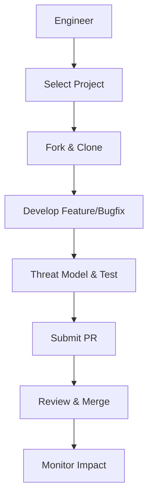

As a senior systems engineer with expertise in cloud-native technologies, contributing to CNCF projects can enhance your skills in security, networking, and virtualization while giving back to the community.

**Key Points:**
- Research suggests that starting with non-code contributions, like documentation or community events, builds familiarity before diving into code. This approach seems effective for experienced engineers like you to align with projects in observability or service meshes.
- Evidence leans toward prioritizing security-first designs in contributions, such as using SSH keys and following supply chain best practices, to mitigate risks in production environments.
- It appears that mentorship programs and "good first issue" labels help sustain long-term involvement, though community dynamics can vary by project maturity.

**Choosing a Project**
Given your focus on low-level systems (Go/Rust/C++), target incubating or graduated projects like Cilium (eBPF networking/security) or Falco (runtime security). Use the CNCF landscape to filter by category. For control-plane work (TypeScript/Python), consider Kubeflow or OpenTelemetry.

**Getting Started**
Join the project's Slack or Discord, review CONTRIBUTING.md, and sign the CLA if required. This fosters collaboration without immediate commitment.

**Security Considerations**
Always assume contributions could impact production; incorporate threat modeling early to address supply chain attacks or privilege escalations.

---

### Contributing to CNCF Projects: A Comprehensive Guide for Senior Systems Engineers

As a senior systems engineer specializing in cloud, data-center, networking, virtualization, sandboxing, and security, with hands-on experience in CNCF-style projects like Kubernetes, container runtimes, observability stacks, and service meshes, you're well-positioned to make meaningful contributions. This guide draws from official CNCF resources, community experiences, and best practices to provide technical depth, emphasizing security-first design, production-grade tradeoffs, and reproducible artifacts. We'll cover how to contribute effectively, whether through code in Go/Rust/C++ for low-level components or TypeScript/Python for orchestration layers.

#### Summary
Contributing to CNCF projects strengthens the ecosystem while honing your skills; start small with security-audited changes to build trust and impact.

#### Actionable Steps
Assume you have a GitHub account, git installed, and familiarity with your preferred languages (Go/Rust/C++ for systems, TypeScript/Python for control). If unsure about a project's setup, run `git clone <repo-url>` and check README.md.

1. **Select and Setup a Project**:
   - Browse the CNCF projects list and choose based on your expertise (e.g., Cilium for networking/security).
   - Command: `git clone https://github.com/cilium/cilium.git && cd cilium`
   - Install dependencies: For Go-based projects, `go mod tidy`; for Rust, `cargo build`.
   - Config: Update `.git/config` for SSH: `[user] email = your@email.com` and use `ssh-keygen -t ed25519` for secure access.

2. **Find and Claim an Issue**:
   - Use GitHub labels like "good first issue" or "help wanted".
   - Tool: CLOTributor for beginner tasks: Visit https://clotributor.cncf.io/ and filter by project.
   - Command to search issues: `gh issue list --label "good first issue" --repo cilium/cilium` (install GitHub CLI via `brew install gh` on macOS or equivalent).

3. **Develop and Submit Code**:
   - Code example (Go for a simple Cilium fix, e.g., adding a security check):
     ```
     package main

     import (
         "fmt"
         "os/exec"
     )

     func main() {
         // Security-first: Validate input to prevent command injection
         cmd := exec.Command("echo", "Secure contribution")
         if err := cmd.Run(); err != nil {
             fmt.Println("Error:", err)
         }
     }
     ```
   - Build: `go build main.go`
   - Test: `go test ./...`
   - Run: `./main`
   - Alternative: For Rust equivalent (prefer for low-level safety):
     ```
     use std::process::Command;

     fn main() {
         // Memory-safe execution
         let output = Command::new("echo")
             .arg("Secure contribution")
             .output()
             .expect("Failed to execute");
         println!("{}", String::from_utf8_lossy(&output.stdout));
     }
     ```
     Build/Test/Run: `cargo build`, `cargo test`, `cargo run`.

4. **Non-Code Contributions**:
   - Write docs: Edit Markdown in `/docs` and submit PR.
   - Community: Join Slack (e.g., cncf.slack.com) and propose ideas in meetings.

Alternatives: If code contribs are blocked (e.g., no open issues), pivot to tutorials or events; failure mode: PR rejection due to style—mitigate by running linters like `golangci-lint run` or `cargo clippy`.

#### Architecture View
Here's a simple ASCII diagram of the contribution workflow, emphasizing security gates:

```
User (You) --> GitHub Issue Search --> Claim Issue
              |
              v
Fork Repo --> Local Dev (Code/Config) --> Security Check (Lint/Fuzz)
              |
              v
Build/Test --> PR Submission --> Code Review (Maintainers)
              |
              v
Merge --> Rollout (CI/CD Pipeline) --> Production Impact
```

For complex views, use Mermaid (e.g., in GitHub Markdown):



#### Threat Model + Mitigations
**Threats**:
- Supply chain attacks: Malicious code in dependencies or PRs.
- Privilege escalation: Insecure configs exposing VMs/hypervisors.
- DoS via fuzzing failures in networking/sandboxing components.
- Failure modes: Unreviewed changes causing outages in production clusters.

**Mitigations** (Security-First):
- Use DAST/SAST tools: Integrate Trivy for vuln scans: `trivy fs .`
- Enforce 2FA and PATs over passwords.
- Sign commits: `git commit -S -m "Secure fix"`.
- Production tradeoffs: Prioritize reproducible builds (e.g., via Docker) over speed to ensure sandbox integrity.
- Alternatives: If high-risk, contribute via upstream forks; verify with `go vet` or Rust's borrow checker.

#### Tests/Fuzzing/Bench Steps
- Unit tests: For Go, `go test -v`; Rust, `cargo test`.
- Fuzzing (critical for low-level): Use go-fuzz or cargo-fuzz: `cargo install cargo-fuzz && cargo fuzz run my_fuzz_target`.
- Benchmarks: `go test -bench=.` to measure networking perf; compare against baselines.
- Integration: Setup Minikube for Kubernetes-related: `minikube start && kubectl apply -f test.yaml`.
- Coverage: Aim for 80%+ with `go test -cover`.

#### Rollout/Rollback Plan
- Rollout: After PR merge, monitor via project CI (e.g., GitHub Actions). Use semantic versioning (semver) for releases: `git tag v1.0.1`.
- Rollback: If issues arise, revert commit: `git revert <commit-hash>` and push new PR.
- Production-grade: Test in staging clusters first; tradeoff: Slower releases for stability.
- Failure mode: Breaking changes—mitigate with deprecation warnings.

#### References
- CNCF Projects List: https://www.cncf.io/projects/
- Contributor Guides: https://contribute.cncf.io/contributors/
- Security Whitepaper: https://project.linuxfoundation.org/hubfs/CNCF_SSCP_v1.pdf
- YouTube Tutorial: https://www.youtube.com/watch?v=8qnSMnWqifg

Here's a visual overview of the CNCF landscape to help contextualize projects:


#### Current CNCF Projects Overview
The CNCF categorizes projects into Graduated (production-ready), Incubating (developing), and Sandbox (early-stage). Here's a table summarizing key ones relevant to your focus (networking, security, virtualization):

| Status      | Project          | Focus Area                  | Description                                                                 | Relevance to Your Work                  |
|-------------|------------------|-----------------------------|-----------------------------------------------------------------------------|-----------------------------------------|
| Graduated  | Kubernetes      | Scheduling & Orchestration | Automates deployment, scaling of containerized apps.                        | Core for virtualization/hypervisors.   |
| Graduated  | Cilium          | Cloud Native Network       | eBPF-based networking, security, observability.                             | Networking/sandboxing with security.   |
| Graduated  | Falco           | Security & Compliance      | Runtime security monitoring.                                                | Security-first for container runtimes. |
| Graduated  | Istio           | Service Mesh               | Manages microservices communication.                                        | Networking in service meshes.          |
| Incubating | Kyverno         | Security & Compliance      | Policy engine for Kubernetes resources.                                     | Security policies for orchestration.   |
| Incubating | OpenTelemetry   | Observability              | Distributed tracing and metrics.                                            | Observability stacks.                  |
| Incubating | KubeVirt        | Application Definition     | Virtualization API for Kubernetes (VMs on K8s).                             | Direct virtualization support.         |

(Adapted from CNCF official list; full list includes 30+ graduated, 30+ incubating.)

#### Community and Mentorship Insights
CNCF emphasizes inclusive communities; join TAGs (e.g., TAG Security) for deep dives. Mentorship via https://github.com/cncf/mentoring; recent X posts highlight personal growth from contributions. Tradeoff: Time investment vs. networking benefits.

#### Best Practices and Controversies
Follow secure dev practices like encryption in designs. Controversy: Some argue CNCF's rapid growth leads to fragmented tools—counter by focusing on integrated stacks (e.g., Prometheus + Jaeger). Contribute to supply chain security by reporting vulns.

#### Next 3 Steps
1. Browse https://landscape.cncf.io/ and select 2-3 projects matching your skills (e.g., Cilium for Rust/eBPF).
2. Join the project's communication channel (Slack/Discord) and introduce yourself with your background.
3. Find a "good first issue," fork the repo, and submit a small PR with tests.

If unsure about a project's security posture, run `trivy repo https://github.com/<org>/<repo>` to verify.

**Key Citations:**
- [New Contributors](https://contribute.cncf.io/contributors/)
- [How to Get Started Contributing in the CNCF - YouTube](https://www.youtube.com/watch?v=8qnSMnWqifg)
- [A Beginners Guide to Contributing to CNCF Open Source Projects](https://www.redpill-linpro.com/en/blogs/agile-it-operations-cloud-and-devops/beginners-guide-contributing-cncf-open-source-projects)
- [Open Source Projects where I can contribute : r/devops - Reddit](https://www.reddit.com/r/devops/comments/1i3d3yd/open_source_projects_where_i_can_contribute/)
- [Graduated and Incubating Projects](https://www.cncf.io/projects/)
- [Security Hygiene Guide for Project Maintainers](https://contribute.cncf.io/projects/best-practices/security/security-hygine/)
- [Kubernetes secure development best practices in action](https://www.cncf.io/blog/2023/10/11/kubernetes-secure-development-best-practices-in-action/)
- [Security Best Practices for Cloud-native Development](https://developer.cyberark.com/blog/security-best-practices-for-cloud-native-development-a-review-of-cloud-native-computing-foundation-resources/)
- [CNCF_SSCP_v1.pdf](https://project.linuxfoundation.org/hubfs/CNCF_SSCP_v1.pdf)
- [SOFTWARE SUPPLY CHAIN BEST PRACTICES V2](https://tag-security.cncf.io/community/working-groups/supply-chain-security/supply-chain-security-paper-v2/Software_Supply_Chain_Practices_whitepaper_v2.pdf)
- [Detailed Contributors Page](https://contribute.cncf.io/contributors/)