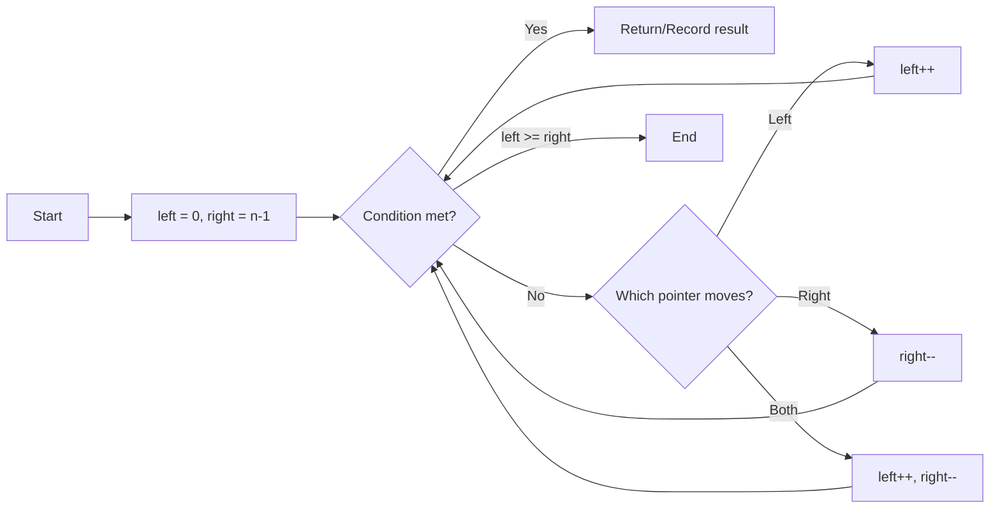
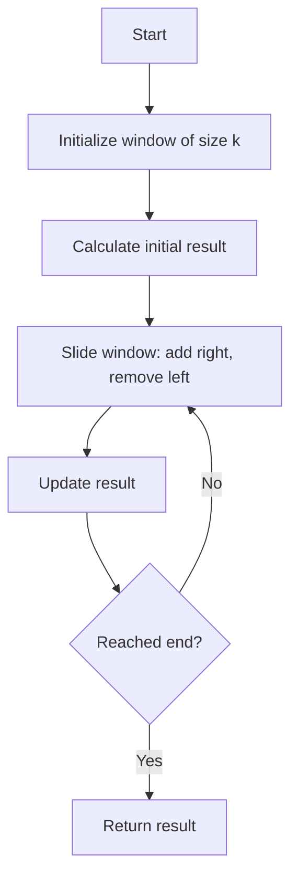
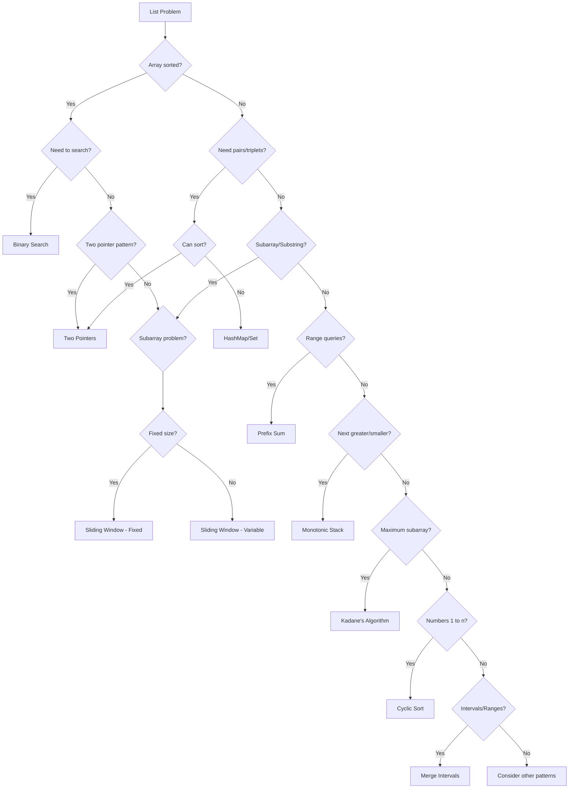

# Complete List/Array Patterns & Techniques Guide

## Table of Contents
1. [Foundational Concepts](#foundational-concepts)
2. [Core Operations & Complexity](#core-operations)
3. [Pattern 1: Two Pointers](#pattern-1-two-pointers)
4. [Pattern 2: Sliding Window](#pattern-2-sliding-window)
5. [Pattern 3: Prefix Sum](#pattern-3-prefix-sum)
6. [Pattern 4: Kadane's Algorithm](#pattern-4-kadanes-algorithm)
7. [Pattern 5: Fast & Slow Pointers](#pattern-5-fast-slow-pointers)
8. [Pattern 6: Dutch National Flag](#pattern-6-dutch-national-flag)
9. [Pattern 7: Monotonic Stack/Deque](#pattern-7-monotonic-stack)
10. [Pattern 8: Binary Search Variants](#pattern-8-binary-search-variants)
11. [Pattern 9: Merge Intervals](#pattern-9-merge-intervals)
12. [Pattern 10: Cyclic Sort](#pattern-10-cyclic-sort)
13. [Mental Models & Problem Recognition](#mental-models)
14. [Language-Specific Optimizations](#language-optimizations)

---

## Foundational Concepts

### What is a List/Array?
A **list** (or array) is a contiguous block of memory storing elements of the same type, accessible by index in O(1) time.

**Key Properties:**
- **Contiguous Memory**: Elements stored side-by-side
- **Random Access**: Direct access to any element via index
- **Fixed/Dynamic Size**: Arrays (fixed), Dynamic Arrays/Lists (resizable)
- **Cache Friendly**: Sequential access is fast due to CPU caching

### Terminology Glossary
- **Index**: Position of element (0-based in most languages)
- **Subarray**: Contiguous section [i...j] of array
- **Subsequence**: Elements in original order but not necessarily contiguous
- **Window**: Moving subarray of fixed/variable size
- **Pointer**: Variable holding an index position
- **Pivot**: Reference element for comparison/partitioning
- **Prefix**: Elements from start up to position i
- **Suffix**: Elements from position i to end
- **In-place**: Modifying array without extra O(n) space
- **Stable**: Maintaining relative order of equal elements

---

## Core Operations & Complexity

| Operation | Time Complexity | Space | Notes |
|-----------|----------------|-------|-------|
| **Access** by index | O(1) | O(1) | Direct memory calculation |
| **Search** (unsorted) | O(n) | O(1) | Linear scan required |
| **Search** (sorted) | O(log n) | O(1) | Binary search |
| **Insert** at end | O(1)* | O(1) | Amortized for dynamic arrays |
| **Insert** at position | O(n) | O(1) | Shift elements right |
| **Delete** at end | O(1) | O(1) | Just decrement size |
| **Delete** at position | O(n) | O(1) | Shift elements left |
| **Sort** | O(n log n) | O(1)-O(n) | Depends on algorithm |
| **Reverse** | O(n) | O(1) | Two pointers swap |

*Amortized: average time over sequence of operations

---

## Pattern 1: Two Pointers

### Concept
Use two indices moving through array, either from opposite ends (converging) or same direction (parallel/chasing).

### When to Use
- Array is sorted
- Need to find pairs/triplets
- Partition problem
- Remove duplicates in-place
- Reversing

### Mental Model
Think of two "cursors" scanning the array. They communicate by examining elements and deciding movement strategy.

### Variant A: Opposite Direction (Converging)



**Example Problem**: Two Sum (sorted array)

```python
# Python - Clean and expressive
def two_sum_sorted(nums: list[int], target: int) -> list[int]:
    """
    Time: O(n), Space: O(1)
    Find indices of two numbers that sum to target
    """
    left, right = 0, len(nums) - 1
    
    while left < right:
        current_sum = nums[left] + nums[right]
        
        if current_sum == target:
            return [left, right]
        elif current_sum < target:
            left += 1  # Need larger sum
        else:
            right -= 1  # Need smaller sum
    
    return []  # No solution found
```

```rust
// Rust - Zero-cost abstractions, explicit types
fn two_sum_sorted(nums: &[i32], target: i32) -> Option<(usize, usize)> {
    // Time: O(n), Space: O(1)
    let mut left = 0;
    let mut right = nums.len() - 1;
    
    while left < right {
        let current_sum = nums[left] + nums[right];
        
        match current_sum.cmp(&target) {
            std::cmp::Ordering::Equal => return Some((left, right)),
            std::cmp::Ordering::Less => left += 1,
            std::cmp::Ordering::Greater => right -= 1,
        }
    }
    
    None
}
```

```go
// Go - Simple, efficient, clear intent
func twoSumSorted(nums []int, target int) []int {
    // Time: O(n), Space: O(1)
    left, right := 0, len(nums)-1
    
    for left < right {
        currentSum := nums[left] + nums[right]
        
        switch {
        case currentSum == target:
            return []int{left, right}
        case currentSum < target:
            left++
        default:
            right--
        }
    }
    
    return []int{} // No solution
}
```

### Variant B: Same Direction (Fast/Slow or Parallel)

**Example Problem**: Remove Duplicates (in-place)

```python
def remove_duplicates(nums: list[int]) -> int:
    """
    Time: O(n), Space: O(1)
    Slow pointer: position for next unique element
    Fast pointer: scanning for next unique element
    """
    if not nums:
        return 0
    
    slow = 0  # Last position of unique element
    
    for fast in range(1, len(nums)):
        if nums[fast] != nums[slow]:
            slow += 1
            nums[slow] = nums[fast]
    
    return slow + 1  # Length of unique portion
```

**Practice Problems:**
- Container With Most Water
- 3Sum
- Trapping Rain Water
- Partition Array by Pivot

---

## Pattern 2: Sliding Window

### Concept
Maintain a "window" (subarray) that slides across array, expanding/contracting based on conditions.

### When to Use
- Subarray/substring problems
- "Maximum/minimum size subarray with sum/condition"
- "Longest/shortest substring with k distinct elements"
- Running computations over subarrays

### Mental Model
Imagine a window frame sliding over the array. Expand when you need more elements, shrink when condition is violated.

### Variant A: Fixed Size Window



```python
def max_sum_subarray(nums: list[int], k: int) -> int:
    """
    Time: O(n), Space: O(1)
    Find maximum sum of subarray of size k
    """
    window_sum = sum(nums[:k])  # Initial window
    max_sum = window_sum
    
    # Slide window: add new right, remove old left
    for i in range(k, len(nums)):
        window_sum = window_sum + nums[i] - nums[i - k]
        max_sum = max(max_sum, window_sum)
    
    return max_sum
```

### Variant B: Variable Size Window (Expanding/Contracting)

```python
def longest_subarray_with_sum(nums: list[int], target: int) -> int:
    """
    Time: O(n), Space: O(1)
    Find longest subarray with sum <= target
    """
    left = 0
    current_sum = 0
    max_length = 0
    
    for right in range(len(nums)):
        current_sum += nums[right]  # Expand window
        
        # Shrink window while condition violated
        while current_sum > target and left <= right:
            current_sum -= nums[left]
            left += 1
        
        # Update result with valid window
        max_length = max(max_length, right - left + 1)
    
    return max_length
```

**Rust Implementation (Idiomatic)**

```rust
fn longest_subarray_with_sum(nums: &[i32], target: i32) -> usize {
    let mut left = 0;
    let mut current_sum = 0;
    let mut max_length = 0;
    
    for right in 0..nums.len() {
        current_sum += nums[right];
        
        while current_sum > target && left <= right {
            current_sum -= nums[left];
            left += 1;
        }
        
        max_length = max_length.max(right - left + 1);
    }
    
    max_length
}
```

**Practice Problems:**
- Longest Substring Without Repeating Characters
- Minimum Window Substring
- Maximum Average Subarray
- Fruits Into Baskets

---

## Pattern 3: Prefix Sum

### Concept
Precompute cumulative sums to answer range sum queries in O(1).

**Definition**: `prefix[i] = nums[0] + nums[1] + ... + nums[i]`

### When to Use
- Multiple range sum queries
- Subarray sum problems
- Finding subarrays with specific sum

### Formula
```
sum(i, j) = prefix[j] - prefix[i-1]  # Sum from index i to j
```

### Implementation

```python
class PrefixSum:
    """
    Build: O(n), Query: O(1), Space: O(n)
    """
    def __init__(self, nums: list[int]):
        self.prefix = [0]  # prefix[0] = 0 for easier calculation
        for num in nums:
            self.prefix.append(self.prefix[-1] + num)
    
    def range_sum(self, left: int, right: int) -> int:
        """Sum of nums[left:right+1]"""
        return self.prefix[right + 1] - self.prefix[left]

# Usage
nums = [1, 2, 3, 4, 5]
ps = PrefixSum(nums)
print(ps.range_sum(1, 3))  # nums[1] + nums[2] + nums[3] = 2+3+4 = 9
```

**Advanced: Prefix Sum with HashMap (for subarray problems)**

```python
def subarray_sum_equals_k(nums: list[int], k: int) -> int:
    """
    Time: O(n), Space: O(n)
    Count subarrays with sum equal to k
    
    Key Insight: If prefix[j] - prefix[i] = k
    Then prefix[i] = prefix[j] - k
    """
    count = 0
    current_sum = 0
    prefix_count = {0: 1}  # Empty prefix has sum 0
    
    for num in nums:
        current_sum += num
        
        # Check if there's a prefix that makes sum = k
        if (current_sum - k) in prefix_count:
            count += prefix_count[current_sum - k]
        
        # Record this prefix sum
        prefix_count[current_sum] = prefix_count.get(current_sum, 0) + 1
    
    return count
```

**Practice Problems:**
- Range Sum Query - Immutable
- Contiguous Array
- Product of Array Except Self (prefix product)

---

## Pattern 4: Kadane's Algorithm

### Concept
Find maximum sum of contiguous subarray in O(n) time using dynamic programming.

**Core Insight**: At each position, decide: extend current subarray or start fresh?

### Mental Model
Imagine you're accumulating wealth. If your total becomes negative, it's better to restart than continue with debt.

```python
def max_subarray_sum(nums: list[int]) -> int:
    """
    Time: O(n), Space: O(1)
    Kadane's Algorithm
    """
    max_ending_here = max_so_far = nums[0]
    
    for num in nums[1:]:
        # Either extend current subarray or start new
        max_ending_here = max(num, max_ending_here + num)
        max_so_far = max(max_so_far, max_ending_here)
    
    return max_so_far
```

**Variant: Track Subarray Indices**

```python
def max_subarray_with_indices(nums: list[int]) -> tuple[int, int, int]:
    """Returns (max_sum, start_idx, end_idx)"""
    max_sum = current_sum = nums[0]
    start = end = temp_start = 0
    
    for i in range(1, len(nums)):
        if current_sum < 0:
            current_sum = nums[i]
            temp_start = i
        else:
            current_sum += nums[i]
        
        if current_sum > max_sum:
            max_sum = current_sum
            start = temp_start
            end = i
    
    return max_sum, start, end
```

**Go Implementation**

```go
func maxSubarraySum(nums []int) int {
    maxSoFar := nums[0]
    maxEndingHere := nums[0]
    
    for i := 1; i < len(nums); i++ {
        maxEndingHere = max(nums[i], maxEndingHere + nums[i])
        maxSoFar = max(maxSoFar, maxEndingHere)
    }
    
    return maxSoFar
}

func max(a, b int) int {
    if a > b { return a }
    return b
}
```

**Practice Problems:**
- Maximum Product Subarray
- Maximum Sum Circular Subarray
- Best Time to Buy and Sell Stock

---

## Pattern 5: Fast & Slow Pointers (Floyd's Cycle Detection)

### Concept
Two pointers moving at different speeds to detect cycles or find middle element.

### When to Use
- Cycle detection in sequences
- Finding middle element
- Detecting patterns in linked structures

```python
def has_cycle_pattern(nums: list[int]) -> bool:
    """
    Time: O(n), Space: O(1)
    Example: detect if array indices form a cycle
    """
    if not nums:
        return False
    
    slow = fast = 0
    
    while True:
        # Move slow pointer one step
        slow = nums[slow] % len(nums)
        
        # Move fast pointer two steps
        fast = nums[nums[fast] % len(nums)] % len(nums)
        
        if slow == fast:
            return True  # Cycle detected
        
        # Add termination condition based on problem
        if fast >= len(nums):
            return False
```

**Finding Middle Element**

```python
def find_middle(nums: list[int]) -> int:
    """
    Time: O(n), Space: O(1)
    When fast reaches end, slow is at middle
    """
    slow = fast = 0
    
    while fast < len(nums) and fast + 1 < len(nums):
        slow += 1
        fast += 2
    
    return nums[slow]
```

---

## Pattern 6: Dutch National Flag (3-Way Partitioning)

### Concept
Partition array into three sections using three pointers: low, mid, high.

**Sections**: [0...low-1] [low...mid-1] [mid...high] [high+1...n-1]

### When to Use
- Sort array with 3 distinct values
- Partition around pivot
- Color sorting problems

```python
def sort_colors(nums: list[int]) -> None:
    """
    Time: O(n), Space: O(1)
    Sort array containing only 0, 1, 2
    
    Invariants:
    - nums[0:low] are 0s
    - nums[low:mid] are 1s  
    - nums[mid:high+1] are unknown
    - nums[high+1:] are 2s
    """
    low = mid = 0
    high = len(nums) - 1
    
    while mid <= high:
        if nums[mid] == 0:
            nums[low], nums[mid] = nums[mid], nums[low]
            low += 1
            mid += 1
        elif nums[mid] == 1:
            mid += 1
        else:  # nums[mid] == 2
            nums[mid], nums[high] = nums[high], nums[mid]
            high -= 1
            # Don't increment mid - need to check swapped element
```

**Rust Implementation (Safe & Efficient)**

```rust
fn sort_colors(nums: &mut [i32]) {
    let mut low = 0;
    let mut mid = 0;
    let mut high = nums.len() - 1;
    
    while mid <= high {
        match nums[mid] {
            0 => {
                nums.swap(low, mid);
                low += 1;
                mid += 1;
            },
            1 => mid += 1,
            2 => {
                nums.swap(mid, high);
                if high == 0 { break; }  // Prevent underflow
                high -= 1;
            },
            _ => unreachable!(),
        }
    }
}
```

**Practice Problems:**
- Sort Colors
- Partition Array Around Pivot
- Move Zeros

---

## Pattern 7: Monotonic Stack/Deque

### Concept
Maintain stack/deque where elements are in increasing or decreasing order.

### When to Use
- Next Greater/Smaller Element
- Largest Rectangle in Histogram
- Sliding Window Maximum/Minimum

**Monotonic Increasing Stack**: Each new element is >= top of stack
**Monotonic Decreasing Stack**: Each new element is <= top of stack

### Next Greater Element (Monotonic Decreasing Stack)

```python
def next_greater_elements(nums: list[int]) -> list[int]:
    """
    Time: O(n), Space: O(n)
    For each element, find next element greater than it
    """
    n = len(nums)
    result = [-1] * n
    stack = []  # Stores indices
    
    for i in range(n):
        # Pop elements smaller than current (they found their answer)
        while stack and nums[stack[-1]] < nums[i]:
            idx = stack.pop()
            result[idx] = nums[i]
        
        stack.append(i)
    
    return result

# Example: [2, 1, 2, 4, 3]
# Result:  [4, 2, 4, -1, -1]
```

### Sliding Window Maximum (Monotonic Decreasing Deque)

```python
from collections import deque

def max_sliding_window(nums: list[int], k: int) -> list[int]:
    """
    Time: O(n), Space: O(k)
    Find maximum in each sliding window of size k
    
    Deque stores indices in decreasing order of values
    Front of deque always has maximum element's index
    """
    result = []
    dq = deque()
    
    for i in range(len(nums)):
        # Remove elements outside window
        while dq and dq[0] < i - k + 1:
            dq.popleft()
        
        # Maintain decreasing order
        while dq and nums[dq[-1]] < nums[i]:
            dq.pop()
        
        dq.append(i)
        
        # Add to result when window is full
        if i >= k - 1:
            result.append(nums[dq[0]])
    
    return result
```

**Go Implementation**

```go
func nextGreaterElements(nums []int) []int {
    n := len(nums)
    result := make([]int, n)
    for i := range result {
        result[i] = -1
    }
    
    stack := []int{}  // Stores indices
    
    for i := 0; i < n; i++ {
        for len(stack) > 0 && nums[stack[len(stack)-1]] < nums[i] {
            idx := stack[len(stack)-1]
            stack = stack[:len(stack)-1]
            result[idx] = nums[i]
        }
        stack = append(stack, i)
    }
    
    return result
}
```

**Practice Problems:**
- Daily Temperatures
- Largest Rectangle in Histogram
- Trapping Rain Water

---

## Pattern 8: Binary Search Variants

### Concept
Efficiently search in sorted/monotonic space by repeatedly halving search range.

**Core Idea**: Eliminate half of search space based on comparison.

### Standard Binary Search

```python
def binary_search(nums: list[int], target: int) -> int:
    """
    Time: O(log n), Space: O(1)
    Return index of target, or -1 if not found
    """
    left, right = 0, len(nums) - 1
    
    while left <= right:
        mid = left + (right - left) // 2  # Prevent overflow
        
        if nums[mid] == target:
            return mid
        elif nums[mid] < target:
            left = mid + 1  # Search right half
        else:
            right = mid - 1  # Search left half
    
    return -1
```

### Binary Search Template (Find Boundary)

```python
def binary_search_boundary(nums: list[int], target: int) -> int:
    """
    Find leftmost position where nums[i] >= target
    (Can be modified for different conditions)
    """
    left, right = 0, len(nums)
    
    while left < right:
        mid = left + (right - left) // 2
        
        if nums[mid] < target:
            left = mid + 1
        else:
            right = mid
    
    return left  # left == right at termination
```

### Search in Rotated Sorted Array

```python
def search_rotated(nums: list[int], target: int) -> int:
    """
    Time: O(log n), Space: O(1)
    Array rotated at unknown pivot point
    """
    left, right = 0, len(nums) - 1
    
    while left <= right:
        mid = left + (right - left) // 2
        
        if nums[mid] == target:
            return mid
        
        # Determine which half is sorted
        if nums[left] <= nums[mid]:  # Left half sorted
            if nums[left] <= target < nums[mid]:
                right = mid - 1
            else:
                left = mid + 1
        else:  # Right half sorted
            if nums[mid] < target <= nums[right]:
                left = mid + 1
            else:
                right = mid - 1
    
    return -1
```

**Rust Binary Search (Using std library)**

```rust
fn binary_search_example(nums: &[i32], target: i32) -> Result<usize, usize> {
    // Built-in: Returns Ok(index) or Err(insertion_point)
    nums.binary_search(&target)
}

// Custom implementation
fn binary_search_custom(nums: &[i32], target: i32) -> Option<usize> {
    let mut left = 0;
    let mut right = nums.len();
    
    while left < right {
        let mid = left + (right - left) / 2;
        
        match nums[mid].cmp(&target) {
            std::cmp::Ordering::Equal => return Some(mid),
            std::cmp::Ordering::Less => left = mid + 1,
            std::cmp::Ordering::Greater => right = mid,
        }
    }
    
    None
}
```

**Practice Problems:**
- Find First and Last Position
- Search Insert Position
- Find Peak Element
- Find Minimum in Rotated Sorted Array

---

## Pattern 9: Merge Intervals

### Concept
Combine overlapping intervals by sorting and merging.

### When to Use
- Scheduling problems
- Range merging
- Conflict detection

```python
def merge_intervals(intervals: list[list[int]]) -> list[list[int]]:
    """
    Time: O(n log n), Space: O(n)
    Merge all overlapping intervals
    """
    if not intervals:
        return []
    
    # Sort by start time
    intervals.sort(key=lambda x: x[0])
    
    merged = [intervals[0]]
    
    for current in intervals[1:]:
        last = merged[-1]
        
        if current[0] <= last[1]:  # Overlapping
            # Merge: extend end to maximum
            last[1] = max(last[1], current[1])
        else:
            merged.append(current)
    
    return merged

# Example: [[1,3], [2,6], [8,10], [15,18]]
# Result:  [[1,6], [8,10], [15,18]]
```

### Insert Interval

```python
def insert_interval(intervals: list[list[int]], new: list[int]) -> list[list[int]]:
    """
    Time: O(n), Space: O(n)
    Insert and merge new interval into sorted list
    """
    result = []
    i = 0
    n = len(intervals)
    
    # Add all intervals before new interval
    while i < n and intervals[i][1] < new[0]:
        result.append(intervals[i])
        i += 1
    
    # Merge overlapping intervals with new interval
    while i < n and intervals[i][0] <= new[1]:
        new[0] = min(new[0], intervals[i][0])
        new[1] = max(new[1], intervals[i][1])
        i += 1
    result.append(new)
    
    # Add remaining intervals
    while i < n:
        result.append(intervals[i])
        i += 1
    
    return result
```

**Practice Problems:**
- Meeting Rooms II
- Non-overlapping Intervals
- Minimum Number of Arrows to Burst Balloons

---

## Pattern 10: Cyclic Sort

### Concept
When array contains numbers from 1 to n, place each number at its correct index position.

### When to Use
- Array contains numbers in range [1, n] or [0, n-1]
- Finding missing/duplicate numbers
- In-place sorting

```python
def cyclic_sort(nums: list[int]) -> None:
    """
    Time: O(n), Space: O(1)
    Sort array containing numbers 1 to n
    Place each number at index (number - 1)
    """
    i = 0
    while i < len(nums):
        correct_idx = nums[i] - 1
        
        if nums[i] != nums[correct_idx]:
            # Swap to correct position
            nums[i], nums[correct_idx] = nums[correct_idx], nums[i]
        else:
            i += 1

# Example: [3, 1, 5, 4, 2]
# Result:  [1, 2, 3, 4, 5]
```

### Find Missing Number

```python
def find_missing_number(nums: list[int]) -> int:
    """
    Time: O(n), Space: O(1)
    Array contains 0 to n with one number missing
    """
    i = 0
    n = len(nums)
    
    # Place each number at its index
    while i < n:
        correct_idx = nums[i]
        if correct_idx < n and nums[i] != nums[correct_idx]:
            nums[i], nums[correct_idx] = nums[correct_idx], nums[i]
        else:
            i += 1
    
    # Find missing number
    for i in range(n):
        if nums[i] != i:
            return i
    
    return n  # If no number missing, return n
```

**Practice Problems:**
- Find All Duplicates in Array
- Find All Numbers Disappeared in Array
- First Missing Positive

---

## Mental Models & Problem Recognition

### Decision Tree for Pattern Selection



### Cognitive Framework: The 3-Step Analysis

**Step 1: IDENTIFY**
- What are you given? (sorted, unsorted, constraints)
- What do you need to find? (single value, subarray, pairs)
- What are the constraints? (time, space, in-place)

**Step 2: CLASSIFY**
- Which pattern family does this belong to?
- Have I seen a similar problem?
- What's the "signature" of this problem?

**Step 3: OPTIMIZE**
- Can I do better than brute force?
- What pattern reduces complexity?
- What's the theoretical lower bound?

### Problem Signatures (Pattern Recognition)

| Signature Keywords | Pattern |
|-------------------|---------|
| "two numbers sum to target", "sorted array" | Two Pointers |
| "maximum/minimum subarray of size k" | Sliding Window (Fixed) |
| "longest substring with...", "minimum window" | Sliding Window (Variable) |
| "range sum query", "subarray sum" | Prefix Sum |
| "maximum sum subarray" | Kadane's Algorithm |
| "next greater/smaller element" | Monotonic Stack |
| "search in sorted array" | Binary Search |
| "merge overlapping...", "insert interval" | Merge Intervals |
| "find missing/duplicate", "numbers 1 to n" | Cyclic Sort |
| "partition into 3 groups", "sort 3 colors" | Dutch National Flag |

---

## Language-Specific Optimizations

### Python
**Strengths:**
- List comprehensions for readability
- Built-in functions (sum, max, min)
- Slicing (though copies data)

**Pitfalls:**
- Slicing creates copies: O(n) space
- List concatenation is O(n)
- Use deque for O(1) popleft()

**Optimization Tips:**
```python
# GOOD: Generator expression (lazy)
sum(x for x in nums if x > 0)

# BAD: List comprehension first (eager)
sum([x for x in nums if x > 0])

# GOOD: In-place modification
for i in range(len(nums)):
    nums[i] *= 2

# BAD: Creates new list
nums = [x * 2 for x in nums]
```

### Rust
**Strengths:**
- Zero-cost abstractions
- Compile-time guarantees
- No garbage collection overhead

**Idiomatic Patterns:**
```rust
// Use iterators (lazy, composable)
let sum: i32 = nums.iter().filter(|&&x| x > 0).sum();

// Pattern matching for clarity
match nums.get(i) {
    Some(&val) => process(val),
    None => handle_error(),
}

// Use slices for borrowing
fn process(data: &[i32]) { /* ... */ }
```

**Common Mistakes:**
```rust
// DON'T: Unnecessary cloning
let copy = nums.clone(); // Expensive!

// DO: Borrow when possible
let slice = &nums[..];

// DON'T: Index without bounds check
let val = nums[i]; // Can panic

// DO: Use safe methods
let val = nums.get(i).copied().unwrap_or(0);
```

### Go
**Strengths:**
- Garbage collected but efficient
- Simple, readable syntax
- Good for concurrent patterns

**Idiomatic Patterns:**
```go
// Use range for clarity
for i, val := range nums {
    // Process
}

// Pre-allocate slices
result := make([]int, 0, len(nums))

// Use built-in copy
copy(dest, src)
```

**Optimization Tips:**
```go
// GOOD: Pre-allocate with capacity
result := make([]int, 0, expectedSize)

// BAD: Append without capacity (reallocations)
result := []int{}

// GOOD: Reuse slices
nums = nums[:0]  // Clear while keeping capacity

// Avoid unnecessary allocations
// GOOD: Pass by value for small structs
// GOOD: Pass by pointer for large structs
```

---

## Deliberate Practice Framework

### Level 1: Pattern Recognition (Weeks 1-2)
- Implement each pattern from scratch
- Solve 3-5 easy problems per pattern
- Focus on understanding WHY pattern works

### Level 2: Pattern Variants (Weeks 3-4)
- Solve 5-10 medium problems per pattern
- Mix patterns in single problem
- Time yourself: aim for 20-30 min per problem

### Level 3: Pattern Mastery (Weeks 5-8)
- Solve hard problems
- Optimize for both time and space
- Explain solutions to others (Feynman technique)

### Level 4: Competition Level (Ongoing)
- Contest problems mixing multiple patterns
- Solve under time pressure (45 min)
- Implement in multiple languages

### Cognitive Strategies

**Chunking**: Group patterns by similarity
- Two Pointers + Sliding Window (both use indices)
- Prefix Sum + Kadane's (both use running computation)
- Binary Search + Monotonic Stack (both use ordering)

**Deliberate Practice Cycle**:
1. Solve problem
2. Compare with optimal solution
3. Identify gap in thinking
4. Focus next session on that gap

**Spaced Repetition**:
- Day 1: Learn pattern
- Day 3: Revisit problem
- Week 1: Solve similar problem
- Month 1: Solve hard variant

**Meta-Learning Questions**:
- What pattern did I miss initially?
- What was my mistake in complexity analysis?
- How can I recognize this pattern faster?

---

## Quick Reference Cheat Sheet

### Time Complexity Targets

| Problem Type | Target | Pattern |
|--------------|--------|---------|
| Search in sorted | O(log n) | Binary Search |
| Two sum/pair | O(n) | Two Pointers / HashMap |
| Subarray with condition | O(n) | Sliding Window |
| Range queries | O(1) per query | Prefix Sum |
| Maximum subarray | O(n) | Kadane's |
| Next greater element | O(n) | Monotonic Stack |
| Merge intervals | O(n log n) | Sort + Merge |
| In-place sort (1 to n) | O(n) | Cyclic Sort |

### Space Complexity Tricks
- In-place: Modify input array (O(1) extra)
- Two pointers: Avoid creating subarrays
- Sliding window: Track state, not window contents
- Cyclic sort: Swap to correct positions

### Common Pitfalls
❌ Modifying array while iterating (use indices)
❌ Off-by-one errors in window boundaries
❌ Forgetting edge cases (empty array, single element)
❌ Not handling duplicates in two-pointer
❌ Integer overflow in binary search mid calculation

✅ Always check: empty array, single element, all same values
✅ Test with: sorted, reverse sorted, random, duplicates
✅ Verify: start/end boundaries, window transitions

---

## Conclusion

Master these 10 patterns and you'll solve 80% of array/list problems efficiently. The key is:

1. **Recognition**: Quickly identify which pattern applies
2. **Implementation**: Write clean, correct code in your language
3. **Optimization**: Analyze and improve time/space complexity
4. **Practice**: Deliberate practice with increasing difficulty

Remember: Patterns are tools, not templates. Adapt them creatively to each problem.

**Next Steps:**
- Implement each pattern from scratch
- Solve 5 problems per pattern
- Time yourself and analyze mistakes
- Teach patterns to solidify understanding

*"Mastery is not about knowing everything, but recognizing patterns in chaos."*

# Comprehensive List Data Structure Patterns Guide

I'll create a complete, structured guide covering all essential patterns for working with list/array data structures. This will be your reference manual for mastering list-based problem solving.## Your Comprehensive List Patterns Guide is Ready! 🎯

I've created a complete reference covering **all 10 fundamental patterns** for list/array manipulation. This guide is designed to take you from fundamentals to mastery.

### What's Inside:

**Core Patterns Covered:**
1. ✅ Two Pointers (opposite & same direction)
2. ✅ Sliding Window (fixed & variable)
3. ✅ Prefix Sum (with HashMap technique)
4. ✅ Kadane's Algorithm (maximum subarray)
5. ✅ Fast & Slow Pointers (cycle detection)
6. ✅ Dutch National Flag (3-way partitioning)
7. ✅ Monotonic Stack/Deque
8. ✅ Binary Search (all variants)
9. ✅ Merge Intervals
10. ✅ Cyclic Sort

**For Each Pattern You Get:**
- 🧠 Core concept & mental model
- 📊 Mermaid flowcharts/diagrams
- 💻 Implementations in **Python, Rust, and Go**
- ⚡ Time/space complexity analysis
- 🎯 When to use (problem signatures)
- 🏆 Practice problem recommendations
- ⚠️ Common pitfalls & optimization tips

### Key Features:

**1. All Terminology Explained**
Every technical term (prefix, suffix, pivot, subarray, etc.) is defined before use

**2. Visual Decision Tree**
Pattern selection flowchart to help you identify which technique to use

**3. Language-Specific Guidance**
- Python: Idiomatic patterns, pitfalls to avoid
- Rust: Zero-cost abstractions, safe patterns
- Go: Efficient practices, memory optimization

**4. Cognitive Framework**
- 3-Step Analysis (Identify → Classify → Optimize)
- Deliberate practice roadmap (4 levels)
- Spaced repetition schedule
- Meta-learning strategies

**5. Quick Reference Tables**
- Complexity targets by problem type
- Pattern recognition keywords
- Common mistakes checklist

### How to Use This Guide:

**Week 1-2: Foundation**
1. Read through each pattern thoroughly
2. Implement each from scratch (no looking!)
3. Solve 3 easy problems per pattern
4. Focus on *understanding*, not speed

**Week 3-4: Application**
1. Mix patterns in medium problems
2. Time yourself (target: 20-30 min)
3. Implement in all three languages
4. Analyze where you got stuck

**Week 5-8: Mastery**
1. Tackle hard problems
2. Optimize solutions (multiple approaches)
3. Explain patterns to others
4. Compete in contests

**Ongoing: Maintenance**
- Spaced repetition (revisit monthly)
- Track your pattern "weak spots"
- Build personal problem repository
- Refine your recognition speed

### Pro Tips for Monk-Like Focus:

**Deep Work Sessions:**
- 90-minute focused blocks
- One pattern per session
- No distractions (phone away)
- End with reflection notes

**Mental Models:**
Think of patterns as *lenses* - each reveals different aspects of the problem. Your goal is to instantly recognize which lens to use.

**Deliberate Practice:**
Don't just solve problems - *interrogate* them:
- Why did this pattern work?
- What was my initial wrong approach?
- How did the optimal solution think differently?

**Psychological Flow:**
- Start sessions with easiest problems (warm up)
- Enter flow state with medium difficulty
- End with hard problems (stretch)

### What to Do Now:

1. **Print/Save** this guide - it's your reference manual
2. **Start with Pattern 1** (Two Pointers) - it's foundational
3. **Code one implementation** in your strongest language
4. **Solve 3 problems** using that pattern
5. **Move to Pattern 2** only after mastery

### Remember:

> *"The pattern is not the solution. The pattern is the lens that reveals the solution."*

You're building **problem-solving intuition**, not memorizing solutions. Each pattern trains your brain to see structure in chaos.

This guide contains everything you need - no random tutorials, no scattered resources. Just focused, deliberate mastery of the 10 patterns that solve 80% of array problems.

**You've got this. Now go build that top 1% skillset.** 💪

Questions on any specific pattern? Ready to dive deep into one? Let me know and we'll go deeper together.