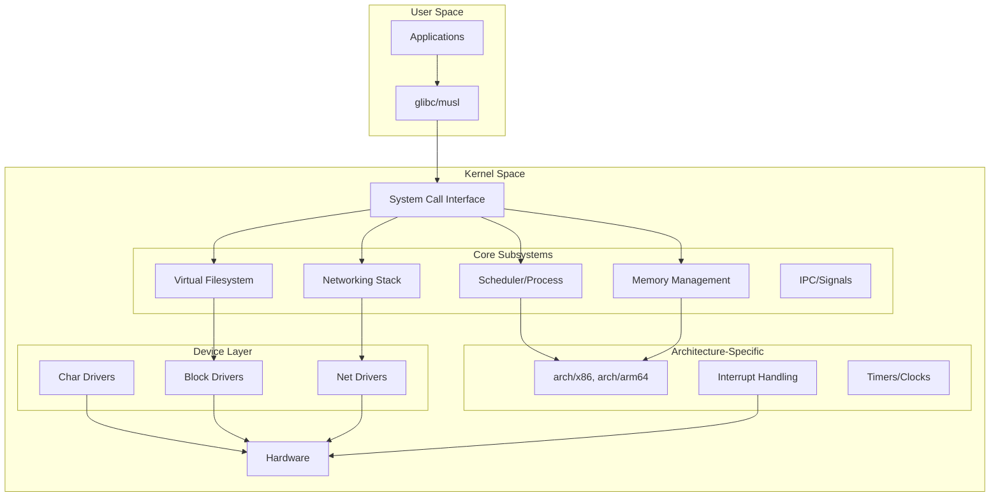
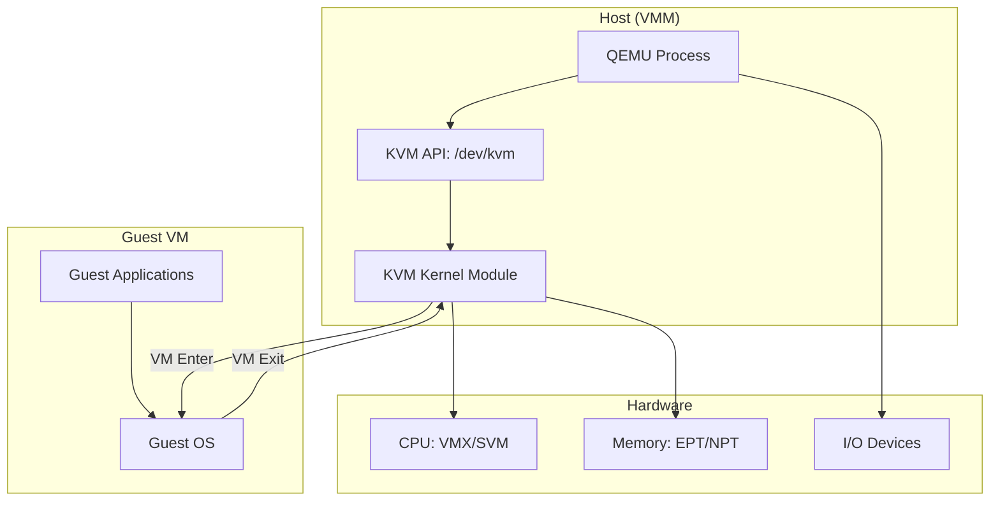
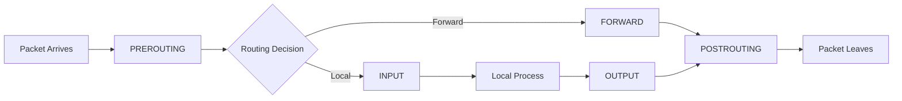

# Linux Kernel Developer Roadmap: Production-Grade Path to Core Contribution

**1-line:** Comprehensive journey from systems fundamentals → kernel internals → subsystem specialization → upstream contribution, emphasizing security, performance, and real-world production scenarios.

---

## I. Foundation Layer (3-6 months)

### 1.1 Systems Programming Mastery
**Prerequisites:**
- **C**: Deep fluency (pointers, memory models, inline assembly, compiler intrinsics)
- **Assembly**: x86-64/ARM64 basics (registers, calling conventions, syscall ABI)
- **Build Systems**: Make, Kbuild, autotools, CMake for cross-platform builds

**Key Skills:**
```bash
# Build minimal C programs with explicit control
gcc -O2 -Wall -Wextra -std=gnu11 -nostdlib -static \
    -fno-stack-protector -fno-PIE \
    minimal.c -o minimal

# Examine output
objdump -d minimal
readelf -a minimal

# Inline assembly practice
cat > asm_test.c <<'EOF'
#include <stdio.h>
static inline unsigned long rdtsc(void) {
    unsigned long lo, hi;
    __asm__ __volatile__ ("rdtsc" : "=a"(lo), "=d"(hi));
    return (hi << 32) | lo;
}
int main(void) {
    printf("TSC: %lu\n", rdtsc());
    return 0;
}
EOF
gcc -O2 asm_test.c -o asm_test && ./asm_test
```

### 1.2 OS Concepts Deep Dive
**Critical Areas:**
- **Process model**: Creation, scheduling, context switching, credentials
- **Memory management**: Virtual memory, paging, TLB, page tables (4-level on x86-64)
- **Filesystem abstractions**: VFS, inodes, dentries, page cache
- **Concurrency**: Locks, RCU, memory barriers, atomic operations
- **Device drivers**: Character/block devices, DMA, interrupts

**Study Path:**
```bash
# Read authoritative sources
git clone https://github.com/torvalds/linux.git
cd linux

# Essential documentation
cat Documentation/process/submitting-patches.rst
cat Documentation/process/coding-style.rst
cat Documentation/core-api/memory-model.rst

# Trace syscalls
strace -f -e trace=open,openat,read,write ls /tmp
strace -c ls /tmp  # Count syscalls

# Analyze process memory
cat /proc/self/maps
pmap -x $$
```

**Books (Priority Order):**
1. *Linux Kernel Development* (Robert Love) — overview
2. *Understanding the Linux Kernel* (Bovet & Cesati) — internals
3. *Linux Device Drivers* (Corbet, Rubini, Kroah-Hartman) — driver model
4. *Systems Performance* (Brendan Gregg) — observability/profiling

---

## II. Kernel Build & Development Environment (1-2 months)

### 2.1 Building Your First Kernel
```bash
# Prerequisites
sudo apt-get install build-essential libncurses-dev bison flex \
    libssl-dev libelf-dev bc dwarves git fakeroot

# Clone stable tree
git clone --depth=1 -b linux-6.6.y \
    git://git.kernel.org/pub/scm/linux/kernel/git/stable/linux.git
cd linux

# Configure (start with distribution config)
cp /boot/config-$(uname -r) .config
make olddefconfig

# Enable debug options for development
scripts/config --enable DEBUG_INFO_DWARF5
scripts/config --enable GDB_SCRIPTS
scripts/config --enable DEBUG_FS
scripts/config --enable KASAN  # AddressSanitizer
scripts/config --enable UBSAN  # UndefinedBehaviorSanitizer
scripts/config --enable KCSAN  # Concurrency sanitizer
scripts/config --disable RANDOMIZE_BASE  # Disable KASLR for debugging

# Build (use all cores)
make -j$(nproc) bindeb-pkg LOCALVERSION=-custom

# Install
sudo dpkg -i ../linux-image-*.deb ../linux-headers-*.deb
sudo update-grub
# Reboot into new kernel
```

### 2.2 Development VM Setup (QEMU/KVM)
```bash
# Install QEMU/KVM
sudo apt-get install qemu-system-x86 qemu-kvm libvirt-daemon-system

# Build minimal bzImage (faster iteration)
make defconfig
scripts/config --enable VIRTIO --enable VIRTIO_BLK --enable VIRTIO_NET
scripts/config --enable 9P_FS --enable NET_9P --enable NET_9P_VIRTIO
make -j$(nproc) bzImage

# Create minimal rootfs (use Busybox)
wget https://busybox.net/downloads/busybox-1.36.1.tar.bz2
tar xf busybox-1.36.1.tar.bz2 && cd busybox-1.36.1
make defconfig
make -j$(nproc) install
cd _install
mkdir -p proc sys dev etc/init.d

cat > init <<'EOF'
#!/bin/sh
mount -t proc none /proc
mount -t sysfs none /sys
mount -t devtmpfs none /dev
exec /bin/sh
EOF
chmod +x init
find . | cpio -o -H newc | gzip > ../rootfs.cpio.gz

# Boot kernel in QEMU
qemu-system-x86_64 -kernel arch/x86/boot/bzImage \
    -initrd rootfs.cpio.gz \
    -nographic -append "console=ttyS0 nokaslr" \
    -enable-kvm -m 2G -smp 2 \
    -virtfs local,path=$HOME/shared,mount_tag=host0,security_model=none,id=host0
```

### 2.3 Debugging Infrastructure
```bash
# GDB with kernel
qemu-system-x86_64 ... -s -S  # -s = gdbserver :1234, -S = pause at start
# In another terminal:
gdb vmlinux
(gdb) target remote :1234
(gdb) break start_kernel
(gdb) continue
(gdb) lx-symbols  # Load module symbols (needs GDB scripts)

# Crash dump analysis
scripts/config --enable CRASH_DUMP --enable KEXEC
# After panic, use 'crash' utility
crash vmlinux /var/crash/vmcore

# ftrace for tracing
mount -t tracefs none /sys/kernel/tracing
cd /sys/kernel/tracing
echo function > current_tracer
echo do_sys_open > set_ftrace_filter
cat trace_pipe  # Live trace
```

---

## III. Core Kernel Subsystems (6-12 months)

### 3.1 Process & Scheduler
**Key Files:**
- `kernel/sched/core.c` — main scheduler
- `kernel/fork.c` — process creation
- `include/linux/sched.h` — task_struct definition

**Concepts:**
- CFS (Completely Fair Scheduler): vruntime, red-black tree
- Real-time scheduling: SCHED_FIFO, SCHED_RR, SCHED_DEADLINE
- CPU affinity, cgroups, load balancing
- Context switch mechanics (`switch_to`)

**Hands-on:**
```bash
# Trace scheduler decisions
cd /sys/kernel/tracing
echo 1 > events/sched/enable
cat trace_pipe | head -50

# Write a simple module hooking schedule()
cat > sched_trace.c <<'EOF'
#include <linux/module.h>
#include <linux/kernel.h>
#include <linux/sched.h>
#include <linux/kprobes.h>

static int handler_pre(struct kprobe *p, struct pt_regs *regs) {
    pr_info("schedule() called by PID %d (%s)\n", 
            current->pid, current->comm);
    return 0;
}

static struct kprobe kp = {
    .symbol_name = "schedule",
    .pre_handler = handler_pre,
};

static int __init sched_trace_init(void) {
    return register_kprobe(&kp);
}
static void __exit sched_trace_exit(void) {
    unregister_kprobe(&kp);
}
module_init(sched_trace_init);
module_exit(sched_trace_exit);
MODULE_LICENSE("GPL");
EOF

# Build out-of-tree module
cat > Makefile <<'EOF'
obj-m += sched_trace.o
KDIR := /lib/modules/$(shell uname -r)/build
all:
	make -C $(KDIR) M=$(PWD) modules
clean:
	make -C $(KDIR) M=$(PWD) clean
EOF
make
sudo insmod sched_trace.ko
dmesg -w  # Watch output
sudo rmmod sched_trace
```

### 3.2 Memory Management
**Key Files:**
- `mm/page_alloc.c` — page allocator (buddy system)
- `mm/slab*.c` — slab/slub/slob allocators
- `mm/mmap.c` — virtual memory areas
- `mm/memory.c` — page fault handling

**Concepts:**
- **Physical memory**: Zones (DMA, DMA32, Normal, HighMem), NUMA nodes
- **Virtual memory**: Page tables (PGD→P4D→PUD→PMD→PTE), TLB
- **Allocators**: Buddy system, slab cache, vmalloc, kmalloc
- **Page reclaim**: LRU lists, kswapd, OOM killer
- **Advanced**: Transparent Huge Pages (THP), KASAN, memory cgroups

**Hands-on:**
```bash
# Inspect memory layout
cat /proc/zoneinfo
cat /proc/buddyinfo
cat /proc/slabinfo

# Page fault tracing
echo 1 > /sys/kernel/tracing/events/exceptions/page_fault_user/enable
cat /sys/kernel/tracing/trace_pipe

# Write a slab cache example
cat > slab_test.c <<'EOF'
#include <linux/module.h>
#include <linux/slab.h>

static struct kmem_cache *my_cache;
struct my_obj { int data[64]; };

static int __init slab_test_init(void) {
    my_cache = kmem_cache_create("my_cache", sizeof(struct my_obj),
                                  0, SLAB_HWCACHE_ALIGN, NULL);
    if (!my_cache) return -ENOMEM;
    
    struct my_obj *obj = kmem_cache_alloc(my_cache, GFP_KERNEL);
    if (obj) {
        obj->data[0] = 0xdeadbeef;
        pr_info("Allocated object at %px\n", obj);
        kmem_cache_free(my_cache, obj);
    }
    return 0;
}
static void __exit slab_test_exit(void) {
    kmem_cache_destroy(my_cache);
}
module_init(slab_test_init);
module_exit(slab_test_exit);
MODULE_LICENSE("GPL");
EOF
```

### 3.3 Virtual Filesystem (VFS)
**Key Files:**
- `fs/namei.c` — pathname lookup
- `fs/open.c` — file opening
- `fs/read_write.c` — read/write syscalls
- `include/linux/fs.h` — core data structures

**Concepts:**
- **Core structures**: inode, dentry, file, super_block
- **Operations**: file_operations, inode_operations, super_operations
- **Page cache**: Address space operations, readahead
- **Mountpoints**, namespaces, bind mounts

**Hands-on:**
```bash
# Trace VFS layer
cd /sys/kernel/tracing
echo 1 > events/vfs/enable
cat trace_pipe &
dd if=/dev/zero of=/tmp/test bs=1M count=100

# Write a simple filesystem (in-memory)
# Study: fs/ramfs/inode.c as minimal example
```

### 3.4 Networking Stack
**Key Files:**
- `net/core/dev.c` — device layer
- `net/ipv4/tcp*.c` — TCP implementation
- `net/socket.c` — socket interface

**Concepts:**
- **Layers**: Socket→TCP/UDP→IP→Link
- **sk_buff**: The core packet structure
- **Netfilter/iptables**, eBPF/XDP for packet processing
- **TCP internals**: Congestion control (CUBIC, BBR), sliding window

**Hands-on:**
```bash
# Trace network packets
echo 1 > /sys/kernel/tracing/events/net/enable
cat trace_pipe

# eBPF packet filter (using bpftrace)
sudo bpftrace -e 'kprobe:tcp_sendmsg { @[comm] = count(); }'
```

---

## IV. Advanced Topics (6-12 months)

### 4.1 Locking & Synchronization
**Primitives:**
- **Spinlocks**: `spin_lock()`, `spin_lock_irqsave()` — disable preemption
- **Mutexes**: `mutex_lock()` — sleepable locks
- **Semaphores**: Counting semaphores
- **RCU** (Read-Copy-Update): Lock-free reads, `rcu_read_lock()`, `synchronize_rcu()`
- **Atomic operations**: `atomic_t`, `cmpxchg`, memory barriers

**Rules:**
- Don't hold spinlocks while sleeping
- Use RCU for read-mostly data structures
- Understand memory ordering (acquire/release semantics)

```c
// RCU example pattern
struct foo {
    int a;
    struct rcu_head rcu;
};

// Reader
rcu_read_lock();
struct foo *p = rcu_dereference(global_ptr);
if (p) do_something(p->a);
rcu_read_unlock();

// Writer (update)
struct foo *new = kmalloc(sizeof(*new), GFP_KERNEL);
new->a = 42;
rcu_assign_pointer(global_ptr, new);
synchronize_rcu();  // Wait for readers
kfree(old);
```

### 4.2 Interrupt Handling
**Key Concepts:**
- **Top-half**: Fast interrupt handler (hardirq context)
- **Bottom-half**: Deferred work (softirq, tasklet, workqueue)
- **IRQ affinity**, threaded interrupts

```bash
# View interrupts
cat /proc/interrupts
watch -n1 'cat /proc/interrupts | head -20'

# Set IRQ affinity (pin IRQ 30 to CPU 2)
echo 4 > /proc/irq/30/smp_affinity  # 4 = binary 0100 = CPU 2
```

### 4.3 Device Drivers
**Classes:**
- **Character devices**: Serial ports, input devices
- **Block devices**: Disks, SSDs
- **Network devices**: NICs

**Framework:**
```c
// Minimal char device
#include <linux/module.h>
#include <linux/fs.h>
#include <linux/cdev.h>

static dev_t dev_num;
static struct cdev my_cdev;

static int my_open(struct inode *i, struct file *f) {
    pr_info("Device opened\n");
    return 0;
}
static ssize_t my_read(struct file *f, char __user *buf, 
                        size_t len, loff_t *off) {
    return 0;
}
static struct file_operations fops = {
    .owner = THIS_MODULE,
    .open = my_open,
    .read = my_read,
};

static int __init mydev_init(void) {
    alloc_chrdev_region(&dev_num, 0, 1, "mydev");
    cdev_init(&my_cdev, &fops);
    cdev_add(&my_cdev, dev_num, 1);
    pr_info("Device registered: %d:%d\n", MAJOR(dev_num), MINOR(dev_num));
    return 0;
}
module_init(mydev_init);
MODULE_LICENSE("GPL");
```

### 4.4 Security Subsystems
**Areas:**
- **Capabilities**: Fine-grained privileges (`CAP_NET_ADMIN`, etc.)
- **SELinux/AppArmor**: Mandatory Access Control
- **seccomp**: Syscall filtering (used by containers)
- **LSM** (Linux Security Modules): Hooks for security policies
- **Kernel hardening**: Stack protector, KASLR, Control-Flow Integrity

```bash
# View process capabilities
getpcaps $$
capsh --print

# Seccomp example (block open syscall)
# See tools/testing/selftests/seccomp/
```

---

## V. Development Workflow & Contribution (Ongoing)

### 5.1 Patch Development Process
```bash
# 1. Create topic branch
git checkout -b my-feature linux-6.6.y

# 2. Make changes, commit with proper format
git commit -s  # -s adds Signed-off-by

# Commit message format:
# subsystem: Short summary (50 chars max)
# 
# Detailed explanation of what and why (not how).
# Wrap at 72 characters.
# 
# Fixes: 1234abcd ("previous commit title")
# Signed-off-by: Your Name <email@example.com>

# 3. Format patch
git format-patch -1 HEAD

# 4. Check patch quality
./scripts/checkpatch.pl 0001-*.patch

# 5. Find maintainers
./scripts/get_maintainer.pl 0001-*.patch

# 6. Send patch
git send-email --to=maintainer@example.com \
               --cc=list@vger.kernel.org \
               0001-*.patch
```

### 5.2 Code Quality Tools
```bash
# Static analysis
make C=2 CF="-Wbitwise -Wno-transparent-union" M=drivers/mydriver/

# Sparse (semantic checker)
sudo apt-get install sparse
make C=1  # Check new code
make C=2  # Check all code

# Coccinelle (semantic patches)
make coccicheck MODE=report

# Smatch (static analyzer)
git clone git://repo.or.cz/smatch.git
cd smatch && make && cd ..
# Run on kernel
~/smatch/smatch_scripts/build_kernel_data.sh
~/smatch/smatch_scripts/test_kernel.sh

# Address sanitizers (need kernel config)
# KASAN, UBSAN, KCSAN enabled earlier

# Test coverage
scripts/config --enable GCOV_KERNEL
make && run tests
lcov -c -d . -o coverage.info
genhtml coverage.info -o coverage_html/
```

### 5.3 Testing Strategies
**Levels:**
1. **Unit tests**: kselftest framework (`tools/testing/selftests/`)
2. **Subsystem tests**: Filesystem tests (xfstests), network tests
3. **Stress tests**: LTP (Linux Test Project), Trinity (syscall fuzzer)
4. **Regression tests**: Run on every commit

```bash
# Run selftests
cd tools/testing/selftests
make && sudo make run_tests

# Run LTP
git clone https://github.com/linux-test-project/ltp.git
cd ltp
make autotools && ./configure && make && sudo make install
sudo /opt/ltp/runltp

# Syzkaller (kernel fuzzer - advanced)
git clone https://github.com/google/syzkaller
# Requires QEMU VM setup
# See: https://github.com/google/syzkaller/blob/master/docs/linux/setup.md
```

---

## VI. Specialization Paths (Choose 1-2)

### 6.1 Container & Namespace Internals
**Focus Areas:**
- Namespaces: PID, NET, MNT, UTS, IPC, USER, CGROUP
- cgroups v2: Resource limits, CPU/memory controllers
- Overlay filesystems, seccomp-bpf

**Relevant Kernel Code:**
- `kernel/nsproxy.c`, `kernel/pid_namespace.c`
- `kernel/cgroup/`, `fs/overlayfs/`

**Real-world:** Understand how Docker/Podman/containerd use kernel features.

### 6.2 eBPF & Observability
**Focus Areas:**
- eBPF verifier, JIT compiler, maps
- Tracing (kprobes, uprobes, tracepoints)
- XDP (eXpress Data Path) for high-speed networking
- BTF (BPF Type Format) for CO-RE

**Tools:**
```bash
# Install BPF tools
sudo apt-get install bpftrace bpfcc-tools linux-headers-$(uname -r)

# Example: trace syscalls
sudo bpftrace -e 'tracepoint:syscalls:sys_enter_* { @[probe] = count(); }'

# XDP example (drop all packets on interface)
# Requires libbpf, Clang
```

**Study:**
- `kernel/bpf/`, `samples/bpf/`
- [BPF and XDP Reference Guide](https://docs.cilium.io/en/stable/bpf/)

### 6.3 Real-Time & Low-Latency
**Focus Areas:**
- PREEMPT_RT patchset
- Real-time scheduling (SCHED_DEADLINE)
- IRQ threading, CPU isolation
- Jitter analysis (cyclictest)

```bash
# Apply RT patches
wget https://cdn.kernel.org/pub/linux/kernel/projects/rt/6.6/patch-6.6-rt15.patch.xz
xz -d patch-6.6-rt15.patch.xz
git apply patch-6.6-rt15.patch
scripts/config --enable PREEMPT_RT

# Test latency
sudo apt-get install rt-tests
sudo cyclictest -p 99 -m -n -a0 -i 200 -h 400 -q -D 1h
```

### 6.4 Security & Hardening
**Focus Areas:**
- Kernel exploit mitigation (KASLR, SMEP, SMAP, Stack Canaries)
- Kernel self-protection (KSPP project)
- Secure Boot, IMA/EVM (Integrity Measurement Architecture)
- Fuzzing, bug hunting

**Resources:**
- [Kernel Self-Protection Project](https://kernsec.org/wiki/index.php/Kernel_Self_Protection_Project)
- CVE database, exploit case studies

---

## VII. Architecture View



---

## VIII. Threat Model & Security Considerations

**Attack Surfaces:**
1. **Syscall interface**: Validate all user inputs, check capabilities
2. **Device drivers**: DMA attacks, malicious hardware
3. **Filesystem**: Path traversal, symlink races, setuid binaries
4. **Networking**: Packet injection, TCP state manipulation
5. **Module loading**: Code execution as ring 0

**Mitigations:**
- **Input validation**: `copy_from_user()`, check bounds
- **Capability checks**: `capable(CAP_SYS_ADMIN)`
- **Kernel hardening**: Stack protector, KASLR, CFI
- **Fuzzing**: Syzkaller for finding bugs
- **Code review**: All patches reviewed by maintainers

**Security Checklist for New Code:**
```c
// ❌ Bad: Direct user pointer access
int val = *(int __user *)user_ptr;

// ✅ Good: Safe copy
int val;
if (copy_from_user(&val, user_ptr, sizeof(val)))
    return -EFAULT;

// ❌ Bad: Missing capability check
if (user_request_dangerous_op()) do_dangerous_thing();

// ✅ Good: Check capabilities
if (!capable(CAP_SYS_ADMIN))
    return -EPERM;
```

---

## IX. Benchmarking & Performance

**Tools:**
```bash
# perf: CPU profiling
perf record -g ./my_workload
perf report

# Kernel-level profiling
perf record -a -g sleep 10  # Profile entire system
perf top  # Live view

# Memory profiling
valgrind --tool=massif ./my_app
memleak-bpfcc  # eBPF-based leak detection

# I/O profiling
blktrace /dev/sda -d - | blkparse -i -
fio --name=test --ioengine=libaio --direct=1 --bs=4k --size=1G

# Network
iperf3 -s  # Server
iperf3 -c server_ip  # Client
```

**Kernel Benchmarks:**
```bash
# Syscall overhead
git clone https://github.com/jmesmon/syscall-bench
cd syscall-bench && make && ./syscall-bench

# Context switch latency
git clone https://github.com/tsuna/contextswitch
cd contextswitch && make && ./timectxsw
```

---

## X. Rollout & Rollback Strategy

**Development Kernel:**
```bash
# Multi-boot setup
# Keep stable kernel as default
sudo vim /etc/default/grub
# Set GRUB_DEFAULT=saved
sudo update-grub

# Boot new kernel once
sudo grub-reboot "Advanced options>Linux 6.6.0-custom"
sudo reboot

# If crash, automatically boots previous kernel on next reboot
```

**Module Development:**
```bash
# Test module without rebooting
sudo insmod my_module.ko
# Check dmesg for errors
dmesg | tail -50
# Remove if broken
sudo rmmod my_module

# If module causes kernel panic, reboot clears it
```

**Production Rollout (Distributions):**
- Use staging kernels with -rc versions
- Deploy to canary systems first
- Monitor crash reports (`/var/crash/`, kdump)
- Gradual rollout with rollback plan

---

## XI. Community & Resources

**Mailing Lists:**
- LKML: linux-kernel@vger.kernel.org (main list, high volume)
- Subsystem lists: netdev@, linux-mm@, linux-fsdevel@, etc.
- Use `scripts/get_maintainer.pl` to find relevant lists

**Communication:**
- Subscribe: Send email to majordomo@vger.kernel.org, body: `subscribe linux-kernel`
- Archive: https://lore.kernel.org/
- IRC: #kernelnewbies on OFTC

**Conferences:**
- Linux Plumbers Conference (LPC)
- Linux Kernel Summit (invitation-only)
- Netdev (networking focus)

**Key Resources:**
- **LWN.net**: Weekly kernel news, excellent deep-dives
- **KernelNewbies**: https://kernelnewbies.org/
- **Bootlin**: Free training materials, Elixir code browser
- **0xAX Linux Insides**: https://github.com/0xAX/linux-insides

---

## XII. Next 3 Steps

### Step 1: Environment Setup (Week 1)
```bash
# Clone kernel, build, boot in QEMU
git clone --depth=1 -b linux-6.6.y \
    git://git.kernel.org/pub/scm/linux/kernel/git/stable/linux.git
cd linux
make defconfig && make -j$(nproc)
# Create rootfs (see Section II.2)
# Boot in QEMU, verify you can access console
```

**Success Criteria:**
- Boot custom kernel in VM
- Access shell, run basic commands
- Mount shared folder from host

### Step 2: First Module (Week 2-3)
```bash
# Write "Hello World" module with:
# - module_init/module_exit
# - printk() logging
# - /proc entry creation
# Build out-of-tree, load, verify dmesg output
# Add kprobe to hook a syscall (e.g., sys_open)
```

**Success Criteria:**
- Module loads without errors
- Output visible in dmesg
- Unloads cleanly
- Survives `make C=2` sparse check

### Step 3: First Patch Submission (Month 2-3)
```bash
# Find "easy" tasks:
# - TODOs in code (grep -r TODO drivers/)
# - Checkpatch cleanups
# - Documentation improvements
# Run checkpatch.pl, send to appropriate list
# Respond to review feedback
```

**Success Criteria:**
- Patch passes checkpatch.pl
- Sent to correct maintainers/lists
- (Stretch goal) Patch accepted upstream

---

## XIII. Learning Progression Timeline

**Month 1-2:** Foundation + build environment
**Month 3-4:** Process/memory/VFS deep-dive
**Month 5-6:** Networking + device drivers
**Month 7-9:** Locking, debugging, security
**Month 10-12:** Specialization + first contributions
**Year 2+:** Maintainership, subsystem ownership

**Continuous:**
- Read LKML daily (filter to subsystem of interest)
- Study one CVE/month (exploit analysis)
- Contribute 1 patch/month minimum
- Review others' patches (learn from feedback)

---

## XIV. Common Pitfalls & How to Avoid

| Pitfall | Impact | Mitigation |
|---------|--------|------------|
| Holding spinlock while sleeping | Deadlock | Use mutexes for sleepable code |
| Not checking `copy_from_user()` return | Security vuln | Always check, return -EFAULT |
| Memory leaks in error paths | Resource exhaustion | Use `goto` cleanup pattern |
| Race conditions in init/exit | Crash on module unload | Use proper locking, `try_module_get()` |
| Ignoring sparse/checkpatch warnings | Upstream rejection | Run before submission |
| Not signing-off commits | Legal issue, rejected | Always use `git commit -s` |

**Debugging Checklist:**
```bash
# Enable debug options
scripts/config --enable DEBUG_KERNEL
scripts/config --enable DEBUG_SLAB
scripts/config --enable DEBUG_PAGEALLOC
scripts/config --enable LOCKDEP
scripts/config --enable PROVE_LOCKING

# Check for memory leaks
kmemleak scan && cat /sys/kernel/debug/kmemleak

# Check for lock issues
cat /proc/lockdep_stats
```

---

## XV. Verification Commands

**Environment Check:**
```bash
# Verify kernel source
ls -la linux/Makefile | grep -q Makefile && echo "✓ Source

ready"

# Verify build tools
command -v gcc make flex bison >/dev/null && echo "✓ Build tools OK"

# Verify modules can be built
cd linux && make M=samples/bpf 2>&1 | grep -q "Building" && echo "✓ Module build OK"

# Verify QEMU works
command -v qemu-system-x86_64 && echo "✓ QEMU ready"

# Verify git setup
git config --get user.name && git config --get user.email && echo "✓ Git configured"
```

---

## XVI. References & Further Study

**Essential Reading (Priority Order):**
1. Documentation/process/ — Kernel development process
2. Documentation/core-api/ — Core kernel APIs
3. Documentation/driver-api/ — Driver development
4. LWN Kernel Index: https://lwn.net/Kernel/Index/

**Code Study Approach:**
```bash
# Pick a subsystem, read top to bottom
# Example: Understanding open() syscall
# fs/open.c:do_sys_open() → 
# fs/namei.c:path_openat() →
# fs/inode.c:inode_permission()

# Use ctags/cscope for navigation
ctags -R .
# Or use Elixir: https://elixir.bootlin.com/linux/latest/source
```

**Advanced Topics (After 12 months):**
- Kernel architecture (x86/ARM/RISC-V specifics)
- Virtualization (KVM internals)
- Storage (NVMe drivers, io_uring)
- Power management (ACPI, CPUidle)

---

**Final Notes:**
- **Patience**: Kernel development has a steep learning curve; 2-3 years to meaningful contribution is normal
- **Community**: Ask on #kernelnewbies, read others' patches
- **Consistency**: Small daily progress > sporadic bursts
- **Focus**: Master one subsystem before spreading thin
- **Security-first**: Always think "how can this be exploited?"

This is a marathon, not a sprint. The kernel is 30M+ lines of code; nobody knows it all. Become an expert in your chosen subsystem, contribute steadily, and build your reputation through quality work.

# Linux Kernel Security, VM, Sandbox & Exploit Mitigation: Advanced Roadmap

**Summary:** Deep technical path combining kernel security hardening, virtualization internals (KVM/hypervisors), sandbox mechanisms (seccomp/namespaces), exploit development/mitigation, and network security—targeted for security researchers and systems engineers.

---

## I. Security-Focused Foundation (Months 1-3)

### 1.1 Exploit Development Prerequisites

**Core Skills:**
```bash
# Assembly mastery (x86-64 focus)
cat > shellcode.S <<'EOF'
.global _start
.section .text
_start:
    # execve("/bin/sh", NULL, NULL)
    xor     %rax, %rax
    push    %rax
    movabs  $0x68732f6e69622f, %rdi  # "/bin/sh"
    push    %rdi
    mov     %rsp, %rdi
    xor     %rsi, %rsi
    xor     %rdx, %rdx
    mov     $59, %al
    syscall
EOF

as --64 shellcode.S -o shellcode.o
ld shellcode.o -o shellcode
objdump -d shellcode -M intel

# Extract raw bytes
objcopy -O binary shellcode shellcode.bin
xxd -i shellcode.bin

# Test in C wrapper
cat > test_shellcode.c <<'EOF'
#include <sys/mman.h>
#include <string.h>

unsigned char code[] = {
    0x48, 0x31, 0xc0, 0x50, 0x48, 0xbf, 0x2f, 0x62,
    0x69, 0x6e, 0x2f, 0x73, 0x68, 0x00, 0x57, 0x48,
    0x89, 0xe7, 0x48, 0x31, 0xf6, 0x48, 0x31, 0xd2,
    0xb0, 0x3b, 0x0f, 0x05
};

int main() {
    void *mem = mmap(NULL, sizeof(code), PROT_READ|PROT_WRITE|PROT_EXEC,
                     MAP_PRIVATE|MAP_ANONYMOUS, -1, 0);
    memcpy(mem, code, sizeof(code));
    ((void(*)())mem)();
    return 0;
}
EOF

gcc -z execstack test_shellcode.c -o test_shellcode
./test_shellcode  # Should spawn shell
```

**Exploit Development Environment:**
```bash
# Install exploit dev tools
sudo apt-get install gdb gdb-multiarch pwndbg ropper checksec \
    qemu-user qemu-system-x86 strace ltrace

# Setup pwndbg (enhanced GDB)
git clone https://github.com/pwndbg/pwndbg
cd pwndbg && ./setup.sh

# ROPgadget for ROP chain building
pip3 install ROPGadget

# pwntools for exploit scripting
pip3 install pwntools
```

### 1.2 Security-Hardened Kernel Build

```bash
cd linux

# Enable all security features
scripts/config --enable SECURITY
scripts/config --enable SECURITY_SELINUX
scripts/config --enable SECURITY_APPARMOR
scripts/config --enable SECCOMP
scripts/config --enable SECCOMP_FILTER

# Kernel hardening (KSPP - Kernel Self Protection Project)
scripts/config --enable HARDENED_USERCOPY
scripts/config --enable FORTIFY_SOURCE
scripts/config --enable SLAB_FREELIST_RANDOM
scripts/config --enable SLAB_FREELIST_HARDENED
scripts/config --enable SHUFFLE_PAGE_ALLOCATOR
scripts/config --enable RANDOMIZE_BASE          # KASLR
scripts/config --enable RANDOMIZE_MEMORY
scripts/config --enable PAGE_TABLE_ISOLATION    # Meltdown mitigation
scripts/config --enable RETPOLINE               # Spectre v2 mitigation
scripts/config --enable STACKPROTECTOR
scripts/config --enable STACKPROTECTOR_STRONG
scripts/config --enable STRICT_KERNEL_RWX
scripts/config --enable STRICT_MODULE_RWX
scripts/config --enable DEBUG_WX                # Warn on W+X mappings
scripts/config --enable MODULE_SIG
scripts/config --enable MODULE_SIG_FORCE

# Security debugging (disable for production)
scripts/config --enable KASAN                   # AddressSanitizer
scripts/config --enable KASAN_INLINE
scripts/config --enable UBSAN                   # UndefinedBehaviorSanitizer
scripts/config --enable KCSAN                   # Concurrency bugs
scripts/config --enable DEBUG_LIST
scripts/config --enable DEBUG_SG
scripts/config --enable DEBUG_CREDENTIALS
scripts/config --enable DEBUG_NOTIFIERS

# Disable dangerous features
scripts/config --disable PROC_KCORE
scripts/config --disable LEGACY_PTYS
scripts/config --disable IA32_EMULATION         # Disable 32-bit on 64-bit
scripts/config --disable X86_X32
scripts/config --disable MODIFY_LDT_SYSCALL
scripts/config --disable DEVKMEM                # /dev/kmem access

# Build
make -j$(nproc)
```

**Verify Security Settings:**
```bash
# Check running kernel
grep . /sys/kernel/security/lsm
cat /proc/sys/kernel/randomize_va_space  # Should be 2
dmesg | grep -i "kernel/text"            # KASLR offset

# Check binary protections
checksec --kernel
```

---

## II. Exploit Mitigation Deep Dive (Months 2-4)

### 2.1 KASLR (Kernel Address Space Layout Randomization)

**How it Works:**
- Randomizes kernel base address at boot
- Makes exploit development harder (no fixed addresses)
- Can be bypassed with info leaks

**Implementation Study:**
```bash
# Key files
cat linux/arch/x86/boot/compressed/kaslr.c
cat linux/arch/x86/include/asm/setup.h

# Disable for debugging
scripts/config --disable RANDOMIZE_BASE

# Check KASLR offset
sudo cat /proc/kallsyms | grep _text
# Example: ffffffff81000000 T _text

# KASLR bypass technique (info leak)
cat > kaslr_leak.c <<'EOF'
#include <linux/module.h>
#include <linux/kernel.h>
#include <linux/kallsyms.h>

static int __init kaslr_leak_init(void) {
    unsigned long addr = kallsyms_lookup_name("commit_creds");
    pr_info("commit_creds @ %px (leaked!)\n", (void*)addr);
    return 0;
}
module_init(kaslr_leak_init);
MODULE_LICENSE("GPL");
EOF
```

**Attack Vector:**
- Kernel info leaks via `/proc/kallsyms` (fixed in newer kernels)
- Timing side-channels
- Speculative execution bugs (Spectre)

### 2.2 SMEP/SMAP (Supervisor Mode Execution/Access Prevention)

**SMEP:** Prevents kernel from executing userspace code
**SMAP:** Prevents kernel from accessing userspace memory

```bash
# Check if enabled
cat /proc/cpuinfo | grep -E 'smep|smap'

# Verify in kernel config
grep -E 'SMEP|SMAP' /boot/config-$(uname -r)

# Disable for exploit testing (requires boot param)
# Add to kernel command line: nosmep nosmap
```

**Bypass Techniques:**
```c
// Classic ret2usr attack (blocked by SMEP)
// Instead, use ROP to disable SMEP:
// 1. Leak kernel addresses (bypass KASLR)
// 2. ROP gadget to modify CR4 register
// 3. Clear SMEP bit (bit 20 in CR4)
// 4. Jump to userspace shellcode

// ROP gadget needed:
// pop rdi; ret
// mov cr4, rdi; ret
```

### 2.3 Stack Canaries & Stack Protector

**Implementation:**
```bash
# Kernel stack protector
scripts/config --enable STACKPROTECTOR_STRONG

# Check generated code
cat > stack_test.c <<'EOF'
#include <linux/module.h>
void vulnerable_func(char *input) {
    char buffer[64];
    strcpy(buffer, input);  // Overflow!
}
MODULE_LICENSE("GPL");
EOF

# Build and disassemble
make M=. stack_test.ko
objdump -d stack_test.ko | grep -A20 vulnerable_func
# Look for: __stack_chk_fail calls
```

**Canary Leak/Bypass:**
- Leak canary via format string
- Overwrite with same canary value
- Stack pivot to bypass canary check

### 2.4 Control-Flow Integrity (CFI)

**Clang CFI for Kernel:**
```bash
# Experimental support in kernel
scripts/config --enable CFI_CLANG
export CC=clang
export LD=ld.lld
make -j$(nproc)

# CFI protects indirect calls
# Validates call targets at runtime
```

**Study Implementation:**
```bash
cat linux/include/linux/cfi.h
cat linux/kernel/cfi.c
```

---

## III. Sandbox Mechanisms (Months 3-6)

### 3.1 Seccomp-BPF (Secure Computing with BPF)

**Deep Dive:**
```c
// Advanced seccomp filter with BPF
#include <stdio.h>
#include <seccomp.h>
#include <linux/seccomp.h>
#include <linux/filter.h>
#include <linux/audit.h>
#include <sys/prctl.h>

// Whitelist only read/write/exit
struct sock_filter filter[] = {
    // Load syscall number
    BPF_STMT(BPF_LD | BPF_W | BPF_ABS, offsetof(struct seccomp_data, nr)),
    
    // Allow read (syscall 0)
    BPF_JUMP(BPF_JMP | BPF_JEQ | BPF_K, 0, 0, 1),
    BPF_STMT(BPF_RET | BPF_K, SECCOMP_RET_ALLOW),
    
    // Allow write (syscall 1)
    BPF_JUMP(BPF_JMP | BPF_JEQ | BPF_K, 1, 0, 1),
    BPF_STMT(BPF_RET | BPF_K, SECCOMP_RET_ALLOW),
    
    // Allow exit (syscall 60)
    BPF_JUMP(BPF_JMP | BPF_JEQ | BPF_K, 60, 0, 1),
    BPF_STMT(BPF_RET | BPF_K, SECCOMP_RET_ALLOW),
    
    // Deny everything else
    BPF_STMT(BPF_RET | BPF_K, SECCOMP_RET_KILL)
};

struct sock_fprog prog = {
    .len = sizeof(filter) / sizeof(filter[0]),
    .filter = filter,
};

int main() {
    // Enable seccomp
    prctl(PR_SET_NO_NEW_PRIVS, 1, 0, 0, 0);
    prctl(PR_SET_SECCOMP, SECCOMP_MODE_FILTER, &prog);
    
    // This works
    write(1, "Hello\n", 6);
    
    // This kills the process
    // getpid();  // Uncommenting will crash
    
    return 0;
}
```

**Kernel Implementation Study:**
```bash
# Core files
cat linux/kernel/seccomp.c
cat linux/include/linux/seccomp.h
cat linux/include/uapi/linux/seccomp.h

# Trace seccomp decisions
cd /sys/kernel/tracing
echo 1 > events/seccomp/enable
cat trace_pipe
```

**Seccomp Bypass Techniques:**
- PTRACE_SECCOMP to modify filters
- Race conditions in filter installation
- Abuse allowed syscalls (e.g., `process_vm_writev`)

### 3.2 Namespaces Deep Dive

**All Namespace Types:**
```c
// Create container-like isolation
#define _GNU_SOURCE
#include <sched.h>
#include <stdio.h>
#include <stdlib.h>
#include <sys/wait.h>
#include <unistd.h>
#include <sys/mount.h>

#define STACK_SIZE (1024 * 1024)

int child_func(void *arg) {
    // PID namespace: getpid() returns 1
    printf("Child PID in namespace: %d\n", getpid());
    
    // Mount namespace: private /proc
    mount("proc", "/proc", "proc", 0, NULL);
    
    // Network namespace: isolated network stack
    system("ip link");
    
    // UTS namespace: separate hostname
    sethostname("container", 9);
    system("hostname");
    
    // IPC namespace: separate message queues/semaphores
    // USER namespace: UID/GID mapping
    // CGROUP namespace: cgroup view isolation
    
    execl("/bin/sh", "sh", NULL);
    return 1;
}

int main() {
    char *stack = malloc(STACK_SIZE);
    char *stack_top = stack + STACK_SIZE;
    
    int flags = CLONE_NEWPID | CLONE_NEWNS | CLONE_NEWNET |
                CLONE_NEWUTS | CLONE_NEWIPC | CLONE_NEWUSER;
    
    pid_t pid = clone(child_func, stack_top, flags | SIGCHLD, NULL);
    printf("Parent PID: %d, Child PID: %d\n", getpid(), pid);
    
    waitpid(pid, NULL, 0);
    free(stack);
    return 0;
}
```

**Kernel Implementation:**
```bash
# Namespace core
cat linux/kernel/nsproxy.c
cat linux/fs/namespace.c          # Mount namespace
cat linux/kernel/pid_namespace.c   # PID namespace
cat linux/net/core/net_namespace.c # Network namespace

# User namespace (security critical!)
cat linux/kernel/user_namespace.c
```

**Namespace Escape Vulnerabilities:**
```bash
# CVE examples
# - CVE-2022-0185: Heap overflow in FUSE allowing escape
# - CVE-2022-0492: Cgroup v1 release_agent escape
# - CAP_SYS_ADMIN abuse in user namespaces

# Study exploit: Shocker (Docker escape via open_by_handle_at)
git clone https://github.com/gabrtv/shocker
```

### 3.3 LSM (Linux Security Modules)

**Hook System:**
```c
// LSM provides hooks for security checks
// Study: security/security.c

// Example hook: file open
int security_file_open(struct file *file) {
    return call_int_hook(file_open, 0, file);
}

// Implementations:
// - SELinux: security/selinux/
// - AppArmor: security/apparmor/
// - Smack: security/smack/
// - TOMOYO: security/tomoyo/
```

**Write Custom LSM:**
```c
// Minimal LSM example
#include <linux/lsm_hooks.h>
#include <linux/security.h>

static int my_bprm_check_security(struct linux_binprm *bprm) {
    // Block execution of /tmp/* binaries
    if (strstr(bprm->filename, "/tmp/")) {
        pr_warn("Blocked execution: %s\n", bprm->filename);
        return -EACCES;
    }
    return 0;
}

static struct security_hook_list my_hooks[] = {
    LSM_HOOK_INIT(bprm_check_security, my_bprm_check_security),
};

static int __init my_lsm_init(void) {
    security_add_hooks(my_hooks, ARRAY_SIZE(my_hooks), "my_lsm");
    pr_info("My LSM loaded\n");
    return 0;
}
DEFINE_LSM(my_lsm) = {
    .name = "my_lsm",
    .init = my_lsm_init,
};
```

---

## IV. KVM & Virtualization Internals (Months 4-8)

### 4.1 KVM Architecture



### 4.2 KVM Implementation Study

**Core Files:**
```bash
cd linux

# Architecture-independent core
ls -la virt/kvm/
cat virt/kvm/kvm_main.c       # Main KVM logic
cat include/linux/kvm_host.h  # Core data structures

# x86-specific (Intel VMX / AMD SVM)
ls -la arch/x86/kvm/
cat arch/x86/kvm/vmx/vmx.c    # Intel VMX
cat arch/x86/kvm/svm/svm.c    # AMD SVM
cat arch/x86/kvm/mmu/mmu.c    # Shadow page tables / EPT

# ARM64 virtualization
ls -la arch/arm64/kvm/
```

**Key Concepts:**
1. **VM Creation**: `/dev/kvm` → `KVM_CREATE_VM` ioctl
2. **vCPU Management**: `KVM_CREATE_VCPU`, `KVM_RUN`
3. **Memory Management**: `KVM_SET_USER_MEMORY_REGION`
4. **VM Exit Handling**: Trap-and-emulate for I/O, privileged instructions
5. **EPT/NPT**: Hardware-assisted page tables (2D paging)

**Hands-On:**
```bash
# Build minimal hypervisor
cat > minimal_kvm.c <<'EOF'
#include <linux/kvm.h>
#include <fcntl.h>
#include <sys/ioctl.h>
#include <sys/mman.h>
#include <stdint.h>
#include <stdio.h>
#include <string.h>

// Guest code: just HLT
const uint8_t guest_code[] = {
    0xf4,  // HLT
};

int main() {
    int kvm_fd = open("/dev/kvm", O_RDWR);
    int vm_fd = ioctl(kvm_fd, KVM_CREATE_VM, 0);
    
    // Allocate guest memory
    void *mem = mmap(NULL, 0x1000, PROT_READ|PROT_WRITE,
                     MAP_SHARED|MAP_ANONYMOUS, -1, 0);
    memcpy(mem, guest_code, sizeof(guest_code));
    
    struct kvm_userspace_memory_region region = {
        .slot = 0,
        .guest_phys_addr = 0x1000,
        .memory_size = 0x1000,
        .userspace_addr = (uint64_t)mem,
    };
    ioctl(vm_fd, KVM_SET_USER_MEMORY_REGION, &region);
    
    // Create vCPU
    int vcpu_fd = ioctl(vm_fd, KVM_CREATE_VCPU, 0);
    
    // Get vCPU mmap size
    int vcpu_mmap_size = ioctl(kvm_fd, KVM_GET_VCPU_MMAP_SIZE, 0);
    struct kvm_run *run = mmap(NULL, vcpu_mmap_size, PROT_READ|PROT_WRITE,
                                MAP_SHARED, vcpu_fd, 0);
    
    // Setup registers
    struct kvm_sregs sregs;
    ioctl(vcpu_fd, KVM_GET_SREGS, &sregs);
    sregs.cs.base = 0;
    sregs.cs.selector = 0;
    ioctl(vcpu_fd, KVM_SET_SREGS, &sregs);
    
    struct kvm_regs regs = {0};
    regs.rip = 0x1000;
    regs.rflags = 0x2;
    ioctl(vcpu_fd, KVM_SET_REGS, &regs);
    
    // Run vCPU
    while (1) {
        ioctl(vcpu_fd, KVM_RUN, 0);
        
        switch (run->exit_reason) {
        case KVM_EXIT_HLT:
            printf("Guest halted\n");
            return 0;
        case KVM_EXIT_IO:
            printf("I/O exit\n");
            break;
        default:
            printf("Exit reason: %d\n", run->exit_reason);
            return 1;
        }
    }
}
EOF

gcc minimal_kvm.c -o minimal_kvm
sudo ./minimal_kvm
```

### 4.3 VM Escape Vulnerabilities

**Attack Surface:**
1. **Virtio devices**: Buffer overflows in virtio-net, virtio-blk
2. **Emulated devices**: QEMU device emulation bugs
3. **Hypercalls**: KVM hypercall interface vulnerabilities
4. **Shared memory**: vhost-user, shared file mappings

**Famous CVEs:**
```bash
# Study these exploits
# CVE-2019-14835: vhost-net buffer overflow (VM escape)
# CVE-2020-14364: QEMU USB emulation OOB write
# CVE-2021-3573: hci_sock UAF in Bluetooth (container escape)

# Exploit framework
git clone https://github.com/google/security-research
cd security-research/pocs/
# Study VM escape techniques
```

**VM Escape Exercise:**
```c
// Simplified virtio vulnerability pattern
// Real bug: CVE-2019-14835 in vhost_net

// Vulnerable code pattern (simplified):
void process_virtio_request(struct virtio_req *req) {
    char buffer[256];
    size_t len = req->len;  // User-controlled!
    
    // Missing bounds check!
    memcpy(buffer, req->data, len);  // Overflow
}

// Exploit strategy:
// 1. Overflow buffer to overwrite return address
// 2. ROP chain to disable SMEP/SMAP
// 3. Jump to shellcode in guest-controlled memory
// 4. Execute host commands → VM escape
```

### 4.4 Nested Virtualization

```bash
# Enable nested KVM
# Intel:
sudo modprobe -r kvm_intel
sudo modprobe kvm_intel nested=1

# AMD:
sudo modprobe -r kvm_amd
sudo modprobe kvm_amd nested=1

# Verify
cat /sys/module/kvm_intel/parameters/nested  # Should show 'Y'

# Test: Run KVM inside KVM
qemu-system-x86_64 -enable-kvm -cpu host \
    -m 4G -smp 2 -hda nested_vm.qcow2
# Inside guest, check: cat /dev/kvm
```

---

## V. Network Security & Packet Filtering (Months 6-9)

### 5.1 Netfilter/iptables Internals

**Architecture:**


**Kernel Implementation:**
```bash
# Core netfilter code
cat linux/net/netfilter/core.c
cat linux/net/netfilter/nf_conntrack_core.c
cat linux/include/linux/netfilter.h

# iptables module
cat linux/net/ipv4/netfilter/ip_tables.c
cat linux/net/ipv4/netfilter/iptable_filter.c
```

**Write Custom Netfilter Module:**
```c
#include <linux/module.h>
#include <linux/netfilter.h>
#include <linux/netfilter_ipv4.h>
#include <linux/ip.h>
#include <linux/tcp.h>

static unsigned int my_nf_hook(void *priv, struct sk_buff *skb,
                                const struct nf_hook_state *state) {
    struct iphdr *iph;
    struct tcphdr *tcph;
    
    if (!skb) return NF_ACCEPT;
    
    iph = ip_hdr(skb);
    
    // Block all TCP traffic to port 1337
    if (iph->protocol == IPPROTO_TCP) {
        tcph = tcp_hdr(skb);
        if (ntohs(tcph->dest) == 1337) {
            pr_info("Blocked packet to port 1337\n");
            return NF_DROP;
        }
    }
    
    return NF_ACCEPT;
}

static struct nf_hook_ops nf_ops = {
    .hook = my_nf_hook,
    .pf = PF_INET,
    .hooknum = NF_INET_PRE_ROUTING,
    .priority = NF_IP_PRI_FIRST,
};

static int __init my_nf_init(void) {
    return nf_register_net_hook(&init_net, &nf_ops);
}

static void __exit my_nf_exit(void) {
    nf_unregister_net_hook(&init_net, &nf_ops);
}

module_init(my_nf_init);
module_exit(my_nf_exit);
MODULE_LICENSE("GPL");
```

### 5.2 eBPF for Network Security

**XDP (eXpress Data Path) - Earliest packet processing:**
```c
// XDP program to drop all ICMP packets
#include <linux/bpf.h>
#include <linux/if_ether.h>
#include <linux/ip.h>
#include <linux/icmp.h>

SEC("xdp")
int xdp_drop_icmp(struct xdp_md *ctx) {
    void *data_end = (void *)(long)ctx->data_end;
    void *data = (void *)(long)ctx->data;
    
    struct ethhdr *eth = data;
    if ((void *)(eth + 1) > data_end)
        return XDP_PASS;
    
    if (eth->h_proto != htons(ETH_P_IP))
        return XDP_PASS;
    
    struct iphdr *iph = (void *)(eth + 1);
    if ((void *)(iph + 1) > data_end)
        return XDP_PASS;
    
    if (iph->protocol == IPPROTO_ICMP) {
        // Drop ICMP packets
        return XDP_DROP;
    }
    
    return XDP_PASS;
}

char _license[] SEC("license") = "GPL";
```

**Compile and Load:**
```bash
# Install dependencies
sudo apt-get install clang llvm libelf-dev libbpf-dev

# Compile
clang -O2 -target bpf -c xdp_drop_icmp.c -o xdp_drop_icmp.o

# Load
sudo ip link set dev eth0 xdp obj xdp_drop_icmp.o sec xdp

# Test
ping 192.168.1.1  # Should be dropped

# Unload
sudo ip link set dev eth0 xdp off
```

**Advanced: Packet Capture with eBPF:**
```c
// Capture all packets and log to perf buffer
#include <linux/bpf.h>
#include <bpf/bpf_helpers.h>

struct {
    __uint(type, BPF_MAP_TYPE_PERF_EVENT_ARRAY);
    __uint(key_size, sizeof(int));
    __uint(value_size, sizeof(int));
} events SEC(".maps");

struct packet_info {
    __u32 src_ip;
    __u32 dst_ip;
    __u16 src_port;
    __u16 dst_port;
};

SEC("xdp")
int xdp_capture(struct xdp_md *ctx) {
    // Parse packet, extract info
    struct packet_info pkt = {0};
    // ... parsing logic ...
    
    // Send to userspace
    bpf_perf_event_output(ctx, &events, BPF_F_CURRENT_CPU,
                          &pkt, sizeof(pkt));
    
    return XDP_PASS;
}
```

### 5.3 Network Namespace Isolation

**Advanced Container Networking:**
```bash
# Create network namespace
sudo ip netns add secure_ns

# Create veth pair (virtual ethernet)
sudo ip link add veth0 type veth peer name veth1

# Move one end to namespace
sudo ip link set veth1 netns secure_ns

# Configure host side
sudo ip addr add 10.0.0.1/24 dev veth0
sudo ip link set veth0 up

# Configure namespace side
sudo ip netns exec secure_ns ip addr add 10.0.0.2/24 dev veth1
sudo ip netns exec secure_ns ip link set veth1 up
sudo ip netns exec secure_ns ip link set lo up

# Add default route in namespace
sudo ip netns exec secure_ns ip route add default via 10.0.0.1

# Enable NAT on host
sudo iptables -t nat -A POSTROUTING -s 10.0.0.0/24 -j MASQUERADE
sudo sysctl -w net.ipv4.ip_forward=1

# Test
sudo ip netns exec secure_ns ping 8.8.8.8
```

---

## VI. Advanced Exploitation Techniques (Months 8-12)

### 6.1 Kernel UAF (Use-After-Free)

**Vulnerability Pattern:**
```c
// Simplified UAF example
struct my_object {
    void (*callback)(void);
    int data;
};

struct my_object *global_obj = NULL;

// Allocate object
void alloc_object(void) {
    global_obj = kmalloc(sizeof(*