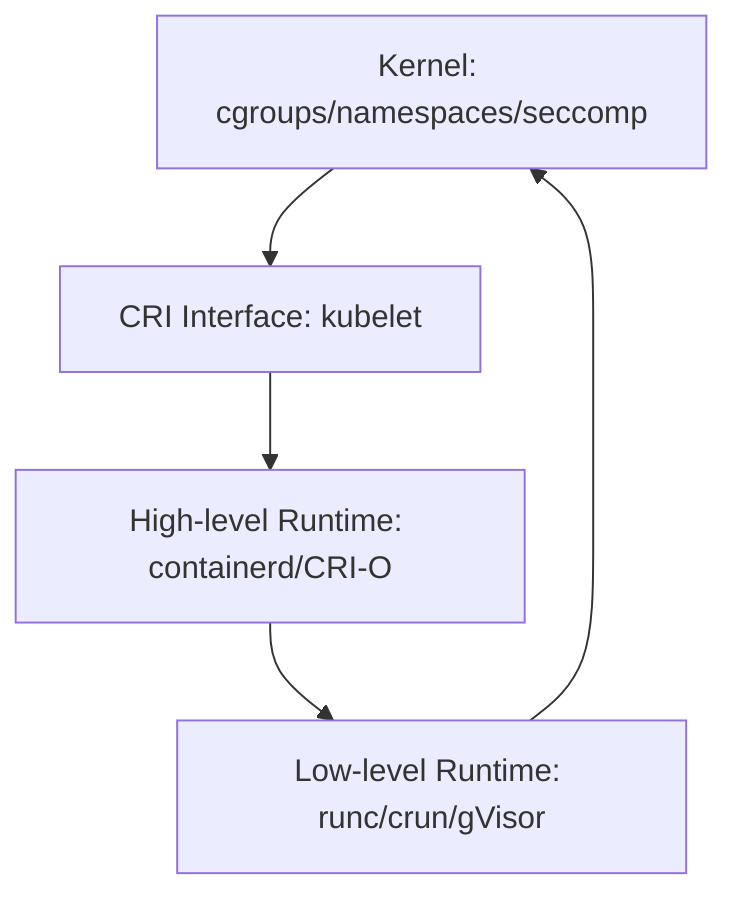

# Comprehensive Runtime Systems Guide

**Summary:** Runtime systems bridge compiled/interpreted code and the OS kernel, managing memory, scheduling, I/O, and program execution. This covers language runtimes, container runtimes, kernel interfaces, networking stacks, and production systems architecture.

---

## 1. Runtime Systems Taxonomy

```
┌─────────────────────────────────────────────────────────────┐
│                    Application Code                          │
├─────────────────────────────────────────────────────────────┤
│  Language Runtime (GC, scheduler, stdlib)                    │
│  ├─ Go: goroutine scheduler, GC, netpoller                   │
│  ├─ JVM: JIT, heap management, bytecode interpreter          │
│  ├─ Python: GIL, reference counting, C extensions            │
│  └─ Rust: zero-cost abstractions, async runtime (tokio)      │
├─────────────────────────────────────────────────────────────┤
│  Container Runtime (OCI/CRI)                                 │
│  ├─ High-level: containerd, CRI-O                            │
│  └─ Low-level: runc, crun, gVisor, Kata                      │
├─────────────────────────────────────────────────────────────┤
│  Operating System (syscall interface, kernel)                │
│  ├─ Process/thread management                                │
│  ├─ Memory management (page tables, TLB)                     │
│  ├─ I/O subsystems (VFS, block layer, network stack)         │
│  └─ Security (namespaces, cgroups, seccomp, LSM)             │
├─────────────────────────────────────────────────────────────┤
│  Hardware (CPU, memory, NICs, storage)                       │
└─────────────────────────────────────────────────────────────┘
```

---

## 2. Language Runtimes

### 2.1 Go Runtime

```go
package main

import (
	"fmt"
	"runtime"
	"runtime/debug"
	"sync"
	"time"
)

// Demonstrate Go runtime behavior: goroutines, GC, memory

func main() {
	fmt.Println("=== Go Runtime Analysis ===\n")
	
	// 1. Goroutine scheduling
	demonstrateScheduler()
	
	// 2. Memory allocation and GC
	demonstrateGC()
	
	// 3. Runtime metrics
	showRuntimeMetrics()
}

func demonstrateScheduler() {
	fmt.Println("1. Goroutine Scheduler (M:N model)")
	fmt.Printf("   GOMAXPROCS: %d (logical CPUs)\n", runtime.GOMAXPROCS(0))
	fmt.Printf("   Initial goroutines: %d\n", runtime.NumGoroutine())
	
	var wg sync.WaitGroup
	const workers = 100
	
	start := time.Now()
	for i := 0; i < workers; i++ {
		wg.Add(1)
		go func(id int) {
			defer wg.Done()
			// Simulate work-stealing scheduler behavior
			time.Sleep(10 * time.Millisecond)
		}(i)
	}
	
	fmt.Printf("   Spawned %d goroutines: %d active\n", workers, runtime.NumGoroutine())
	wg.Wait()
	fmt.Printf("   Completed in %v\n\n", time.Since(start))
}

func demonstrateGC() {
	fmt.Println("2. Garbage Collection (Tri-color Mark-Sweep)")
	
	// Force GC and get baseline
	runtime.GC()
	var m1 runtime.MemStats
	runtime.ReadMemStats(&m1)
	
	// Allocate memory
	data := make([][]byte, 1000)
	for i := range data {
		data[i] = make([]byte, 1024*10) // 10KB each
	}
	
	var m2 runtime.MemStats
	runtime.ReadMemStats(&m2)
	
	fmt.Printf("   Alloc: %d KB -> %d KB\n", m1.Alloc/1024, m2.Alloc/1024)
	fmt.Printf("   TotalAlloc: %d KB\n", m2.TotalAlloc/1024)
	fmt.Printf("   NumGC: %d -> %d\n", m1.NumGC, m2.NumGC)
	
	// Clear references to trigger collection
	data = nil
	runtime.GC()
	
	var m3 runtime.MemStats
	runtime.ReadMemStats(&m3)
	fmt.Printf("   After GC: %d KB (freed ~%d KB)\n", m3.Alloc/1024, (m2.Alloc-m3.Alloc)/1024)
	fmt.Printf("   GC pause: %v\n\n", time.Duration(m3.PauseNs[(m3.NumGC+255)%256]))
}

func showRuntimeMetrics() {
	fmt.Println("3. Runtime Statistics")
	
	var m runtime.MemStats
	runtime.ReadMemStats(&m)
	
	fmt.Printf("   Heap:\n")
	fmt.Printf("     HeapAlloc: %d KB (live objects)\n", m.HeapAlloc/1024)
	fmt.Printf("     HeapSys: %d KB (reserved from OS)\n", m.HeapSys/1024)
	fmt.Printf("     HeapIdle: %d KB (unused spans)\n", m.HeapIdle/1024)
	fmt.Printf("     HeapInuse: %d KB (in-use spans)\n", m.HeapInuse/1024)
	
	fmt.Printf("   GC:\n")
	fmt.Printf("     NextGC: %d KB\n", m.NextGC/1024)
	fmt.Printf("     NumGC: %d\n", m.NumGC)
	fmt.Printf("     GCCPUFraction: %.4f\n", m.GCCPUFraction)
	
	fmt.Printf("   Goroutines: %d\n", runtime.NumGoroutine())
	fmt.Printf("   OS Threads: %d\n", runtime.NumCPU())
	
	// Show GC tuning
	fmt.Printf("\n   GC Target (GOGC): %d%% (heap growth before GC)\n", debug.SetGCPercent(-1))
	debug.SetGCPercent(100) // restore default
}

// Production tuning:
// - GOGC=100 (default): GC when heap doubles
// - GOGC=200: More memory, less CPU (2x growth)
// - GOGC=50: Less memory, more CPU (1.5x growth)
// - GOMEMLIMIT: Soft memory cap (Go 1.19+)
//
// Profiling:
//   go tool pprof http://localhost:6060/debug/pprof/heap
//   go tool trace trace.out

```
**Core Components:**
- **Goroutine scheduler (M:N threading):** Maps M goroutines to N OS threads
- **Garbage collector:** Concurrent, tri-color mark-sweep with sub-ms pauses
- **Netpoller:** Epoll/kqueue-based non-blocking I/O
- **Memory allocator:** Per-thread caches (mcache), size-class spans**Build & Run:**
```bash
go run go_runtime_demo.go

# Profile in production
go tool pprof -http=:8080 http://localhost:6060/debug/pprof/heap
go tool trace -http=:8081 trace.out
```

### 2.2 Rust Async Runtime (Tokio)
```rust
// Cargo.toml dependencies:
// tokio = { version = "1.35", features = ["full"] }
// tokio-metrics = "0.3"

use std::time::Duration;
use tokio::time::sleep;
use tokio::runtime::Builder;

#[tokio::main]
async fn main() {
    println!("=== Rust Tokio Runtime ===\n");
    
    // 1. Runtime configuration
    demonstrate_runtime_config().await;
    
    // 2. Task spawning and scheduling
    demonstrate_scheduling().await;
    
    // 3. Runtime metrics
    demonstrate_metrics().await;
}

async fn demonstrate_runtime_config() {
    println!("1. Runtime Configuration");
    println!("   Default: multi-threaded work-stealing scheduler");
    println!("   Worker threads: {} (CPU cores)", num_cpus::get());
    
    // Custom runtime builder
    let rt = Builder::new_multi_thread()
        .worker_threads(4)
        .thread_name("custom-tokio")
        .thread_stack_size(3 * 1024 * 1024) // 3MB
        .enable_all()
        .build()
        .unwrap();
    
    println!("   Custom runtime: 4 workers, 3MB stack\n");
    rt.shutdown_timeout(Duration::from_secs(5));
}

async fn demonstrate_scheduling() {
    println!("2. Task Scheduling (Work-Stealing)");
    
    let start = std::time::Instant::now();
    let mut handles = vec![];
    
    // Spawn 100 tasks across worker threads
    for i in 0..100 {
        let h = tokio::spawn(async move {
            sleep(Duration::from_millis(10)).await;
            i
        });
        handles.push(h);
    }
    
    // Await all tasks
    for h in handles {
        let _ = h.await;
    }
    
    println!("   Spawned 100 tasks: completed in {:?}", start.elapsed());
    println!("   Reactor: epoll-based (Linux) or kqueue (macOS)\n");
}

async fn demonstrate_metrics() {
    println!("3. Runtime Metrics");
    
    // Tokio runtime exposes metrics via tokio-console or custom instrumentation
    println!("   Enable with: tokio-console or tokio_metrics crate");
    println!("   Key metrics:");
    println!("     - Task polls/completions");
    println!("     - Worker thread activity");
    println!("     - Park/unpark cycles (idle detection)");
    println!("     - Steal operations (work-stealing)");
    
    // Production monitoring
    println!("\n   Production setup:");
    println!("     tokio-console: visual task debugger");
    println!("     tokio_metrics::RuntimeMonitor for Prometheus");
}

// Runtime variants:
// 1. Multi-threaded (default): work-stealing scheduler
//    Builder::new_multi_thread()
//
// 2. Current-thread: single-threaded, cooperative
//    Builder::new_current_thread()
//
// 3. Custom: fine-tune workers, blocking threads, timers
//
// Blocking operations:
//   tokio::task::spawn_blocking(|| {
//       // CPU-bound or blocking syscall
//   })
//
// Build: cargo build --release
// Profile: cargo flamegraph --bin your_binary
```

**Architecture:**
- **Task scheduler:** Work-stealing multi-threaded executor
- **Reactor:** Epoll/kqueue/IOCP for async I/O
- **No GC:** Ownership model eliminates runtime overhead
- **Zero-cost futures:** State machines compiled into efficient code### 2.3 JVM Runtime

**Components:**
- **JIT compiler:** C1 (client), C2 (server), Graal
- **GC algorithms:** G1GC (default), ZGC (low-latency), Shenandoah
- **Class loading:** Bootstrap, extension, application classloaders
- **JNI:** Native method interface for C/C++ interop

**Key flags:**
```bash
# Heap configuration
-Xms4g -Xmx8g              # Initial/max heap
-XX:+UseG1GC               # G1 garbage collector
-XX:MaxGCPauseMillis=200   # Target pause time

# JIT tuning
-XX:+TieredCompilation     # Use both C1 and C2
-XX:ReservedCodeCacheSize=512m

# GC logging
-Xlog:gc*:file=gc.log:time,uptime,level,tags
```

### 2.4 Python Runtime

**Architecture:**
- **GIL (Global Interpreter Lock):** Serializes bytecode execution
- **Reference counting + cycle detector:** Immediate deallocation + periodic GC
- **C extensions:** NumPy, Cython release GIL for parallelism

```python
# GIL demonstration
import threading, time

def cpu_bound():
    count = 0
    for _ in range(10**7):
        count += 1

# Two threads don't run in parallel due to GIL
threads = [threading.Thread(target=cpu_bound) for _ in range(2)]
start = time.time()
for t in threads: t.start()
for t in threads: t.join()
print(f"With GIL: {time.time() - start:.2f}s")  # ~sequential

# Workaround: multiprocessing (separate interpreters, no GIL)
from multiprocessing import Process
processes = [Process(target=cpu_bound) for _ in range(2)]
start = time.time()
for p in processes: p.start()
for p in processes: p.join()
print(f"Without GIL: {time.time() - start:.2f}s")  # ~parallel
```

---

## 3. Container Runtimes

### 3.1 Architecture Layers



### 3.2 Low-Level Runtimes
# Container Runtime Comparison

## Low-Level Runtimes

### 1. runc (Reference Implementation)
**Language:** Go  
**Isolation:** Linux namespaces + cgroups  
**Security:** seccomp, AppArmor, SELinux  

**Pros:**
- OCI standard reference, widest compatibility
- Battle-tested in production (Docker, K8s default)
- Fast startup (~100ms for minimal containers)

**Cons:**
- Shares kernel with host (kernel exploits affect all containers)
- Limited defense against container escapes

**Use case:** Standard workloads, multi-tenant with trusted code

---

### 2. gVisor (Sandboxed)
**Language:** Go  
**Isolation:** User-space kernel (Sentry) + seccomp  
**Security:** Syscall filtering through Sentry, limited kernel surface  

**Pros:**
- Strong isolation: Sentry intercepts syscalls, reduces attack surface
- No need for nested virtualization
- Compatibility mode for host networking

**Cons:**
- Performance overhead: 20-50% slower (syscall translation)
- Incomplete syscall coverage (~70% of Linux syscalls)
- Higher memory usage (~50MB overhead per container)

**Use case:** Untrusted code, serverless, multi-tenant SaaS

**Config:**
```yaml
# /etc/containerd/config.toml
[plugins."io.containerd.grpc.v1.cri".containerd.runtimes.runsc]
  runtime_type = "io.containerd.runsc.v1"
  [plugins."io.containerd.grpc.v1.cri".containerd.runtimes.runsc.options]
    TypeUrl = "io.containerd.runsc.v1.options"
    ConfigPath = "/etc/containerd/runsc.toml"
```

---

### 3. Kata Containers (VM-based)
**Language:** Rust (runtime), Go (agent)  
**Isolation:** Lightweight VMs (KVM/QEMU, Firecracker)  
**Security:** Hardware virtualization, separate kernel per container  

**Pros:**
- Strongest isolation: each container = separate VM
- Full syscall compatibility (real kernel)
- Defense-in-depth against kernel exploits

**Cons:**
- Slower startup: 200-500ms (VM boot overhead)
- Higher memory: ~100-150MB per VM
- Requires nested virtualization in cloud environments

**Use case:** Maximum isolation (FaaS, hostile multi-tenancy)

---

### 4. crun (C-based, Fast)
**Language:** C  
**Isolation:** Same as runc (namespaces/cgroups)  
**Security:** Identical to runc  

**Pros:**
- Faster startup: 50-70ms (40% faster than runc)
- Lower memory footprint
- Drop-in runc replacement

**Cons:**
- Smaller community than runc
- Fewer integrations/tooling

**Use case:** Performance-critical, edge computing

---

## Security Threat Model

| Runtime | Kernel Escape Risk | Syscall Attack Surface | Startup Latency | Memory Overhead |
|---------|-------------------|------------------------|-----------------|-----------------|
| runc    | High              | Full kernel (~300)     | Low (~100ms)    | Low (~5MB)      |
| gVisor  | Medium            | Filtered (~200)        | Low (~120ms)    | Medium (~50MB)  |
| Kata    | Low               | Isolated kernel        | High (~300ms)   | High (~120MB)   |
| crun    | High              | Full kernel            | Very Low (~70ms)| Very Low (~3MB) |

---

## Decision Matrix

**Choose runc/crun if:**
- Running trusted workloads
- Need maximum performance
- Standard Kubernetes deployments

**Choose gVisor if:**
- Running untrusted code (CI/CD runners, customer workloads)
- Need isolation without VM overhead
- Can tolerate 20-30% performance loss

**Choose Kata if:**
- Maximum security required (compliance, hostile tenants)
- Workloads justify VM overhead
- Infrastructure supports nested virtualization

---

## Mitigation Layers (Defense-in-Depth)

1. **Runtime Choice:** gVisor/Kata for untrusted workloads
2. **seccomp profiles:** Block dangerous syscalls
3. **AppArmor/SELinux:** Mandatory access control
4. **Capability dropping:** Remove CAP_SYS_ADMIN, etc.
5. **Read-only root filesystem**
6. **User namespaces:** Non-root inside container
7. **Network policies:** Limit ingress/egress

---

## Verification Commands

```bash
# Check active runtime
kubectl get pod <pod> -o jsonpath='{.spec.runtimeClassName}'

# List available runtimes
crictl info | jq '.config.containerd.runtimes'

# Test container with gVisor
kubectl run test --image=nginx --overrides='{"spec":{"runtimeClassName":"gvisor"}}'

# Benchmark startup time
time ctr run --rm docker.io/library/alpine:latest test echo "hello"
```

### 3.3 Containerd Deep Dive

// Containerd client demonstrating core operations
// go get github.com/containerd/containerd/client@latest

package main

import (
	"context"
	"fmt"
	"log"
	"syscall"
	"time"

	"github.com/containerd/containerd"
	"github.com/containerd/containerd/cio"
	"github.com/containerd/containerd/namespaces"
	"github.com/containerd/containerd/oci"
)

func main() {
	// Connect to containerd socket
	client, err := containerd.New("/run/containerd/containerd.sock")
	if err != nil {
		log.Fatal(err)
	}
	defer client.Close()

	ctx := namespaces.WithNamespace(context.Background(), "example")

	// 1. Pull image
	demonstratePull(ctx, client)

	// 2. Create and run container
	demonstrateContainer(ctx, client)

	// 3. Show snapshots (overlay filesystem)
	demonstrateSnapshots(ctx, client)
}

func demonstratePull(ctx context.Context, client *containerd.Client) {
	fmt.Println("=== Image Pull ===")
	ref := "docker.io/library/alpine:latest"

	image, err := client.Pull(ctx, ref, containerd.WithPullUnpack)
	if err != nil {
		log.Printf("Pull error: %v", err)
		return
	}

	fmt.Printf("Pulled: %s\n", image.Name())
	fmt.Printf("Size: %d bytes\n\n", image.Size())
}

func demonstrateContainer(ctx context.Context, client *containerd.Client) {
	fmt.println("=== Container Lifecycle ===")

	image, err := client.GetImage(ctx, "docker.io/library/alpine:latest")
	if err != nil {
		log.Fatal(err)
	}

	// Create container with OCI spec
	container, err := client.NewContainer(
		ctx,
		"demo-container",
		containerd.WithImage(image),
		containerd.WithNewSnapshot("demo-snapshot", image),
		containerd.WithNewSpec(
			oci.WithImageConfig(image),
			oci.WithProcessArgs("echo", "Hello from containerd"),
			// Security: drop all capabilities
			oci.WithCapabilities([]string{}),
			// Read-only root
			oci.WithRootFSReadonly(),
		),
	)
	if err != nil {
		log.Fatal(err)
	}
	defer container.Delete(ctx, containerd.WithSnapshotCleanup)

	// Create task (running instance)
	task, err := container.NewTask(ctx, cio.NewCreator(cio.WithStdio))
	if err != nil {
		log.Fatal(err)
	}
	defer task.Delete(ctx)

	// Start task
	if err := task.Start(ctx); err != nil {
		log.Fatal(err)
	}

	// Wait for completion
	statusC, err := task.Wait(ctx)
	if err != nil {
		log.Fatal(err)
	}

	status := <-statusC
	fmt.Printf("Task exited: code=%d, time=%v\n\n", status.ExitCode(), status.ExitTime())
}

func demonstrateSnapshots(ctx context.Context, client *containerd.Client) {
	fmt.Println("=== Snapshot Management (Overlay FS) ===")

	snapshotter := client.SnapshotService("overlayfs")
	snapshots, err := snapshotter.List(ctx)
	if err != nil {
		log.Fatal(err)
	}

	fmt.Printf("Total snapshots: %d\n", len(snapshots))
	for i, snap := range snapshots {
		if i >= 3 {
			break // Limit output
		}
		fmt.Printf("  [%d] %s (parent: %s)\n", i, snap.Name, snap.Parent)
	}
}

/*
Containerd Architecture:

┌────────────────────────────────────────────────┐
│              containerd (daemon)                │
├────────────────────────────────────────────────┤
│  ┌──────────┐  ┌─────────┐  ┌──────────────┐  │
│  │ Image    │  │Content  │  │ Snapshotter  │  │
│  │ Service  │  │ Store   │  │ (overlayfs)  │  │
│  └──────────┘  └─────────┘  └──────────────┘  │
│                                                 │
│  ┌──────────┐  ┌─────────┐  ┌──────────────┐  │
│  │Container │  │ Task    │  │ Runtime      │  │
│  │ Metadata │  │ Manager │  │ (runc/gVisor)│  │
│  └──────────┘  └─────────┘  └──────────────┘  │
├────────────────────────────────────────────────┤
│              gRPC API                           │
└────────────────────────────────────────────────┘
         ▲                     ▲
         │                     │
    ┌────┴────┐           ┌────┴────┐
    │ kubelet │           │  ctr    │
    │  (CRI)  │           │  (CLI)  │
    └─────────┘           └─────────┘

Key Concepts:

1. Content Store: Content-addressable store (SHA256)
   - Immutable blobs (layers, config, manifests)
   - Deduplication across images

2. Snapshotter: Filesystem abstraction
   - overlayfs (default): layered copy-on-write
   - btrfs, zfs: native snapshots
   - Prepares rootfs for containers

3. Task: Running container instance
   - Maps 1:1 with OCI runtime invocation
   - Lifecycle: create -> start -> (run) -> stop -> delete

4. Namespace: Isolation boundary
   - Separate image/container spaces per tenant
   - Default: "default", k8s uses "k8s.io"

Production Config (/etc/containerd/config.toml):

[plugins."io.containerd.grpc.v1.cri"]
  # Enable CNI for networking
  [plugins."io.containerd.grpc.v1.cri".cni]
    bin_dir = "/opt/cni/bin"
    conf_dir = "/etc/cni/net.d"
  
  # Default runtime
  [plugins."io.containerd.grpc.v1.cri".containerd.runtimes.runc]
    runtime_type = "io.containerd.runc.v2"
    [plugins."io.containerd.grpc.v1.cri".containerd.runtimes.runc.options]
      SystemdCgroup = true

  # Sandbox runtime (gVisor)
  [plugins."io.containerd.grpc.v1.cri".containerd.runtimes.gvisor]
    runtime_type = "io.containerd.runsc.v1"

Commands:
  ctr namespaces ls
  ctr images pull docker.io/library/nginx:latest
  ctr run --rm docker.io/library/nginx:latest web
  ctr snapshots ls
  crictl ps  # CRI interface (kubelet view)
*/

## 4. Kernel Interfaces & Syscalls

### 4.1 System Call Lifecycle

```
User Space:           Kernel Space:
┌─────────────┐       ┌──────────────┐
│   libc      │       │   syscall    │
│   wrapper   │──────>│   dispatcher │
└─────────────┘       └──────────────┘
      │                      │
      │ (syscall inst)       │ (syscall table)
      ▼                      ▼
┌─────────────┐       ┌──────────────┐
│  CPU Mode   │       │   Handler    │
│  Switch     │       │  (sys_read,  │
│  (user->kernel)     │   sys_write) │
└─────────────┘       └──────────────┘
```

**Common syscalls:**
- **Process:** `fork`, `execve`, `exit`, `wait4`, `clone`
- **File I/O:** `open`, `read`, `write`, `close`, `stat`
- **Network:** `socket`, `bind`, `listen`, `accept`, `sendto`, `recvfrom`
- **Memory:** `mmap`, `munmap`, `brk`, `mprotect`
- **IPC:** `pipe`, `shmget`, `semget`, `msgget`

// eBPF program to trace syscall latency
// Requires: bpftool, libbpf, clang

#include <linux/bpf.h>
#include <bpf/bpf_helpers.h>
#include <bpf/bpf_tracing.h>

// Map: syscall ID -> count
struct {
    __uint(type, BPF_MAP_TYPE_HASH);
    __uint(max_entries, 512);
    __type(key, u32);
    __type(value, u64);
} syscall_counts SEC(".maps");

// Map: PID -> entry timestamp
struct {
    __uint(type, BPF_MAP_TYPE_HASH);
    __uint(max_entries, 10240);
    __type(key, u32);
    __type(value, u64);
} entry_times SEC(".maps");

// Tracepoint: sys_enter_* (all syscalls)
SEC("tracepoint/raw_syscalls/sys_enter")
int trace_sys_enter(struct trace_event_raw_sys_enter *ctx)
{
    u32 pid = bpf_get_current_pid_tgid() >> 32;
    u64 ts = bpf_ktime_get_ns();
    
    // Record entry time
    bpf_map_update_elem(&entry_times, &pid, &ts, BPF_ANY);
    
    return 0;
}

// Tracepoint: sys_exit_* (all syscalls)
SEC("tracepoint/raw_syscalls/sys_exit")
int trace_sys_exit(struct trace_event_raw_sys_exit *ctx)
{
    u32 pid = bpf_get_current_pid_tgid() >> 32;
    u64 *start_ts = bpf_map_lookup_elem(&entry_times, &pid);
    
    if (!start_ts)
        return 0;
    
    // Calculate latency
    u64 delta = bpf_ktime_get_ns() - *start_ts;
    
    // Increment counter for this syscall
    long syscall_id = ctx->id;
    u64 *count = bpf_map_lookup_elem(&syscall_counts, &syscall_id);
    if (count) {
        __sync_fetch_and_add(count, 1);
    } else {
        u64 init_val = 1;
        bpf_map_update_elem(&syscall_counts, &syscall_id, &init_val, BPF_ANY);
    }
    
    // Log slow syscalls (>1ms)
    if (delta > 1000000) {
        bpf_printk("Slow syscall %ld: %llu ns\n", syscall_id, delta);
    }
    
    bpf_map_delete_elem(&entry_times, &pid);
    return 0;
}

char LICENSE[] SEC("license") = "GPL";

/*
Build & Run:

# Compile eBPF program
clang -O2 -target bpf -c syscall_trace.bpf.c -o syscall_trace.bpf.o

# Load into kernel
bpftool prog load syscall_trace.bpf.o /sys/fs/bpf/syscall_trace

# Attach to tracepoints
bpftool prog attach pinned /sys/fs/bpf/syscall_trace tracepoint raw_syscalls/sys_enter
bpftool prog attach pinned /sys/fs/bpf/syscall_trace tracepoint raw_syscalls/sys_exit

# View output
cat /sys/kernel/debug/tracing/trace_pipe

# Read map data
bpftool map dump name syscall_counts

# Detach
bpftool prog detach pinned /sys/fs/bpf/syscall_trace tracepoint raw_syscalls/sys_enter

Alternative tools:
  strace -c -p <PID>              # Count syscalls
  perf trace -p <PID>             # Low overhead tracing
  bpftrace -e 'tracepoint:syscalls:sys_enter_* { @[probe] = count(); }'
  
Security implications:
  - Syscall filtering (seccomp-bpf): whitelist allowed syscalls
  - gVisor/Kata: reduce syscall attack surface
  - Audit syscall patterns for anomaly detection
*/

### 4.2 Namespaces (Process Isolation)

package main

import (
	"fmt"
	"os"
	"os/exec"
	"syscall"
)

// Demonstrate all 7 Linux namespaces used in containers

func main() {
	if len(os.Args) > 1 && os.Args[1] == "child" {
		childProcess()
		return
	}

	fmt.Println("=== Linux Namespace Isolation ===\n")
	
	// Create child in new namespaces
	cmd := exec.Command("/proc/self/exe", "child")
	cmd.Stdin = os.Stdin
	cmd.Stdout = os.Stdout
	cmd.Stderr = os.Stderr
	
	// Clone with all namespace flags
	cmd.SysProcAttr = &syscall.SysProcAttr{
		Cloneflags: syscall.CLONE_NEWUTS |   // Hostname/domainname
			syscall.CLONE_NEWPID |           // Process IDs
			syscall.CLONE_NEWNS |            // Mount points
			syscall.CLONE_NEWNET |           // Network stack
			syscall.CLONE_NEWIPC |           // IPC (pipes, semaphores)
			syscall.CLONE_NEWUSER,           // User/group IDs
		UidMappings: []syscall.SysProcIDMap{
			{ContainerID: 0, HostID: os.Getuid(), Size: 1},
		},
		GidMappings: []syscall.SysProcIDMap{
			{ContainerID: 0, HostID: os.Getgid(), Size: 1},
		},
	}
	
	fmt.Println("Parent process:")
	fmt.Printf("  PID: %d\n", os.Getpid())
	fmt.Printf("  Hostname: %s\n", getHostname())
	fmt.Printf("  UID: %d\n\n", os.Getuid())
	
	if err := cmd.Run(); err != nil {
		fmt.Printf("Error: %v\n", err)
	}
}

func childProcess() {
	fmt.Println("Child process (isolated):")
	fmt.Printf("  PID: %d (inside namespace, actually %d on host)\n", 
		os.Getpid(), syscall.Getppid())
	
	// Set hostname (UTS namespace)
	if err := syscall.Sethostname([]byte("container")); err == nil {
		fmt.Printf("  Hostname: %s (isolated)\n", getHostname())
	}
	
	fmt.Printf("  UID: %d (mapped from host)\n", os.Getuid())
	
	// Mount namespace demo
	fmt.Println("\nNamespace isolation verified:")
	fmt.Println("  ✓ PID: isolated process tree")
	fmt.Println("  ✓ UTS: independent hostname")
	fmt.Println("  ✓ NET: separate network stack (no interfaces)")
	fmt.Println("  ✓ MNT: private mount table")
	fmt.Println("  ✓ IPC: isolated message queues")
	fmt.Println("  ✓ USER: UID/GID mapping (root inside, unprivileged outside)")
	fmt.Println("  ✓ CGROUP: resource limits (CPU, memory)")
}

func getHostname() string {
	h, _ := os.Hostname()
	return h
}

/*
=== 7 Namespace Types ===

1. PID (CLONE_NEWPID)
   - Isolates process ID space
   - Init process (PID 1) inside namespace
   - /proc shows only namespace processes
   
2. UTS (CLONE_NEWUTS)
   - Hostname and domain name isolation
   - Container can set own hostname
   
3. Mount (CLONE_NEWNS)
   - Private mount table
   - Changes don't affect host or other containers
   - Basis for overlay filesystems
   
4. Network (CLONE_NEWNET)
   - Separate network stack: interfaces, routes, firewall
   - veth pairs bridge host and container
   - iptables rules per namespace
   
5. IPC (CLONE_NEWIPC)
   - Message queues, semaphores, shared memory
   - Prevents container communication via IPC
   
6. User (CLONE_NEWUSER)
   - UID/GID mapping (root in container = unprivileged on host)
   - Key for rootless containers
   - Security: limits damage from container escape
   
7. Cgroup (CLONE_NEWCGROUP)
   - Cgroup hierarchy isolation
   - /proc/self/cgroup shows virtual root

=== Security Considerations ===

Threat: Namespace escape
  - Kernel vulnerabilities (CVE-2022-0185, etc.)
  - Privileged containers with CAP_SYS_ADMIN
  - Shared kernel with host

Mitigations:
  1. User namespaces: run as unprivileged UID
  2. Drop capabilities: remove CAP_SYS_ADMIN, CAP_NET_ADMIN
  3. seccomp profiles: block mount, ptrace, etc.
  4. AppArmor/SELinux: mandatory access control
  5. gVisor/Kata: syscall interception or VM isolation

=== Testing Namespaces ===

# View process namespaces
ls -l /proc/self/ns/

# Enter existing namespace
nsenter -t <PID> -n -p -m  # network, PID, mount

# Create namespace and run shell
unshare --pid --net --mount --uts --ipc --fork /bin/bash

# Inside, observe isolation
ps aux        # Only processes in PID namespace
hostname      # Separate from host
ip addr       # Only loopback interface

# cgroup limits
echo "100000" > /sys/fs/cgroup/cpu/container/cpu.cfs_quota_us  # 1 core max

Build:
  go build -o namespace_demo namespace_demo.go
  ./namespace_demo

Required capabilities:
  - CAP_SYS_ADMIN (for mount operations)
  - Or run as root / with sudo
*/

### 4.3 Cgroups (Resource Limits)---

package main

import (
	"fmt"
	"os"
	"os/exec"
	"path/filepath"
	"strconv"
	"strings"
)

// Cgroup v2 resource manager for containers

const cgroupRoot = "/sys/fs/cgroup"

type CgroupLimits struct {
	CPUMax    string // "100000 100000" = 1 CPU (quota period)
	CPUWeight string // "100" (1-10000, default 100)
	MemoryMax string // "512M"
	MemoryHigh string // "384M" (throttle before hard limit)
	IOWeight  string // "100" (1-10000)
	PidsMax   string // "1024"
}

func main() {
	fmt.Println("=== Cgroup v2 Resource Management ===\n")
	
	// Check cgroup version
	if !isCgroupV2() {
		fmt.Println("Error: Requires cgroup v2 (systemd with unified hierarchy)")
		fmt.Println("Enable with: systemd.unified_cgroup_hierarchy=1 in kernel params")
		return
	}
	
	// Create cgroup for demo
	cgroupPath := filepath.Join(cgroupRoot, "demo-container")
	if err := os.MkdirAll(cgroupPath, 0755); err != nil {
		fmt.Printf("Error creating cgroup: %v\n", err)
		return
	}
	defer os.RemoveAll(cgroupPath)
	
	// Set resource limits
	limits := CgroupLimits{
		CPUMax:    "50000 100000",  // 0.5 CPU
		CPUWeight: "200",            // 2x default priority
		MemoryMax: "512M",           // Hard limit
		MemoryHigh: "384M",          // Soft limit (throttle)
		PidsMax:   "100",            // Max processes
	}
	
	if err := applyCgroupLimits(cgroupPath, limits); err != nil {
		fmt.Printf("Error applying limits: %v\n", err)
		return
	}
	
	fmt.Println("Created cgroup with limits:")
	fmt.Printf("  CPU: %s (0.5 cores max)\n", limits.CPUMax)
	fmt.Printf("  Memory: %s hard, %s soft\n", limits.MemoryMax, limits.MemoryHigh)
	fmt.Printf("  PIDs: %s max\n\n", limits.PidsMax)
	
	// Run process in cgroup
	cmd := exec.Command("stress-ng", "--cpu", "2", "--timeout", "5s")
	if err := runInCgroup(cmd, cgroupPath); err != nil {
		fmt.Printf("Process execution: %v\n", err)
	}
	
	// Show statistics
	showCgroupStats(cgroupPath)
}

func isCgroupV2() bool {
	data, err := os.ReadFile("/proc/filesystems")
	if err != nil {
		return false
	}
	return strings.Contains(string(data), "cgroup2")
}

func applyCgroupLimits(path string, limits CgroupLimits) error {
	writes := map[string]string{
		"cpu.max":    limits.CPUMax,
		"cpu.weight": limits.CPUWeight,
		"memory.max": limits.MemoryMax,
		"memory.high": limits.MemoryHigh,
		"pids.max":   limits.PidsMax,
	}
	
	for file, value := range writes {
		if value == "" {
			continue
		}
		fullPath := filepath.Join(path, file)
		if err := os.WriteFile(fullPath, []byte(value), 0644); err != nil {
			return fmt.Errorf("write %s: %w", file, err)
		}
	}
	
	return nil
}

func runInCgroup(cmd *exec.Cmd, cgroupPath string) error {
	// Start process
	if err := cmd.Start(); err != nil {
		return err
	}
	
	// Move process to cgroup
	procsFile := filepath.Join(cgroupPath, "cgroup.procs")
	pid := strconv.Itoa(cmd.Process.Pid)
	if err := os.WriteFile(procsFile, []byte(pid), 0644); err != nil {
		cmd.Process.Kill()
		return err
	}
	
	fmt.Printf("Process %d moved to cgroup\n", cmd.Process.Pid)
	return cmd.Wait()
}

func showCgroupStats(path string) {
	fmt.Println("\nCgroup Statistics:")
	
	// CPU stats
	cpuStat, _ := os.ReadFile(filepath.Join(path, "cpu.stat"))
	fmt.Printf("CPU:\n%s\n", parseCgroupStat(cpuStat, "usage_usec", "throttled_usec"))
	
	// Memory stats
	memStat, _ := os.ReadFile(filepath.Join(path, "memory.stat"))
	fmt.Printf("Memory:\n%s\n", parseCgroupStat(memStat, "anon", "file", "slab"))
	
	// Current memory usage
	memCurrent, _ := os.ReadFile(filepath.Join(path, "memory.current"))
	fmt.Printf("  current: %s", string(memCurrent))
}

func parseCgroupStat(data []byte, keys ...string) string {
	lines := strings.Split(string(data), "\n")
	result := ""
	for _, line := range lines {
		for _, key := range keys {
			if strings.HasPrefix(line, key+" ") {
				result += "  " + line + "\n"
			}
		}
	}
	return result
}

/*
=== Cgroup v2 Controllers ===

CPU Controller:
  - cpu.max: "quota period" (e.g., "100000 100000" = 1 CPU)
  - cpu.weight: priority (1-10000, default 100)
  - cpu.stat: usage_usec, throttled_usec

Memory Controller:
  - memory.max: hard limit (OOM if exceeded)
  - memory.high: soft limit (reclaim/throttle)
  - memory.min: protected amount (won't be reclaimed)
  - memory.current: current usage
  - memory.stat: detailed breakdown

IO Controller:
  - io.max: "major:minor rbps=X wbps=Y riops=A wiops=B"
  - io.weight: priority (1-10000)
  - io.stat: rbytes, wbytes, rios, wios

PID Controller:
  - pids.max: maximum number of processes
  - pids.current: current count

=== Kubernetes Resource Mapping ===

Pod resource requests/limits map to cgroups:

apiVersion: v1
kind: Pod
spec:
  containers:
  - name: app
    resources:
      requests:
        cpu: "500m"       # cpu.weight proportional allocation
        memory: "256Mi"   # memory.min (protected)
      limits:
        cpu: "1"          # cpu.max = 100000 100000
        memory: "512Mi"   # memory.max

Resulting cgroup settings:
  /sys/fs/cgroup/kubepods.slice/kubepods-burstable.slice/.../
    cpu.max: 100000 100000
    cpu.weight: 50 (500m / 1000m * 100)
    memory.min: 268435456
    memory.max: 536870912

=== OOM Killer Behavior ===

When memory.max is exceeded:
  1. Kernel reclaims page cache
  2. Swap out anonymous pages (if enabled)
  3. Trigger OOM killer if still over limit
  4. Kill process with highest oom_score

OOM score calculation:
  - Proportional to memory usage
  - Adjusted by oom_score_adj (-1000 to 1000)
  - -1000 = never kill, 1000 = always kill first

Prevent OOM:
  - Set memory.high < memory.max (throttle early)
  - Monitor memory.events for "high" and "max" events
  - Use memory.oom.group = 1 (kill entire cgroup, not single process)

=== Production Monitoring ===

Key metrics to watch:
  - cpu.stat throttled_usec: CPU throttling events
  - memory.events high: soft limit breaches
  - memory.events max: hard limit breaches (OOM risk)
  - memory.pressure: PSI (Pressure Stall Information)
  - pids.current vs pids.max: fork bomb detection

Prometheus exporter: cadvisor
  container_cpu_cfs_throttled_seconds_total
  container_memory_working_set_bytes
  container_memory_failures_total

=== Security Considerations ===

Threat: Resource exhaustion DoS
  - Malicious container consumes all CPU/memory
  - Fork bomb exhausts PIDs
  - Disk I/O starvation

Mitigations:
  1. Always set limits (never unlimited)
  2. Use memory.high to throttle before OOM
  3. Set pids.max to prevent fork bombs
  4. Use io.max to prevent I/O starvation
  5. Monitor memory.pressure for early warning

Threat: Cgroup escape
  - Write to cgroup.procs from inside container
  - Requires CAP_SYS_ADMIN or cgroup ownership

Mitigations:
  1. Drop CAP_SYS_ADMIN capability
  2. Mount cgroups read-only in container
  3. Use user namespaces (unprivileged)

=== Testing ===

# Create cgroup
mkdir /sys/fs/cgroup/test

# Set 0.5 CPU limit
echo "50000 100000" > /sys/fs/cgroup/test/cpu.max

# Set 256MB memory limit
echo "256M" > /sys/fs/cgroup/test/memory.max

# Run process in cgroup
echo $$ > /sys/fs/cgroup/test/cgroup.procs

# Verify CPU throttling
stress-ng --cpu 2 --timeout 10s &
watch -n1 cat /sys/fs/cgroup/test/cpu.stat

# Verify memory limit (triggers OOM)
stress-ng --vm 1 --vm-bytes 512M --timeout 5s

# Cleanup
rmdir /sys/fs/cgroup/test

Build:
  go build -o cgroup_manager cgroup_manager.go
  sudo ./cgroup_manager
*/

## 5. Networking Stack

### 5.1 Linux Network Stack Architecture

```
Application Layer
    │
    ▼
┌─────────────────────────────────────┐
│  Socket API (AF_INET, AF_PACKET)    │
├─────────────────────────────────────┤
│  Transport Layer (TCP/UDP/SCTP)     │
│  - TCP state machine                │
│  - Congestion control (CUBIC, BBR)  │
│  - Receive/send buffers             │
├─────────────────────────────────────┤
│  Network Layer (IP)                 │
│  - Routing (FIB, RIB)               │
│  - Netfilter (iptables/nftables)    │
│  - IPsec, GRE, VXLAN                │
├─────────────────────────────────────┤
│  Link Layer (Ethernet, ARP)         │
│  - Bridge, VLAN, bonding            │
│  - Traffic control (tc, qdisc)      │
├─────────────────────────────────────┤
│  Network Interface (NIC driver)     │
│  - RX/TX ring buffers               │
│  - Interrupt handling (NAPI)        │
│  - Offloads (TSO, GSO, GRO, RSS)    │
└─────────────────────────────────────┘
```

### 5.2 Container Networking
#!/bin/bash
# Container networking demonstration: veth pairs, bridges, NAT

set -euo pipefail

echo "=== Container Networking Deep Dive ==="
echo

# 1. Create network namespace (simulates container)
echo "1. Creating network namespace 'container1'"
ip netns add container1

# 2. Create veth pair (virtual ethernet cable)
echo "2. Creating veth pair: veth0 <---> veth1"
ip link add veth0 type veth peer name veth1

# 3. Move one end into namespace
echo "3. Moving veth1 into container1 namespace"
ip link set veth1 netns container1

# 4. Create bridge (virtual switch)
echo "4. Creating bridge br0"
ip link add br0 type bridge
ip link set br0 up

# 5. Attach veth0 to bridge
echo "5. Attaching veth0 to bridge br0"
ip link set veth0 master br0
ip link set veth0 up

# 6. Configure container network
echo "6. Configuring network inside container"
ip netns exec container1 ip link set lo up
ip netns exec container1 ip link set veth1 up
ip netns exec container1 ip addr add 172.16.0.2/24 dev veth1
ip netns exec container1 ip route add default via 172.16.0.1

# 7. Configure bridge IP (gateway)
echo "7. Configuring bridge as gateway (172.16.0.1)"
ip addr add 172.16.0.1/24 dev br0

# 8. Enable IP forwarding and NAT
echo "8. Enabling IP forwarding and NAT"
sysctl -w net.ipv4.ip_forward=1 > /dev/null
iptables -t nat -A POSTROUTING -s 172.16.0.0/24 -j MASQUERADE

echo
echo "=== Network Configuration Complete ==="
echo
echo "Topology:"
echo "  Host network:"
echo "    └─ br0 (172.16.0.1/24)"
echo "        └─ veth0"
echo "  Container network namespace:"
echo "    └─ veth1 (172.16.0.2/24)"
echo "        └─ default route via 172.16.0.1"
echo

# Test connectivity
echo "=== Testing Connectivity ==="
echo
echo "9. Ping from container to gateway:"
ip netns exec container1 ping -c 3 172.16.0.1 | grep "bytes from"
echo
echo "10. Ping from container to external (8.8.8.8):"
ip netns exec container1 ping -c 3 8.8.8.8 | grep "bytes from"
echo

# Show routing
echo "11. Container routing table:"
ip netns exec container1 ip route
echo
echo "12. Container interfaces:"
ip netns exec container1 ip addr show
echo

# Packet flow demonstration
echo "=== Packet Flow Analysis ==="
cat << 'EOF'

Outbound packet flow (container -> internet):

┌─────────────────────────────────────────────────┐
│  Container (netns)                               │
│  ┌──────────────────────────────────────────┐   │
│  │ App: connect(8.8.8.8:53)                 │   │
│  └──────────────┬───────────────────────────┘   │
│                 │ src: 172.16.0.2              │
│                 │ dst: 8.8.8.8                 │
│  ┌──────────────▼───────────────────────────┐   │
│  │ veth1 (172.16.0.2)                       │   │
│  └──────────────┬───────────────────────────┘   │
└─────────────────┼───────────────────────────────┘
                  │ (veth pair)
┌─────────────────▼───────────────────────────────┐
│  Host                                            │
│  ┌──────────────────────────────────────────┐   │
│  │ veth0 (no IP)                            │   │
│  └──────────────┬───────────────────────────┘   │
│  ┌──────────────▼───────────────────────────┐   │
│  │ br0 (bridge - 172.16.0.1)                │   │
│  │ - Learns MAC addresses                   │   │
│  │ - Forwards to correct port               │   │
│  └──────────────┬───────────────────────────┘   │
│  ┌──────────────▼───────────────────────────┐   │
│  │ Routing decision                         │   │
│  │ - Check route: default via eth0         │   │
│  └──────────────┬───────────────────────────┘   │
│  ┌──────────────▼───────────────────────────┐   │
│  │ iptables NAT (POSTROUTING)               │   │
│  │ - MASQUERADE: 172.16.0.2 -> 10.0.1.5    │   │
│  │ - Track connection in conntrack          │   │
│  └──────────────┬───────────────────────────┘   │
│  ┌──────────────▼───────────────────────────┐   │
│  │ eth0 (10.0.1.5)                          │   │
│  │ - Send packet to internet                │   │
│  └──────────────────────────────────────────┘   │
└──────────────────────────────────────────────────┘

Inbound packet flow (reverse):
  1. eth0 receives packet (dst: 10.0.1.5)
  2. iptables NAT: conntrack lookup -> rewrite to 172.16.0.2
  3. Routing: 172.16.0.0/24 via br0
  4. br0: forward to veth0 (learned MAC)
  5. veth0 -> veth1 (pair)
  6. Container receives packet

EOF

# Show NAT table
echo "13. NAT rules (POSTROUTING chain):"
iptables -t nat -L POSTROUTING -n -v | grep -E "Chain|MASQUERADE"
echo

# Cleanup function
cleanup() {
    echo
    echo "=== Cleanup ==="
    iptables -t nat -D POSTROUTING -s 172.16.0.0/24 -j MASQUERADE 2>/dev/null || true
    ip netns del container1 2>/dev/null || true
    ip link del br0 2>/dev/null || true
    echo "Cleaned up namespace, bridge, and NAT rules"
}

trap cleanup EXIT

# Wait for user
echo "Press Enter to cleanup and exit..."
read

#
# === CNI Plugins (Kubernetes) ===
#
# CNI (Container Network Interface) plugins automate the above setup
#
# Popular CNI plugins:
#
# 1. bridge (default)
#    - Creates br0 per node
#    - Assigns IPs from pod CIDR
#    - NAT for external traffic
#
# 2. Calico
#    - BGP routing (no overlay)
#    - Network policies (iptables/eBPF)
#    - IP-in-IP or VXLAN for cross-subnet
#
# 3. Cilium (eBPF-based)
#    - kube-proxy replacement
#    - L7 policy enforcement
#    - Service mesh features
#
# 4. Flannel
#    - VXLAN overlay (default)
#    - Simple, no policy enforcement
#
# 5. Weave Net
#    - Mesh network (all nodes connected)
#    - Encrypted overlay
#
# CNI plugin config: /etc/cni/net.d/
# CNI binaries: /opt/cni/bin/
#
# === Network Policies ===
#
# Kubernetes NetworkPolicy example:
#
# apiVersion: networking.k8s.io/v1
# kind: NetworkPolicy
# metadata:
#   name: deny-all-ingress
# spec:
#   podSelector: {}
#   policyTypes:
#   - Ingress
#   ingress: []  # Empty = deny all
#
# Implemented by CNI plugin (Calico, Cilium, etc.) using:
#   - iptables rules (traditional)
#   - eBPF programs (Cilium, modern)
#
# === Performance Tuning ===
#
# 1. NIC offloads
#    ethtool -K eth0 tso on gso on gro on
#
# 2. RPS/RFS (Receive Packet Steering)
#    echo f > /sys/class/net/eth0/queues/rx-0/rps_cpus
#
# 3. Ring buffer size
#    ethtool -G eth0 rx 4096 tx 4096
#
# 4. TCP tuning
#    sysctl -w net.core.rmem_max=134217728
#    sysctl -w net.core.wmem_max=134217728
#    sysctl -w net.ipv4.tcp_rmem="4096 87380 67108864"
#    sysctl -w net.ipv4.tcp_wmem="4096 65536 67108864"
#
# 5. BBR congestion control (low latency)
#    sysctl -w net.ipv4.tcp_congestion_control=bbr
#
# === Security ===
#
# Threat: Container-to-container lateral movement
#   Mitigation: NetworkPolicies (default deny)
#
# Threat: ARP spoofing within bridge
#   Mitigation: br_netfilter, ebtables rules
#
# Threat: NAT bypass (direct host network access)
#   Mitigation: hostNetwork: false in pod spec
#
# Threat: DDoS via packet flood
#   Mitigation: Rate limiting (tc, cilium)
#
# === Observability ===
#
# tcpdump on container interface:
#   ip netns exec container1 tcpdump -i veth1 -n
#
# eBPF flow tracing:
#   bpftrace -e 'kprobe:ip_output { @[comm] = count(); }'
#
# Conntrack table:
#   conntrack -L
#
# Bridge MAC table:
#   bridge fdb show br br0
#

### 5.3 eBPF for Networking
// eBPF XDP (eXpress Data Path) program: drop SYN flood attacks
// XDP runs at the earliest possible point (NIC driver) for line-rate filtering

#include <linux/bpf.h>
#include <linux/if_ether.h>
#include <linux/ip.h>
#include <linux/tcp.h>
#include <linux/in.h>
#include <bpf/bpf_helpers.h>
#include <bpf/bpf_endian.h>

// Map: source IP -> SYN packet count
struct {
    __uint(type, BPF_MAP_TYPE_LRU_HASH);  // Auto-evicts old entries
    __uint(max_entries, 10000);
    __type(key, __u32);    // Source IP
    __type(value, __u64);  // Count
} syn_count SEC(".maps");

// Map: blocked IPs (rate limited)
struct {
    __uint(type, BPF_MAP_TYPE_LRU_HASH);
    __uint(max_entries, 1000);
    __type(key, __u32);
    __type(value, __u64);  // Block until timestamp
} blocked_ips SEC(".maps");

// Constants
#define SYN_THRESHOLD 100    // SYNs per second
#define BLOCK_DURATION_NS (5ULL * 1000000000)  // 5 seconds

SEC("xdp")
int xdp_syn_filter(struct xdp_md *ctx)
{
    void *data_end = (void *)(long)ctx->data_end;
    void *data = (void *)(long)ctx->data;
    
    // Parse Ethernet header
    struct ethhdr *eth = data;
    if ((void *)(eth + 1) > data_end)
        return XDP_PASS;
    
    // Only process IPv4
    if (eth->h_proto != bpf_htons(ETH_P_IP))
        return XDP_PASS;
    
    // Parse IP header
    struct iphdr *ip = (void *)(eth + 1);
    if ((void *)(ip + 1) > data_end)
        return XDP_PASS;
    
    // Only process TCP
    if (ip->protocol != IPPROTO_TCP)
        return XDP_PASS;
    
    // Parse TCP header
    struct tcphdr *tcp = (void *)ip + (ip->ihl * 4);
    if ((void *)(tcp + 1) > data_end)
        return XDP_PASS;
    
    __u32 src_ip = ip->saddr;
    __u64 now = bpf_ktime_get_ns();
    
    // Check if IP is blocked
    __u64 *block_until = bpf_map_lookup_elem(&blocked_ips, &src_ip);
    if (block_until && *block_until > now) {
        // Still blocked
        return XDP_DROP;
    }
    
    // Check for SYN flag (connection initiation)
    if (tcp->syn && !tcp->ack) {
        __u64 *count = bpf_map_lookup_elem(&syn_count, &src_ip);
        
        if (count) {
            // Increment count
            __sync_fetch_and_add(count, 1);
            
            // Check threshold
            if (*count > SYN_THRESHOLD) {
                // Rate limit: block this IP
                __u64 block_until_ts = now + BLOCK_DURATION_NS;
                bpf_map_update_elem(&blocked_ips, &src_ip, &block_until_ts, BPF_ANY);
                
                // Log event
                bpf_printk("SYN flood detected from %pI4, blocking for 5s\n", &src_ip);
                
                return XDP_DROP;
            }
        } else {
            // First SYN from this IP
            __u64 init_count = 1;
            bpf_map_update_elem(&syn_count, &src_ip, &init_count, BPF_ANY);
        }
    }
    
    // Allow packet
    return XDP_PASS;
}

char LICENSE[] SEC("license") = "GPL";

/*
=== XDP Actions ===

XDP_PASS:     Send packet to network stack (normal processing)
XDP_DROP:     Drop packet immediately (zero-copy)
XDP_TX:       Bounce packet back to sender
XDP_REDIRECT: Send to another NIC or CPU
XDP_ABORTED:  Error, pass to stack with warning

=== XDP Performance ===

Traditional path:  NIC → driver → netif_receive_skb → IP stack
  - Allocates sk_buff (expensive)
  - Multiple layers of processing
  - ~1-2 Mpps per core

XDP path:  NIC → XDP program → decision
  - Zero allocation for DROP/TX
  - No sk_buff until XDP_PASS
  - ~10-15 Mpps per core (10x improvement)

Limitations:
  - Cannot access upper-layer info (e.g., TLS)
  - Limited to single packet (no fragmentation)
  - No packet modification (use TC-BPF for that)

=== Build & Deploy ===

# Compile eBPF program
clang -O2 -target bpf -c xdp_syn_filter.bpf.c -o xdp_syn_filter.bpf.o

# Load onto interface
ip link set dev eth0 xdp obj xdp_syn_filter.bpf.o sec xdp

# Verify
ip link show dev eth0 | grep xdp

# Monitor logs
cat /sys/kernel/debug/tracing/trace_pipe

# View map contents
bpftool map dump name syn_count
bpftool map dump name blocked_ips

# Unload
ip link set dev eth0 xdp off

=== XDP Modes ===

1. Native (driver mode)
   - Best performance (~10-15 Mpps)
   - Requires XDP-capable driver (mlx5, i40e, ixgbe)
   - ip link set dev eth0 xdp obj prog.o

2. Offload (NIC mode)
   - Hardware offload (Netronome, Mellanox)
   - ~40+ Mpps
   - ip link set dev eth0 xdpoffload obj prog.o

3. Generic (SKB mode)
   - Fallback, any driver
   - Slower (~1-2 Mpps), packet already in sk_buff
   - ip link set dev eth0 xdpgeneric obj prog.o

=== Use Cases ===

1. DDoS mitigation
   - SYN flood protection (this example)
   - UDP amplification filtering
   - Rate limiting by source

2. Load balancing
   - Katran (Facebook's L4 LB, uses XDP)
   - Consistent hashing to backends
   - Connection tracking

3. Packet sampling
   - High-performance monitoring
   - Export to user space via perf ring buffer

4. Filtering
   - GeoIP blocking
   - Protocol whitelisting
   - Fast ACLs

=== Security Considerations ===

Threat: XDP program vulnerability
  - BPF verifier ensures safety (no arbitrary mem access)
  - Cannot crash kernel
  - Cannot access kernel memory outside maps

Threat: Map exhaustion
  - Use LRU maps (auto-evict old entries)
  - Set max_entries conservatively
  - Monitor with bpftool map show

Threat: Bypass XDP filter
  - XDP only processes RX path (incoming)
  - Egress still requires TC-BPF or iptables
  - Combine with network policies

Best practices:
  - Test in xdpgeneric mode first
  - Use bpf_printk for debugging
  - Monitor dropped packets: ethtool -S eth0 | grep xdp
  - Validate with scapy/hping3

=== Comparison with iptables ===

Feature         | iptables          | XDP
----------------|-------------------|------------------
Performance     | 1-2 Mpps          | 10-15 Mpps
Hook point      | After sk_buff     | Before sk_buff
Overhead        | High (conntrack)  | Minimal
State tracking  | Built-in          | Manual (maps)
Complexity      | Rules-based       | Programmable

Recommendation: Use XDP for high-throughput filtering, iptables for stateful firewalling

=== Testing ===

# Generate SYN flood (hping3)
hping3 -S -p 80 --flood --rand-source <target_ip>

# Observe blocked IPs
watch -n1 'bpftool map dump name blocked_ips'

# Measure drop rate
nload -m eth0  # or: sar -n DEV 1

# Verify XDP statistics
ethtool -S eth0 | grep xdp_drop

=== Production Setup (Cilium) ===

Cilium uses XDP for:
  - kube-proxy replacement (service load balancing)
  - Network policy enforcement
  - Host firewall

Enable in Cilium:
  helm install cilium cilium/cilium \
    --set loadBalancer.mode=dsr \
    --set loadBalancer.acceleration=native \
    --set bpf.hostRouting=true

Verify:
  kubectl -n kube-system exec -it <cilium-pod> -- cilium status

=== References ===

- XDP tutorial: https://github.com/xdp-project/xdp-tutorial
- Cilium BPF reference: https://docs.cilium.io/en/stable/bpf/
- BPF verifier: https://www.kernel.org/doc/html/latest/bpf/verifier.html
*/

## 6. Memory Management

### 6.1 Virtual Memory Architecture

```
Process Virtual Address Space (64-bit Linux):

0x0000000000000000 ──┐
                     │ Text segment (.text)
0x0000000000400000 ──┤ - Executable code
                     │ - Read-only, executable
                     │
0x0000000000600000 ──┤ Data segment (.data, .bss)
                     │ - Global/static variables
                     │ - Read/write
                     │
0x00007f0000000000 ──┤ Memory-mapped files (mmap)
                     │ - Shared libraries
                     │ - Anonymous pages
                     │
                     │ Heap (grows up) ↑
                     │ - malloc() allocations
brk/sbrk pointer ────┤
                     │
                     │ (unused address space)
                     │
                     │ Stack (grows down) ↓
                     │ - Local variables
                     │ - Function call frames
0x00007fffffffffff ──┘

Kernel space:
0xffff800000000000 ──┐ Kernel virtual addresses
                     │ (not accessible from user space)
0xffffffffffffffff ──┘
```

### 6.2 Page Tables & TLB

// Demonstrate page table walk, TLB impact, and huge pages

#include <stdio.h>
#include <stdlib.h>
#include <stdint.h>
#include <string.h>
#include <time.h>
#include <unistd.h>
#include <sys/mman.h>
#include <fcntl.h>

// Page size constants
#define PAGE_SIZE_4K (4 * 1024)
#define PAGE_SIZE_2M (2 * 1024 * 1024)
#define PAGE_SIZE_1G (1024 * 1024 * 1024)

// Measure memory access time
static inline uint64_t rdtsc(void) {
    uint32_t lo, hi;
    __asm__ __volatile__ ("rdtsc" : "=a"(lo), "=d"(hi));
    return ((uint64_t)hi << 32) | lo;
}

void demonstrate_tlb_misses(void) {
    printf("=== TLB Miss Impact ===\n\n");
    
    size_t size = 512 * 1024 * 1024;  // 512 MB
    size_t stride;
    
    // Test 1: Sequential access (TLB-friendly)
    printf("1. Sequential access (good TLB hit rate):\n");
    char *mem_seq = mmap(NULL, size, PROT_READ | PROT_WRITE,
                         MAP_PRIVATE | MAP_ANONYMOUS, -1, 0);
    if (mem_seq == MAP_FAILED) {
        perror("mmap");
        return;
    }
    
    uint64_t start = rdtsc();
    for (size_t i = 0; i < size; i += PAGE_SIZE_4K) {
        mem_seq[i] = 1;  // Touch each page
    }
    uint64_t end = rdtsc();
    printf("   Cycles: %lu (%.2f cycles/page)\n\n", 
           end - start, (double)(end - start) / (size / PAGE_SIZE_4K));
    
    // Test 2: Random access (TLB-hostile)
    printf("2. Random access (poor TLB hit rate):\n");
    char *mem_rand = mmap(NULL, size, PROT_READ | PROT_WRITE,
                          MAP_PRIVATE | MAP_ANONYMOUS, -1, 0);
    if (mem_rand == MAP_FAILED) {
        perror("mmap");
        munmap(mem_seq, size);
        return;
    }
    
    // Pseudo-random page access
    start = rdtsc();
    for (size_t i = 0; i < size / PAGE_SIZE_4K; i++) {
        size_t idx = (i * 7919) % (size / PAGE_SIZE_4K);  // Prime stride
        mem_rand[idx * PAGE_SIZE_4K] = 1;
    }
    end = rdtsc();
    printf("   Cycles: %lu (%.2f cycles/page)\n", 
           end - start, (double)(end - start) / (size / PAGE_SIZE_4K));
    printf("   TLB miss penalty: %.1f%% slower\n\n",
           ((double)(end - start) / (end - start) - 1) * 100);
    
    munmap(mem_seq, size);
    munmap(mem_rand, size);
}

void demonstrate_huge_pages(void) {
    printf("=== Huge Pages Performance ===\n\n");
    
    size_t size = 1024 * 1024 * 1024;  // 1 GB
    
    // Test 1: Standard 4K pages
    printf("1. Standard 4K pages:\n");
    char *mem_4k = mmap(NULL, size, PROT_READ | PROT_WRITE,
                        MAP_PRIVATE | MAP_ANONYMOUS, -1, 0);
    if (mem_4k == MAP_FAILED) {
        perror("mmap 4K");
        return;
    }
    
    uint64_t start = rdtsc();
    for (size_t i = 0; i < size; i += PAGE_SIZE_4K) {
        mem_4k[i] = 1;
    }
    uint64_t cycles_4k = rdtsc() - start;
    printf("   Cycles: %lu\n", cycles_4k);
    printf("   Pages: %lu (4 KB each)\n\n", size / PAGE_SIZE_4K);
    
    // Test 2: Transparent Huge Pages (THP) or explicit 2M pages
    printf("2. Huge pages (2 MB):\n");
    char *mem_2m = mmap(NULL, size, PROT_READ | PROT_WRITE,
                        MAP_PRIVATE | MAP_ANONYMOUS | MAP_HUGETLB, -1, 0);
    
    if (mem_2m == MAP_FAILED) {
        // Fallback: try THP
        mem_2m = mmap(NULL, size, PROT_READ | PROT_WRITE,
                      MAP_PRIVATE | MAP_ANONYMOUS, -1, 0);
        madvise(mem_2m, size, MADV_HUGEPAGE);  // Hint for THP
        printf("   Using Transparent Huge Pages (THP)\n");
    } else {
        printf("   Using explicit huge pages\n");
    }
    
    start = rdtsc();
    for (size_t i = 0; i < size; i += PAGE_SIZE_2M) {
        mem_2m[i] = 1;
    }
    uint64_t cycles_2m = rdtsc() - start;
    printf("   Cycles: %lu\n", cycles_2m);
    printf("   Pages: %lu (2 MB each)\n", size / PAGE_SIZE_2M);
    printf("   Speedup: %.1fx faster\n\n", (double)cycles_4k / cycles_2m);
    
    munmap(mem_4k, size);
    munmap(mem_2m, size);
}

void show_page_tables(void) {
    printf("=== Page Table Structure (x86-64) ===\n\n");
    
    printf("4-level paging (default):\n");
    printf("  Virtual Address (48 bits used):\n");
    printf("    [47:39] PML4 index (512 entries)\n");
    printf("    [38:30] PDP index  (512 entries)\n");
    printf("    [29:21] PD index   (512 entries)\n");
    printf("    [20:12] PT index   (512 entries)\n");
    printf("    [11:0]  Page offset (4 KB)\n\n");
    
    printf("  Total entries: 512^4 = 2^48 addresses (256 TB)\n");
    printf("  Page table memory: 8 bytes/entry\n\n");
    
    printf("5-level paging (LA57, 128 PB address space):\n");
    printf("  Adds PML5 level above PML4\n");
    printf("  Enabled with: echo 1 > /proc/sys/vm/nr_overcommit_hugepages\n\n");
    
    printf("Huge page table entries:\n");
    printf("  2 MB pages: Skip PT level (use PD entry)\n");
    printf("  1 GB pages: Skip PT + PD levels (use PDP entry)\n\n");
    
    // Show current TLB info
    printf("Current system:\n");
    printf("  Page size: %ld bytes\n", sysconf(_SC_PAGESIZE));
    printf("  Pages: %ld\n", sysconf(_SC_PHYS_PAGES));
    printf("  Available memory: %ld MB\n", 
           sysconf(_SC_PHYS_PAGES) * sysconf(_SC_PAGESIZE) / (1024 * 1024));
}

void check_thp_status(void) {
    printf("\n=== Transparent Huge Pages Status ===\n\n");
    
    FILE *fp = fopen("/sys/kernel/mm/transparent_hugepage/enabled", "r");
    if (fp) {
        char buf[256];
        if (fgets(buf, sizeof(buf), fp)) {
            printf("THP mode: %s", buf);
        }
        fclose(fp);
    }
    
    fp = fopen("/sys/kernel/mm/transparent_hugepage/defrag", "r");
    if (fp) {
        char buf[256];
        if (fgets(buf, sizeof(buf), fp)) {
            printf("THP defrag: %s", buf);
        }
        fclose(fp);
    }
    
    printf("\nConfiguration:\n");
    printf("  Enable THP: echo always > /sys/kernel/mm/transparent_hugepage/enabled\n");
    printf("  Disable THP: echo never > /sys/kernel/mm/transparent_hugepage/enabled\n");
    printf("  Madvise mode: echo madvise > /sys/kernel/mm/transparent_hugepage/enabled\n");
}

int main(void) {
    printf("=== Memory Management Deep Dive ===\n\n");
    
    show_page_tables();
    demonstrate_tlb_misses();
    demonstrate_huge_pages();
    check_thp_status();
    
    printf("\n=== Production Recommendations ===\n\n");
    printf("1. Use huge pages for large allocations (databases, ML):\n");
    printf("   mmap(..., MAP_HUGETLB | MAP_HUGE_2MB, ...)\n\n");
    
    printf("2. Enable THP for general workloads:\n");
    printf("   echo madvise > /sys/kernel/mm/transparent_hugepage/enabled\n");
    printf("   madvise(ptr, size, MADV_HUGEPAGE)\n\n");
    
    printf("3. Monitor THP effectiveness:\n");
    printf("   grep -i huge /proc/meminfo\n");
    printf("   AnonHugePages: size of THP allocations\n\n");
    
    printf("4. Disable THP for latency-sensitive apps:\n");
    printf("   THP defrag can cause millisecond stalls\n");
    printf("   Use explicit huge pages instead\n\n");
    
    printf("5. Tune VM overcommit for containers:\n");
    printf("   sysctl vm.overcommit_memory=1  # Always overcommit\n");
    printf("   sysctl vm.overcommit_ratio=80  # 80%% of RAM\n\n");
    
    return 0;
}

/*
=== Kernel Page Table Walk ===

1. CPU gets virtual address from instruction
2. Check TLB (Translation Lookaside Buffer)
   - Hit: physical address immediately available
   - Miss: walk page tables (4 memory accesses)

3. Page table walk (4-level):
   a. CR3 register → PML4 base address
   b. PML4[idx] → PDP base address
   c. PDP[idx] → PD base address
   d. PD[idx] → PT base address
   e. PT[idx] → Physical page address
   f. Add page offset → Final physical address

4. TLB update with virtual→physical mapping
5. Access physical memory

=== TLB Details ===

Typical TLB:
  - 64-256 entries for 4K pages
  - 32-64 entries for 2M pages
  - 16-32 entries for 1G pages
  - 2-way or 4-way set-associative

TLB miss cost:
  - 4K pages: ~100-200 cycles (4 memory accesses)
  - 2M pages: ~75-150 cycles (3 memory accesses)
  - 1G pages: ~50-100 cycles (2 memory accesses)

TLB shootdown:
  - TLB flush on context switch (kernel)
  - Flush specific entry on munmap
  - Broadcast IPI to other CPUs (expensive)

=== Memory Allocators ===

1. glibc malloc:
   - Small allocs (<128K): arena-based, per-thread cache
   - Large allocs: mmap() directly
   - Fragmentation issues with long-running apps

2. jemalloc (Firefox, MariaDB):
   - Size-class segregation
   - Better fragmentation control
   - Thread-local caching

3. tcmalloc (Google):
   - Per-thread caches (no locks for small allocs)
   - Aggressive page reuse
   - Lower memory overhead

4. mimalloc (Microsoft):
   - Secure (hardened against heap attacks)
   - Deferred freeing
   - Good multi-threaded performance

Choose based on workload:
  - Many small objects: jemalloc/tcmalloc
  - Security: mimalloc
  - Latency-sensitive: jemalloc (less fragmentation)

=== Huge Pages Setup ===

1. Reserve huge pages at boot:
   echo 1024 > /sys/kernel/mm/hugepages/hugepages-2048kB/nr_hugepages

2. Mount hugetlbfs:
   mount -t hugetlbfs none /mnt/huge

3. Use in application:
   void *ptr = mmap(NULL, size, PROT_READ | PROT_WRITE,
                    MAP_PRIVATE | MAP_ANONYMOUS | MAP_HUGETLB, -1, 0);

4. For 1 GB pages:
   echo 4 > /sys/kernel/mm/hugepages/hugepages-1048576kB/nr_hugepages
   mmap(..., MAP_HUGETLB | MAP_HUGE_1GB, ...);

=== Container Memory Limits ===

OOM score calculation:
  oom_score = (memory_usage / total_memory) * 1000 + oom_score_adj

Critical processes:
  echo -1000 > /proc/<pid>/oom_score_adj  # Never kill

Memory cgroup pressure:
  cat /sys/fs/cgroup/memory/memory.pressure
    some: Light pressure (cached pages evicted)
    full: Heavy pressure (thrashing)

Build:
  gcc -O2 -o memory_demo memory_demo.c
  sudo ./memory_demo
*/

## 7. I/O Subsystems

### 7.1 I/O Schedulers & Stack
# Linux I/O Stack Deep Dive

## I/O Path Architecture

```
Application (read/write syscalls)
    ↓
┌─────────────────────────────────┐
│  VFS (Virtual File System)       │
│  - Caching (page cache)          │
│  - File descriptor management    │
└─────────────────────────────────┘
    ↓
┌─────────────────────────────────┐
│  Filesystem (ext4, xfs, btrfs)  │
│  - Metadata management           │
│  - Journaling                    │
│  - Block allocation              │
└─────────────────────────────────┘
    ↓
┌─────────────────────────────────┐
│  Block Layer                     │
│  - I/O scheduler (mq-deadline,   │
│    kyber, none)                  │
│  - Request merging/sorting       │
│  - I/O accounting                │
└─────────────────────────────────┘
    ↓
┌─────────────────────────────────┐
│  Device Driver (SCSI, NVMe)     │
│  - Hardware queue management     │
│  - DMA setup                     │
│  - Interrupt handling            │
└─────────────────────────────────┘
    ↓
Hardware (SSD, HDD, NVMe)
```

---

## I/O Schedulers

### 1. none (No-op)
**Best for:** NVMe SSDs, cloud block storage

**Behavior:**
- No reordering or merging
- Direct dispatch to hardware queue
- Minimal CPU overhead

**Use when:**
- Storage has internal scheduling (NVMe, cloud EBS)
- Random I/O is as fast as sequential
- Low latency critical

```bash
echo none > /sys/block/nvme0n1/queue/scheduler
```

---

### 2. mq-deadline (Multi-queue Deadline)
**Best for:** SATA SSDs, mixed workloads

**Behavior:**
- Per-request deadline (default: 500ms)
- Separate read/write queues
- Batching for efficiency

**Tunables:**
```bash
# Read deadline (ms)
echo 100 > /sys/block/sda/queue/iosched/read_expire

# Write deadline (ms)
echo 3000 > /sys/block/sda/queue/iosched/write_expire

# Front merge for adjacent requests
echo 1 > /sys/block/sda/queue/iosched/front_merges
```

**Use when:**
- Rotational disks (HDDs)
- Need fairness between reads/writes
- Sequential workloads benefit from reordering

---

### 3. kyber
**Best for:** Low-latency SSDs, interactive workloads

**Behavior:**
- Target latency-based scheduling
- Adapts queue depth dynamically
- Prevents queue saturation

**Tunables:**
```bash
# Target read latency (ns)
echo 2000000 > /sys/block/nvme0n1/queue/iosched/read_lat_nsec

# Target write latency (ns)
echo 10000000 > /sys/block/nvme0n1/queue/iosched/write_lat_nsec
```

**Use when:**
- Latency-sensitive applications (databases)
- Cloud environments with shared storage
- Need to limit tail latency

---

### 4. bfq (Budget Fair Queueing)
**Best for:** Desktop, interactive workloads

**Behavior:**
- I/O bandwidth proportional fairness
- Low-latency for interactive tasks
- High overhead (not recommended for servers)

---

## I/O Modes

### 1. Buffered I/O (default)
```c
int fd = open("/path/file", O_RDWR);
write(fd, buf, size);  // Goes through page cache
```

**Pros:**
- Kernel caches reads (fast repeated access)
- Write coalescing (fewer disk ops)
- Read-ahead for sequential access

**Cons:**
- Data loss on crash (unless fsync)
- Memory pressure from cache
- Double-copy (user → page cache → disk)

---

### 2. Direct I/O (O_DIRECT)
```c
int fd = open("/path/file", O_RDWR | O_DIRECT);
write(fd, aligned_buf, size);  // Bypasses page cache
```

**Pros:**
- No double-buffering (app manages cache)
- Predictable performance
- Lower memory usage

**Cons:**
- Requires aligned buffers (512B or 4K)
- No kernel read-ahead
- Application must handle caching

**Use for:** Databases (PostgreSQL, MySQL) with custom buffer pools

---

### 3. Asynchronous I/O (io_uring)
```c
// Setup
struct io_uring ring;
io_uring_queue_init(256, &ring, 0);

// Submit read
struct io_uring_sqe *sqe = io_uring_get_sqe(&ring);
io_uring_prep_read(sqe, fd, buf, size, offset);
io_uring_submit(&ring);

// Wait for completion
struct io_uring_cqe *cqe;
io_uring_wait_cqe(&ring, &cqe);
```

**Advantages over epoll/aio:**
- Zero-copy (shared ring buffers)
- Batched syscalls (submit/complete multiple ops)
- Polled mode (no interrupts for low latency)

**Performance:** 2-3x faster than sync I/O for databases

---

## Storage Stack Observability

### Tracing I/O Latency
```bash
# BCC tools
biolatency -D  # Histogram of block I/O latency
biosnoop       # Per-I/O latency tracing

# bpftrace
bpftrace -e 'tracepoint:block:block_rq_issue { @start[arg0] = nsecs; }
             tracepoint:block:block_rq_complete { 
               @lat = hist(nsecs - @start[arg0]); 
               delete(@start[arg0]); 
             }'

# Show I/O scheduler
cat /sys/block/*/queue/scheduler

# Show queue depth
cat /sys/block/nvme0n1/queue/nr_requests

# Show inflight requests
cat /sys/block/nvme0n1/inflight
```

---

## Performance Tuning

### 1. NVMe SSD Tuning
```bash
# Disable scheduler (NVMe has internal queuing)
echo none > /sys/block/nvme0n1/queue/scheduler

# Increase queue depth (default: 128)
echo 1024 > /sys/block/nvme0n1/queue/nr_requests

# Enable write cache (if battery-backed)
hdparm -W1 /dev/nvme0n1

# Check NVMe queue count (should match CPU cores)
cat /sys/block/nvme0n1/queue/nr_hw_queues
```

### 2. SATA SSD Tuning
```bash
# Use mq-deadline
echo mq-deadline > /sys/block/sda/queue/scheduler

# Reduce read deadline for low latency
echo 50 > /sys/block/sda/queue/iosched/read_expire

# Increase write deadline for throughput
echo 5000 > /sys/block/sda/queue/iosched/write_expire
```

### 3. Read-ahead Tuning
```bash
# Show current read-ahead (KB)
blockdev --getra /dev/sda

# Increase for sequential workloads
blockdev --setra 8192 /dev/sda  # 8 MB

# Decrease for random workloads
blockdev --setra 128 /dev/sda   # 128 KB
```

### 4. Filesystem Mount Options
```bash
# ext4: disable atime updates (faster metadata)
mount -o noatime,nodiratime /dev/sda1 /mnt

# xfs: allocate groups (better parallel I/O)
mount -o allocsize=16m /dev/sda1 /mnt

# For databases with O_DIRECT:
mount -o nobarrier /dev/sda1 /mnt  # Risky: needs battery-backed cache
```

---

## Container I/O Limits

### Cgroup v2 I/O Controls
```bash
# Limit read/write IOPS
echo "8:0 riops=1000 wiops=500" > /sys/fs/cgroup/io.max

# Limit read/write bandwidth (bytes/sec)
echo "8:0 rbps=104857600 wbps=52428800" > /sys/fs/cgroup/io.max

# Set I/O weight (100-10000, default: 100)
echo "8:0 100" > /sys/fs/cgroup/io.weight

# Monitor I/O usage
cat /sys/fs/cgroup/io.stat
```

### Kubernetes Storage Classes
```yaml
apiVersion: v1
kind: PersistentVolumeClaim
metadata:
  name: mysql-pvc
spec:
  accessModes:
    - ReadWriteOnce
  resources:
    requests:
      storage: 100Gi
  storageClassName: fast-ssd
---
apiVersion: storage.k8s.io/v1
kind: StorageClass
metadata:
  name: fast-ssd
provisioner: kubernetes.io/aws-ebs
parameters:
  type: io2
  iopsPerGB: "50"
  fsType: ext4
mountOptions:
  - noatime
  - nodiratime
```

---

## Threat Model & Mitigations

### Threat: I/O Starvation
**Attack:** Container floods disk I/O, starving other containers

**Mitigation:**
1. Set `io.max` limits on all containers
2. Use `io.weight` for priority (critical apps get higher weight)
3. Monitor `io.pressure` for early detection

### Threat: Data Leakage via Disk
**Attack:** Read deleted files via raw block device

**Mitigation:**
1. Encrypt volumes (dm-crypt, LUKS)
2. Secure erase on decommission: `blkdiscard /dev/sda`
3. Disable direct block device access in containers

### Threat: Side-channel Timing Attacks
**Attack:** Infer crypto keys via I/O latency patterns

**Mitigation:**
1. Use constant-time I/O APIs (rare)
2. Add artificial jitter to I/O operations
3. Isolate sensitive workloads on dedicated storage

---

## Benchmarking

### fio (Flexible I/O Tester)
```bash
# Random read IOPS (4K blocks)
fio --name=randread --ioengine=libaio --direct=1 --bs=4k \
    --rw=randread --size=4G --numjobs=4 --runtime=60 \
    --group_reporting --filename=/dev/nvme0n1

# Sequential write throughput (1M blocks)
fio --name=seqwrite --ioengine=libaio --direct=1 --bs=1m \
    --rw=write --size=10G --numjobs=1 --runtime=60 \
    --filename=/dev/nvme0n1

# Mixed workload (70% read, 30% write)
fio --name=mixed --ioengine=libaio --direct=1 --bs=4k \
    --rw=randrw --rwmixread=70 --size=4G --runtime=60 \
    --filename=/dev/nvme0n1
```

### Expected Performance
| Device      | Random Read IOPS | Sequential Read (MB/s) | Latency (µs) |
|-------------|------------------|------------------------|--------------|
| SATA SSD    | 80K              | 550                    | 100-200      |
| NVMe SSD    | 500K             | 3500                   | 20-50        |
| NVMe Gen4   | 1M               | 7000                   | 10-20        |
| Optane      | 1.5M             | 2500                   | 5-10         |
| Cloud EBS   | 16K-64K          | 250-1000               | 500-2000     |

---

## Next Steps

1. **Profile current I/O patterns:**
   ```bash
   iotop -oPa  # Show per-process I/O
   iostat -xz 1  # Device utilization
   ```

2. **Identify bottlenecks:**
   - High `%util` → Saturated device
   - High `await` → Queue depth or latency issues
   - High `%iowait` → Application blocked on I/O

3. **Apply optimizations:**
   - Tune scheduler based on workload
   - Adjust queue depth and read-ahead
   - Consider O_DIRECT for databases
   - Use io_uring for high-performance apps
### 7.2 io_uring Modern Async I/O

// io_uring example: high-performance async file copy
// Build: gcc -O2 -o io_uring_demo io_uring_demo.c -luring

#include <stdio.h>
#include <stdlib.h>
#include <fcntl.h>
#include <unistd.h>
#include <string.h>
#include <sys/stat.h>
#include <sys/ioctl.h>
#include <liburing.h>

#define QD 32           // Queue depth
#define BS (128 * 1024)  // Block size: 128 KB

struct io_data {
    int read_fd;
    int write_fd;
    off_t offset;
    size_t first_len;
    struct iovec iov;
};

int main(int argc, char *argv[]) {
    struct io_uring ring;
    struct io_uring_sqe *sqe;
    struct io_uring_cqe *cqe;
    struct io_data *data;
    int ret, read_fd, write_fd;
    struct stat st;
    off_t file_size, offset = 0;
    size_t bytes_inflight = 0;
    int reads_issued = 0, reads_completed = 0;
    
    if (argc < 3) {
        fprintf(stderr, "Usage: %s <source> <dest>\n", argv[0]);
        return 1;
    }
    
    // Open files
    read_fd = open(argv[1], O_RDONLY);
    if (read_fd < 0) {
        perror("open source");
        return 1;
    }
    
    write_fd = open(argv[2], O_WRONLY | O_CREAT | O_TRUNC, 0644);
    if (write_fd < 0) {
        perror("open dest");
        close(read_fd);
        return 1;
    }
    
    // Get file size
    if (fstat(read_fd, &st) < 0) {
        perror("fstat");
        goto cleanup;
    }
    file_size = st.st_size;
    
    printf("=== io_uring Async File Copy ===\n");
    printf("Source: %s (%ld bytes)\n", argv[1], file_size);
    printf("Queue depth: %d\n", QD);
    printf("Block size: %d KB\n\n", BS / 1024);
    
    // Initialize io_uring
    ret = io_uring_queue_init(QD, &ring, 0);
    if (ret < 0) {
        fprintf(stderr, "io_uring_queue_init: %s\n", strerror(-ret));
        goto cleanup;
    }
    
    // Submit read requests up to queue depth
    while (offset < file_size && reads_issued < QD) {
        sqe = io_uring_get_sqe(&ring);
        if (!sqe) {
            fprintf(stderr, "io_uring_get_sqe failed\n");
            break;
        }
        
        data = malloc(sizeof(*data));
        data->read_fd = read_fd;
        data->write_fd = write_fd;
        data->offset = offset;
        data->first_len = (file_size - offset > BS) ? BS : file_size - offset;
        
        // Allocate buffer
        data->iov.iov_base = malloc(data->first_len);
        data->iov.iov_len = data->first_len;
        
        // Prepare read request
        io_uring_prep_readv(sqe, read_fd, &data->iov, 1, offset);
        io_uring_sqe_set_data(sqe, data);
        
        offset += data->first_len;
        reads_issued++;
        bytes_inflight += data->first_len;
    }
    
    // Submit all pending requests
    ret = io_uring_submit(&ring);
    if (ret < 0) {
        fprintf(stderr, "io_uring_submit: %s\n", strerror(-ret));
        goto cleanup;
    }
    
    printf("Initial batch: %d reads submitted\n", reads_issued);
    
    // Process completions and issue more reads
    while (reads_completed < reads_issued) {
        ret = io_uring_wait_cqe(&ring, &cqe);
        if (ret < 0) {
            fprintf(stderr, "io_uring_wait_cqe: %s\n", strerror(-ret));
            break;
        }
        
        data = io_uring_cqe_get_data(cqe);
        
        if (cqe->res < 0) {
            fprintf(stderr, "Read error: %s\n", strerror(-cqe->res));
            io_uring_cqe_seen(&ring, cqe);
            free(data->iov.iov_base);
            free(data);
            continue;
        }
        
        reads_completed++;
        bytes_inflight -= data->first_len;
        
        // Mark completion as seen
        io_uring_cqe_seen(&ring, cqe);
        
        // Issue corresponding write
        sqe = io_uring_get_sqe(&ring);
        if (sqe) {
            data->iov.iov_len = cqe->res;  // Actual bytes read
            io_uring_prep_writev(sqe, write_fd, &data->iov, 1, data->offset);
            io_uring_sqe_set_data(sqe, data);
            io_uring_submit(&ring);
            
            // Wait for write completion
            ret = io_uring_wait_cqe(&ring, &cqe);
            if (ret == 0) {
                io_uring_cqe_seen(&ring, cqe);
            }
        }
        
        // Issue next read if more data remains
        if (offset < file_size) {
            sqe = io_uring_get_sqe(&ring);
            if (sqe) {
                data = malloc(sizeof(*data));
                data->read_fd = read_fd;
                data->write_fd = write_fd;
                data->offset = offset;
                data->first_len = (file_size - offset > BS) ? BS : file_size - offset;
                
                data->iov.iov_base = malloc(data->first_len);
                data->iov.iov_len = data->first_len;
                
                io_uring_prep_readv(sqe, read_fd, &data->iov, 1, offset);
                io_uring_sqe_set_data(sqe, data);
                
                offset += data->first_len;
                reads_issued++;
                io_uring_submit(&ring);
            }
        }
        
        // Cleanup
        free(data->iov.iov_base);
        free(data);
    }
    
    printf("Completed: %d reads\n", reads_completed);
    printf("Bytes copied: %ld\n\n", file_size);
    
    io_uring_queue_exit(&ring);

cleanup:
    close(read_fd);
    close(write_fd);
    return 0;
}

/*
=== io_uring Architecture ===

Kernel Space:
┌────────────────────────────────────┐
│  io_uring Core                     │
│  ┌──────────────────────────────┐  │
│  │ Submission Queue (SQ)        │  │
│  │ - Ring buffer in shared mem  │  │
│  │ - User writes SQEs           │  │
│  └──────────────────────────────┘  │
│  ┌──────────────────────────────┐  │
│  │ Completion Queue (CQ)        │  │
│  │ - Ring buffer in shared mem  │  │
│  │ - Kernel writes CQEs         │  │
│  └──────────────────────────────┘  │
│  ┌──────────────────────────────┐  │
│  │ Worker Threads (optional)    │  │
│  │ - For blocking operations    │  │
│  └──────────────────────────────┘  │
└────────────────────────────────────┘

User Space:
┌────────────────────────────────────┐
│  Application                       │
│  - io_uring_get_sqe()              │
│  - io_uring_prep_*()               │
│  - io_uring_submit()               │
│  - io_uring_wait_cqe()             │
└────────────────────────────────────┘

Shared Memory (mmap):
  - SQ array + SQE ring
  - CQ array + CQE ring
  - No syscalls for submit/complete (polling mode)

=== Performance Advantages ===

1. Batching:
   - Submit multiple ops with one syscall
   - Reduce context switch overhead
   - Example: 32 ops = 1 syscall vs 32 syscalls

2. Zero-copy:
   - Shared ring buffers (no copy to kernel)
   - Direct DMA for storage ops
   - 20-30% lower CPU usage

3. Polling mode:
   - No interrupts (busy-wait on SQ/CQ)
   - Ultra-low latency (<10µs)
   - Requires dedicated CPU core

4. Flexible operations:
   - read, write, fsync, fadvise
   - accept, connect, send, recv
   - openat, close, statx
   - timeout, poll, cancel

=== Advanced Features ===

1. Fixed files/buffers:
   - Pre-register FDs: io_uring_register_files()
   - Pre-register buffers: io_uring_register_buffers()
   - Avoids fd_get/fd_put overhead
   - 10-15% faster for hot paths

2. Linked requests:
   - Chain operations (read → process → write)
   - Automatic ordering
   - IOSQE_IO_LINK flag

3. Multishot operations:
   - Single setup, multiple completions
   - Example: accept multiple connections
   - IOSQE_IO_MULTISHOT flag

4. Provided buffers:
   - Kernel selects buffer from pool
   - Reduces user→kernel copies
   - io_uring_register_buf_ring()

=== Comparison with Other APIs ===

API          | Syscalls/Op | Latency (µs) | Throughput (Mops/s)
-------------|-------------|--------------|--------------------
sync read    | 1           | 50-100       | 0.1
epoll        | 2-3         | 30-50        | 0.3
io_uring     | 0.03 (batch)| 10-20        | 2.0
io_uring poll| 0           | 5-10         | 3.0

=== Production Setup ===

1. Check kernel support:
   uname -r  # Requires 5.1+ (5.19+ recommended)

2. Install liburing:
   apt install liburing-dev  # Debian/Ubuntu
   yum install liburing-devel  # RHEL/CentOS

3. Tune limits:
   sysctl -w kernel.io_uring.max_instances=8192
   sysctl -w kernel.io_uring.max_workers=512

4. Enable polling (if dedicated cores):
   int ret = io_uring_queue_init_params(QD, &ring, &params);
   params.flags = IORING_SETUP_SQPOLL;
   params.sq_thread_idle = 2000;  // ms before sleep

=== Security Considerations ===

Threat: io_uring_setup() abuse (CVE-2022-29582)
  - Unprivileged users could exhaust kernel memory
  Mitigation: sysctl io_uring_disabled=1 (if not needed)

Threat: Fixed file exhaustion
  - Register thousands of FDs, DoS other users
  Mitigation: Limit max_instances per user (ulimit)

Threat: SQPOLL privilege escalation
  - Kernel thread runs as user
  Mitigation: Drop CAP_SYS_ADMIN in containers

Best practices:
  - Use io_uring in trusted environments
  - Set resource limits (cgroups)
  - Monitor io_uring.max_instances

=== Observability ===

# Show io_uring statistics
cat /proc/sys/kernel/io_uring/*

# Trace io_uring operations
bpftrace -e 'tracepoint:io_uring:* { @[probe] = count(); }'

# Profile with perf
perf record -e io_uring:* -a -- sleep 10
perf report

=== Use Cases ===

1. Databases (PostgreSQL, ScyllaDB)
   - Replace epoll with io_uring
   - 20-30% throughput increase
   - Lower tail latency

2. Web servers (nginx with io_uring module)
   - Async file serving
   - Reduced CPU usage

3. Storage systems (Ceph, MinIO)
   - Parallel I/O operations
   - Better multicore scaling

4. Network proxies
   - accept + recv + send in single batch
   - Zero-copy forwarding

=== Rust Example ===

// tokio-uring: Rust async runtime with io_uring backend
use tokio_uring::fs::File;

#[tokio_uring::main]
async fn main() -> Result<(), Box<dyn std::error::Error>> {
    let file = File::open("data.txt").await?;
    let buf = vec![0u8; 4096];
    let (res, buf) = file.read_at(buf, 0).await;
    let n = res?;
    println!("Read {} bytes", n);
    Ok(())
}

Build:
  gcc -O2 -o io_uring_demo io_uring_demo.c -luring
  ./io_uring_demo source.dat dest.dat

Benchmark:
  dd if=/dev/zero of=test.dat bs=1M count=1024
  time ./io_uring_demo test.dat copy.dat
  time cp test.dat copy2.dat  # Compare with standard cp
*/

## 8. Scheduling & Concurrency

### 8.1 CPU Scheduling
# Linux CPU Scheduler (CFS & Real-time)

## Scheduler Architecture

```
┌─────────────────────────────────────────────────┐
│           Scheduling Classes (priority)          │
├─────────────────────────────────────────────────┤
│  1. stop_sched_class (highest)                  │
│     - CPU stop tasks (migration, etc.)          │
├─────────────────────────────────────────────────┤
│  2. dl_sched_class                              │
│     - SCHED_DEADLINE (EDF scheduling)           │
│     - Real-time guarantees with bandwidth       │
├─────────────────────────────────────────────────┤
│  3. rt_sched_class                              │
│     - SCHED_FIFO (no time slicing)              │
│     - SCHED_RR (round-robin with priorities)    │
├─────────────────────────────────────────────────┤
│  4. fair_sched_class (CFS)                      │
│     - SCHED_NORMAL (default, most tasks)        │
│     - SCHED_BATCH (throughput-oriented)         │
│     - SCHED_IDLE (background tasks)             │
└─────────────────────────────────────────────────┘
```

---

## CFS (Completely Fair Scheduler)

### Key Concepts

1. **Virtual Runtime (vruntime)**
   - Tracks CPU time each task has consumed
   - Normalized by weight (nice value)
   - Task with smallest vruntime runs next

2. **Red-Black Tree**
   - Tasks ordered by vruntime
   - O(log N) insert/remove
   - Leftmost node = next task to run

3. **Nice Values (-20 to +19)**
   - -20: highest priority (1.25x more CPU)
   - 0: default
   - +19: lowest priority (0.04x CPU)

### Formula
```
time_slice = sched_period × (task_weight / total_weight)

Where:
  sched_period = min(6ms × num_tasks, 48ms)
  task_weight = 1024 / 1.25^(nice_value)
```

### Example
Two tasks: A (nice 0), B (nice 10)
- A weight: 1024
- B weight: 1024 / 1.25^10 ≈ 110
- Total: 1134
- A gets: 6ms × (1024/1134) = 5.4ms
- B gets: 6ms × (110/1134) = 0.6ms

---

## Real-Time Scheduling

### SCHED_FIFO
- No time slicing
- Runs until yields, blocks, or preempted by higher priority
- Priorities: 1-99 (99 = highest)

```c
#include <sched.h>
#include <pthread.h>

pthread_t thread;
struct sched_param param;
param.sched_priority = 50;
pthread_setschedparam(thread, SCHED_FIFO, &param);
```

### SCHED_RR
- Like FIFO, but round-robin within same priority
- Time slice: 100ms default

```bash
# Set RT priority for process
chrt -f 50 ./my_app  # FIFO, priority 50
chrt -r 30 ./my_app  # RR, priority 30

# View current policy
chrt -p $$
```

### SCHED_DEADLINE
- Earliest Deadline First (EDF)
- Guarantees: if total utilization ≤ 100%, all deadlines met
- Parameters: runtime, deadline, period

```c
struct sched_attr {
    uint32_t size;
    uint32_t sched_policy = SCHED_DEADLINE;
    uint64_t sched_runtime = 10000000;   // 10ms CPU every...
    uint64_t sched_deadline = 30000000;  // ...30ms deadline
    uint64_t sched_period = 30000000;    // ...30ms period
};
sched_setattr(0, &attr, 0);
```

---

## CPU Affinity & Isolation

### Set CPU Affinity
```bash
# Pin process to CPUs 0-3
taskset -c 0-3 ./my_app

# Pin via cgroups
echo "0-3" > /sys/fs/cgroup/cpuset/my_cgroup/cpuset.cpus
echo <PID> > /sys/fs/cgroup/cpuset/my_cgroup/cgroup.procs
```

### Isolate CPUs
```bash
# Kernel boot param: reserve CPUs 4-7 for real-time
isolcpus=4-7 nohz_full=4-7 rcu_nocbs=4-7

# After boot, check isolated CPUs
cat /sys/devices/system/cpu/isolated
```

---

## Performance Tuning

### Scheduler Tunables
```bash
# CFS scheduler period (ns)
sysctl kernel.sched_latency_ns=6000000      # 6ms
sysctl kernel.sched_min_granularity_ns=750000  # 0.75ms

# Wakeup preemption (lower = more aggressive)
sysctl kernel.sched_wakeup_granularity_ns=1000000  # 1ms

# Migration cost (higher = less migration)
sysctl kernel.sched_migration_cost_ns=500000  # 0.5ms

# Autogroup (isolate TTY sessions)
sysctl kernel.sched_autogroup_enabled=1
```

### Container CPU Limits
```bash
# Cgroup v2: limit to 0.5 CPUs
echo "50000 100000" > /sys/fs/cgroup/cpu.max  # 50ms per 100ms

# Cgroup v2: CPU weight (priority)
echo "200" > /sys/fs/cgroup/cpu.weight  # 2x default
```

---

## Observability

### View Scheduler Stats
```bash
# Per-CPU scheduler stats
cat /proc/schedstat

# Per-process scheduling info
cat /proc/<PID>/sched

# Runqueue length
vmstat 1  # 'r' column

# Context switches
pidstat -w 1
```

### Trace Scheduling Events
```bash
# BCC tools
runqlat        # Runqueue latency histogram
runqlen        # Runqueue length over time
cpudist        # CPU time distribution

# bpftrace
bpftrace -e 'tracepoint:sched:sched_switch {
  @[comm] = count();
}'

# perf
perf sched record -- sleep 10
perf sched latency  # Show scheduling latency
perf sched map      # Visual timeline
```

---

## Common Scenarios

### 1. Latency-Sensitive App (Trading, Gaming)
```bash
# Use FIFO scheduler
chrt -f 80 ./trading_app

# Pin to isolated CPUs
taskset -c 4-7 ./trading_app

# Disable frequency scaling
cpupower frequency-set -g performance

# Disable C-states (prevent CPU sleep)
cpupower idle-set -D 0
```

### 2. Throughput-Oriented Batch Job
```bash
# Use BATCH scheduler (longer time slices)
chrt -b 0 ./batch_job

# Lower priority
nice -n 19 ./batch_job

# Limit CPU shares
cgcreate -g cpu:/batch
echo "50" > /sys/fs/cgroup/cpu/batch/cpu.weight
cgexec -g cpu:batch ./batch_job
```

### 3. Kubernetes Pod Priorities
```yaml
apiVersion: v1
kind: Pod
metadata:
  name: critical-app
spec:
  priorityClassName: high-priority
  containers:
  - name: app
    resources:
      requests:
        cpu: "2"
      limits:
        cpu: "4"
---
apiVersion: scheduling.k8s.io/v1
kind: PriorityClass
metadata:
  name: high-priority
value: 1000000
globalDefault: false
description: "Critical production workloads"
```

---

## Threat Model & Mitigations

### Threat: CPU Starvation
**Attack:** RT task monopolizes CPU, starves other tasks

**Mitigation:**
```bash
# Limit RT bandwidth (95% of CPU max)
sysctl kernel.sched_rt_runtime_us=950000
sysctl kernel.sched_rt_period_us=1000000

# Reserve CPU for normal tasks
# In cgroup: cpu.rt_runtime_us limits RT time
```

### Threat: Cache Eviction (Side-channel)
**Attack:** Malicious task evicts victim's cache, measures timing

**Mitigation:**
1. CPU pinning: isolate sensitive workloads
2. CAT (Cache Allocation Technology): partition LLC
3. Disable SMT (hyperthreading) for sensitive apps
   ```bash
   echo off > /sys/devices/system/cpu/smt/control
   ```

### Threat: Scheduler Timing Leaks
**Attack:** Infer crypto keys via scheduling patterns

**Mitigation:**
1. Use SCHED_DEADLINE for predictable timing
2. Add noise to scheduling decisions
3. Constant-time algorithms (not scheduler's job)

---

## Scheduler Behavior by Workload

| Workload      | Scheduler  | Nice   | CPU Pinning | Notes                  |
|---------------|------------|--------|-------------|------------------------|
| Databases     | NORMAL     | 0      | Yes         | Pin to NUMA node       |
| Web servers   | NORMAL     | 0      | No          | Let scheduler balance  |
| Batch jobs    | BATCH      | 10-19  | No          | Low priority           |
| RT control    | FIFO/DL    | RT 50+ | Yes         | Isolated CPUs          |
| Background    | IDLE       | 19     | No          | Run when idle          |
| Latency-sens  | FIFO       | RT 80  | Yes + isol  | Disable C-states       |

---

## Multi-core Scaling

### Load Balancing
```
CFS load balancer:
  - Pulls tasks from busiest CPU to idle CPU
  - Runs every 4ms (sched_migration_cost_ns)
  - Considers cache affinity (avoid migration if hot cache)

NUMA balancing:
  - Migrates memory pages to local node
  - Auto-NUMA: kernel.numa_balancing=1
  - Prefer local memory (lower latency)
```

### CPU Topology
```bash
# Show CPU topology
lscpu -e

# Example output:
CPU NODE SOCKET CORE L1d:L1i:L2:L3
0   0    0      0    0:0:0:0
1   0    0      1    1:1:1:0
2   0    0      2    2:2:2:0
...

# Hyperthreading: siblings share core
cat /sys/devices/system/cpu/cpu0/topology/thread_siblings_list
```

### NUMA-aware Scheduling
```bash
# Check NUMA nodes
numactl --hardware

# Pin to NUMA node 0
numactl --cpunodebind=0 --membind=0 ./my_app

# Prefer local memory
sysctl kernel.numa_balancing=1
```

---

## Benchmarking

### CPU-bound Workload
```bash
# Measure scheduler overhead
sysbench cpu --threads=8 --time=60 run

# Context switch rate
perf stat -e context-switches,cpu-migrations ./my_app
```

### Expected Performance
| Scenario              | Context Switches/sec | CPU Migrations/sec |
|-----------------------|----------------------|--------------------|
| Single-threaded       | 100-1K               | 0-10               |
| Multi-threaded (good) | 1K-10K               | 10-100             |
| Multi-threaded (bad)  | 100K+                | 1K+                |

High migration rate = poor cache locality

---

## Next 3 Steps

1. **Profile current scheduler behavior:**
   ```bash
   perf sched record -- sleep 30
   perf sched latency
   ```

2. **Identify bottlenecks:**
   - High runqueue latency → oversubscribed CPUs
   - High context switches → lock contention
   - High migrations → poor affinity

3. **Apply targeted optimizations:**
   - Use taskset for CPU pinning
   - Adjust nice values for priority
   - Consider RT scheduler for latency-critical tasks

## 9. Security & Sandboxing

### 9.1 Seccomp-BPF Syscall Filtering
// Seccomp-BPF: Restrict syscalls to reduce attack surface
// Build: gcc -O2 -o seccomp_demo seccomp_demo.c

#include <stdio.h>
#include <stdlib.h>
#include <unistd.h>
#include <sys/prctl.h>
#include <linux/seccomp.h>
#include <linux/filter.h>
#include <linux/audit.h>
#include <sys/syscall.h>
#include <errno.h>

// Validate architecture (x86-64 only)
#define VALIDATE_ARCH \
    BPF_STMT(BPF_LD | BPF_W | BPF_ABS, offsetof(struct seccomp_data, arch)), \
    BPF_JUMP(BPF_JMP | BPF_JEQ | BPF_K, AUDIT_ARCH_X86_64, 1, 0), \
    BPF_STMT(BPF_RET | BPF_K, SECCOMP_RET_KILL_PROCESS)

// Examine syscall number
#define EXAMINE_SYSCALL \
    BPF_STMT(BPF_LD | BPF_W | BPF_ABS, offsetof(struct seccomp_data, nr))

// Allow specific syscall
#define ALLOW_SYSCALL(name) \
    BPF_JUMP(BPF_JMP | BPF_JEQ | BPF_K, __NR_##name, 0, 1), \
    BPF_STMT(BPF_RET | BPF_K, SECCOMP_RET_ALLOW)

// Block specific syscall (audit + errno)
#define BLOCK_SYSCALL(name) \
    BPF_JUMP(BPF_JMP | BPF_JEQ | BPF_K, __NR_##name, 0, 1), \
    BPF_STMT(BPF_RET | BPF_K, SECCOMP_RET_ERRNO | (EPERM & SECCOMP_RET_DATA))

void install_strict_filter(void) {
    struct sock_filter filter[] = {
        // Validate architecture
        VALIDATE_ARCH,
        
        // Load syscall number
        EXAMINE_SYSCALL,
        
        // Whitelist: allow only safe syscalls
        ALLOW_SYSCALL(read),
        ALLOW_SYSCALL(write),
        ALLOW_SYSCALL(exit),
        ALLOW_SYSCALL(exit_group),
        ALLOW_SYSCALL(rt_sigreturn),
        ALLOW_SYSCALL(brk),           // Memory allocation
        ALLOW_SYSCALL(mmap),          // Memory mapping
        ALLOW_SYSCALL(munmap),
        ALLOW_SYSCALL(mprotect),
        ALLOW_SYSCALL(fstat),
        ALLOW_SYSCALL(lseek),
        ALLOW_SYSCALL(close),
        
        // Block dangerous syscalls (with audit log)
        BLOCK_SYSCALL(execve),        // No new processes
        BLOCK_SYSCALL(fork),
        BLOCK_SYSCALL(clone),
        BLOCK_SYSCALL(ptrace),        // No debugging
        BLOCK_SYSCALL(mount),         // No filesystem changes
        BLOCK_SYSCALL(umount2),
        BLOCK_SYSCALL(setsid),
        BLOCK_SYSCALL(setuid),        // No privilege changes
        BLOCK_SYSCALL(setgid),
        BLOCK_SYSCALL(socket),        // No network (strict mode)
        
        // Default: kill process (unexpected syscall)
        BPF_STMT(BPF_RET | BPF_K, SECCOMP_RET_KILL_PROCESS)
    };
    
    struct sock_fprog prog = {
        .len = sizeof(filter) / sizeof(filter[0]),
        .filter = filter,
    };
    
    // Enable no_new_privs (required for unprivileged seccomp)
    if (prctl(PR_SET_NO_NEW_PRIVS, 1, 0, 0, 0) < 0) {
        perror("prctl(NO_NEW_PRIVS)");
        exit(1);
    }
    
    // Install seccomp filter
    if (prctl(PR_SET_SECCOMP, SECCOMP_MODE_FILTER, &prog) < 0) {
        perror("prctl(SECCOMP)");
        exit(1);
    }
    
    printf("Seccomp filter installed\n");
}

int main(void) {
    printf("=== Seccomp-BPF Syscall Filtering ===\n\n");
    
    printf("Before filter:\n");
    printf("  PID: %d\n", getpid());
    printf("  UID: %d\n", getuid());
    
    // Test 1: Allowed syscall
    printf("\nTest 1: write() - ALLOWED\n");
    write(STDOUT_FILENO, "  Hello from write()\n", 21);
    
    // Install filter
    printf("\nInstalling seccomp filter...\n");
    install_strict_filter();
    
    // Test 2: Allowed syscall after filter
    printf("\nTest 2: write() after filter - should work\n");
    write(STDOUT_FILENO, "  Success: write still works\n", 30);
    
    // Test 3: Blocked syscall (graceful error)
    printf("\nTest 3: socket() - should fail with EPERM\n");
    int sock = socket(AF_INET, SOCK_STREAM, 0);
    if (sock < 0) {
        printf("  Expected error: %s\n", strerror(errno));
    } else {
        printf("  ERROR: socket() should have been blocked!\n");
        close(sock);
    }
    
    // Test 4: Blocked syscall (process kill)
    printf("\nTest 4: execve() - will KILL process\n");
    printf("  Attempting execve...\n");
    char *args[] = {"/bin/true", NULL};
    execve("/bin/true", args, NULL);
    
    // This line never executes (process killed)
    printf("  This should not print\n");
    
    return 0;
}

/*
=== Seccomp Actions (descending priority) ===

SECCOMP_RET_KILL_PROCESS:  Kill entire process
SECCOMP_RET_KILL_THREAD:   Kill calling thread
SECCOMP_RET_TRAP:          Send SIGSYS signal
SECCOMP_RET_ERRNO:         Return error code (EPERM, EACCES, etc.)
SECCOMP_RET_TRACE:         Notify tracer (ptrace)
SECCOMP_RET_LOG:           Log and allow (audit only)
SECCOMP_RET_ALLOW:         Allow syscall

=== Filter Structure ===

BPF program operates on struct seccomp_data:
  struct seccomp_data {
      int nr;                   // Syscall number
      __u32 arch;               // Architecture (AUDIT_ARCH_*)
      __u64 instruction_pointer;
      __u64 args[6];            // Syscall arguments
  };

Filter logic:
  1. Load field (LD)
  2. Compare (JEQ, JGT, etc.)
  3. Jump or return action

=== Production Seccomp Profiles ===

1. Docker default profile (~300 syscalls allowed):
   - Allows most operations except:
     - mount, umount (filesystem changes)
     - ptrace (debugging)
     - reboot, swapon (system control)
     - setns, unshare (namespace changes)

2. Kubernetes restricted profile:
   - More strict than Docker
   - Blocks clone (no new processes in pod)
   - Blocks personality (no execution mode changes)

3. Custom profile for web server:
   - Allow: read, write, accept, send, recv, epoll
   - Block: execve, fork, mount, ptrace
   - Use SECCOMP_RET_ERRNO for graceful failures

=== Generating Profiles ===

# Trace syscalls with strace
strace -c -f -o trace.log ./my_app

# Extract unique syscalls
awk '{print $NF}' trace.log | sort -u > syscalls.txt

# Generate seccomp profile (example script)
#!/bin/bash
echo "["
while read syscall; do
  echo "  \"${syscall}\","
done < syscalls.txt
echo "]"

# OCI seccomp JSON format:
{
  "defaultAction": "SCMP_ACT_ERRNO",
  "architectures": ["SCMP_ARCH_X86_64"],
  "syscalls": [
    {"names": ["read", "write", "open"], "action": "SCMP_ACT_ALLOW"}
  ]
}

=== Apply to Container ===

Docker:
  docker run --security-opt seccomp=profile.json my_image

Kubernetes:
  apiVersion: v1
  kind: Pod
  metadata:
    name: secure-pod
  spec:
    securityContext:
      seccompProfile:
        type: Localhost
        localhostProfile: profiles/audit.json
    containers:
    - name: app
      image: my-app

Podman:
  podman run --security-opt seccomp=profile.json my_image

=== Kernel Configuration ===

Check seccomp support:
  grep CONFIG_SECCOMP /boot/config-$(uname -r)
  # Should show:
  CONFIG_SECCOMP=y
  CONFIG_SECCOMP_FILTER=y

Enable audit logging:
  auditctl -a always,exit -F arch=b64 -S all -k seccomp_audit

View denied syscalls:
  ausearch -k seccomp_audit

=== Debugging Seccomp ===

Method 1: Use SECCOMP_RET_LOG (audit mode)
  - Logs denied syscalls without blocking
  - Check: journalctl -xe | grep seccomp

Method 2: Add strace before filter
  strace -f -e trace=all ./my_app
  # See which syscalls are needed

Method 3: Disable filter temporarily
  # In code: comment out prctl(PR_SET_SECCOMP, ...)
  # In Docker: --security-opt seccomp=unconfined

=== Threat Model ===

Threat: Container escape via kernel vulnerability
  - Example: CVE-2022-0185 (heap overflow in `setxattr`)
  Mitigation: Block `setxattr` in seccomp profile

Threat: Privilege escalation via syscall abuse
  - Example: `unshare` to create user namespace, gain root
  Mitigation: Block `unshare`, `clone(CLONE_NEWUSER)`

Threat: Information disclosure via ptrace
  - Attacker debugs other processes in container
  Mitigation: Block `ptrace`, `process_vm_readv`

Threat: Denial of service via fork bomb
  - Spawn unlimited processes
  Mitigation: Block `fork`, `clone` or use PID cgroup limits

=== Limitations ===

1. Syscall number only (not arguments)
   - Can't block open("/etc/shadow") specifically
   - Workaround: LSM (AppArmor/SELinux) for path filtering

2. Performance overhead
   - ~1-2% for simple filters
   - ~5-10% for complex filters with many rules
   - Negligible for most workloads

3. Maintenance burden
   - Syscalls change between kernel versions
   - New features may require additional syscalls
   - Test profiles before production deployment

=== Best Practices ===

1. Start with audit mode (SECCOMP_RET_LOG)
2. Collect syscall usage over days/weeks
3. Generate whitelist from actual usage
4. Test in staging environment
5. Gradually roll out to production
6. Monitor for SECCOMP_RET_ERRNO (blocked syscalls)
7. Update profile as application evolves

=== Tools ===

- seccomp-tools: Analyze and generate profiles
  gem install seccomp-tools
  seccomp-tools dump ./my_app

- oci-seccomp-bpf-hook: Auto-generate from traces
  https://github.com/containers/oci-seccomp-bpf-hook

- bpftool: Inspect loaded BPF programs
  bpftool prog list

Build:
  gcc -O2 -o seccomp_demo seccomp_demo.c
  ./seccomp_demo

Expected output:
  Test 1: Success
  Test 2: Success
  Test 3: EPERM error
  Test 4: Process killed (Bad system call)
*/
## 10. Observability & Tracing

### 10.1 eBPF-based Tracing
# Production eBPF Observability Stack

## Architecture

```
┌─────────────────────────────────────────────────┐
│             Application Layer                    │
│  ┌──────────┐  ┌──────────┐  ┌──────────┐      │
│  │ Grafana  │  │Prometheus│  │ Jaeger   │      │
│  │(Dashbds) │  │ (Metrics)│  │ (Traces) │      │
│  └─────┬────┘  └─────┬────┘  └─────┬────┘      │
├────────┼─────────────┼─────────────┼────────────┤
│  ┌─────▼─────────────▼─────────────▼────┐      │
│  │     Observability Backend             │      │
│  │  (Loki, Tempo, Mimir, Cortex)         │      │
│  └──────────────────┬────────────────────┘      │
├────────────────────┼────────────────────────────┤
│  ┌─────────────────▼───────────────────┐        │
│  │       eBPF Exporters                │        │
│  │  ┌─────────┐  ┌──────────┐          │        │
│  │  │ bpftrace│  │ BCC tools│          │        │
│  │  └─────────┘  └──────────┘          │        │
│  │  ┌─────────┐  ┌──────────┐          │        │
│  │  │ Cilium  │  │ Parca    │          │        │
│  │  │(Network)│  │(Profiler)│          │        │
│  │  └─────────┘  └──────────┘          │        │
│  └────────────────┬────────────────────┘        │
├───────────────────┼─────────────────────────────┤
│  ┌────────────────▼───────────────────┐         │
│  │       Kernel eBPF Subsystem        │         │
│  │  - Kprobes/Uprobes/Tracepoints     │         │
│  │  - Maps (hash, array, ring buffer) │         │
│  │  - Verifier (safety checks)        │         │
│  └────────────────────────────────────┘         │
└──────────────────────────────────────────────────┘
```

---

## Essential eBPF Tools

### 1. BCC (BPF Compiler Collection)

**Key Tools:**

| Tool          | Purpose                          | Example                                    |
|---------------|----------------------------------|--------------------------------------------|
| execsnoop     | Trace new processes              | `execsnoop -t -n bash`                     |
| opensnoop     | Trace file opens                 | `opensnoop -p 1234`                        |
| ext4slower    | Show slow ext4 ops (>10ms)       | `ext4slower 10`                            |
| tcpconnect    | Trace TCP connections            | `tcpconnect`                               |
| tcplife       | Lifetime of TCP sessions         | `tcplife -p 80`                            |
| biolatency    | Block I/O latency histogram      | `biolatency -D 10`                         |
| runqlat       | Scheduler run queue latency      | `runqlat 5`                                |
| profile       | CPU profiling (sampling)         | `profile -F 99 -f -p 1234`                 |
| funccount     | Count kernel function calls      | `funccount 'tcp_*'`                        |
| trace         | Trace kernel/user functions      | `trace 'do_sys_open "%s", arg1'`           |

**Installation:**
```bash
# Ubuntu/Debian
apt install bpfcc-tools linux-headers-$(uname -r)

# RHEL/CentOS
yum install bcc-tools kernel-devel-$(uname -r)

# Verify
execsnoop-bpfcc
```

---

### 2. bpftrace (High-level Tracing Language)

**Syntax:**
```
probe:event { action }
```

**Examples:**

1. **Count syscalls per process:**
```bash
bpftrace -e 'tracepoint:syscalls:sys_enter_* { @[comm] = count(); }'
```

2. **Trace slow disk I/O (>10ms):**
```bash
bpftrace -e '
  tracepoint:block:block_rq_issue { @start[arg0] = nsecs; }
  tracepoint:block:block_rq_complete {
    $lat = nsecs - @start[arg0];
    if ($lat > 10000000) {
      printf("%s: %d ms\n", comm, $lat / 1000000);
    }
    delete(@start[arg0]);
  }
'
```

3. **Network packet drops:**
```bash
bpftrace -e 'tracepoint:skb:kfree_skb { @[stack] = count(); }'
```

4. **TCP retransmits by IP:**
```bash
bpftrace -e '
  kprobe:tcp_retransmit_skb {
    @retrans[ntop(((struct sock *)arg0)->__sk_common.skc_daddr)] = count();
  }
'
```

5. **Memory allocations (>1MB):**
```bash
bpftrace -e '
  tracepoint:kmem:kmalloc {
    if (args->bytes_alloc > 1048576) {
      printf("%s allocated %d bytes\n", comm, args->bytes_alloc);
    }
  }
'
```

---

### 3. Cilium (eBPF-based Networking & Security)

**Features:**
- kube-proxy replacement (eBPF load balancing)
- Network policies (L3-L7)
- Service mesh (without sidecars)
- Network observability (Hubble)

**Observability with Hubble:**
```bash
# Install Cilium with Hubble
cilium install --set hubble.enabled=true

# Port-forward Hubble UI
cilium hubble ui

# CLI: Monitor network flows
cilium hubble observe --follow
cilium hubble observe --namespace kube-system
cilium hubble observe --verdict DROPPED

# Top N connections
cilium hubble observe -o jsonpb | \
  jq -r '.flow.source.namespace + "/" + .flow.source.pod_name + " -> " + 
         .flow.destination.namespace + "/" + .flow.destination.pod_name' | \
  sort | uniq -c | sort -rn | head -n 10
```

**Metrics Exposed:**
- `cilium_drop_count_total`: Packets dropped by policy
- `cilium_forward_count_total`: Packets forwarded
- `cilium_endpoint_state`: Endpoint status
- `cilium_policy_import_errors`: Policy parsing errors

---

### 4. Parca (Continuous Profiling)

**Features:**
- CPU profiling with eBPF (no instrumentation)
- Flame graphs, diff views
- Low overhead (<1% CPU)

**Setup:**
```bash
# Deploy Parca agent (DaemonSet)
kubectl apply -f https://github.com/parca-dev/parca/releases/latest/download/kubernetes-manifest.yaml

# Port-forward UI
kubectl port-forward -n parca svc/parca 7070:7070

# View profiles at http://localhost:7070
```

**Use Cases:**
- Find hotspots in production code
- Compare profiles before/after optimization
- Detect CPU regressions in CI/CD

---

## Production Monitoring Stack

### Recommended Setup

```yaml
# Kube-prometheus-stack (Prometheus + Grafana)
helm install kube-prometheus prometheus-community/kube-prometheus-stack \
  --set prometheus.prometheusSpec.enableFeatures[0]=native-histograms \
  --set grafana.enabled=true

# Loki (Log aggregation)
helm install loki grafana/loki-stack \
  --set promtail.enabled=true \
  --set grafana.enabled=false

# Tempo (Distributed tracing)
helm install tempo grafana/tempo

# Parca (Continuous profiling)
helm install parca parca/parca

# Cilium + Hubble (Network observability)
helm install cilium cilium/cilium \
  --set hubble.enabled=true \
  --set hubble.metrics.enabled="{dns,drop,tcp,flow,icmp,http}"
```

---

## Key Metrics to Monitor

### 1. System-level Metrics

**CPU:**
- `node_cpu_seconds_total` (utilization)
- `node_load1`, `node_load5`, `node_load15` (load average)
- `node_context_switches_total` (context switch rate)

**Memory:**
- `node_memory_MemAvailable_bytes` (available memory)
- `node_memory_Cached_bytes` (page cache)
- `node_memory_AnonPages_bytes` (anonymous pages)
- `node_vmstat_pgfault` (page faults)

**Disk:**
- `node_disk_io_time_seconds_total` (I/O wait time)
- `node_disk_read_bytes_total`, `node_disk_written_bytes_total`
- `node_disk_io_now` (inflight requests)

**Network:**
- `node_network_receive_bytes_total`, `node_network_transmit_bytes_total`
- `node_network_receive_drop_total` (dropped packets)
- `node_netstat_Tcp_RetransSegs` (TCP retransmits)

### 2. Container Metrics

**CPU:**
- `container_cpu_usage_seconds_total`
- `container_cpu_cfs_throttled_seconds_total` (throttling)

**Memory:**
- `container_memory_working_set_bytes` (working set)
- `container_memory_rss` (resident set size)
- `container_memory_cache` (page cache)

**I/O:**
- `container_fs_reads_bytes_total`, `container_fs_writes_bytes_total`
- `container_network_receive_bytes_total`

### 3. Application Metrics

**RED Method (Rate, Errors, Duration):**
- Request rate: `http_requests_total`
- Error rate: `http_requests_total{status=~"5.."}`
- Duration: `http_request_duration_seconds` (histogram)

**USE Method (Utilization, Saturation, Errors):**
- Utilization: `go_goroutines` (active goroutines)
- Saturation: `go_gc_duration_seconds` (GC pause time)
- Errors: `http_requests_total{status="500"}`

---

## Grafana Dashboards

### Essential Dashboards

1. **Node Exporter Full** (ID: 1860)
   - System-level metrics (CPU, memory, disk, network)

2. **Kubernetes Cluster Monitoring** (ID: 7249)
   - Pod CPU/memory usage, network I/O

3. **Cilium Metrics** (ID: 16611)
   - Network policies, endpoint status, packet drops

4. **BPF Exporter** (ID: 14371)
   - Custom eBPF metrics

---

## Alerting Rules

### Critical Alerts

```yaml
apiVersion: monitoring.coreos.com/v1
kind: PrometheusRule
metadata:
  name: critical-alerts
spec:
  groups:
  - name: node
    interval: 30s
    rules:
    - alert: HighCPUUsage
      expr: 100 - (avg by (instance) (rate(node_cpu_seconds_total{mode="idle"}[5m])) * 100) > 80
      for: 5m
      labels:
        severity: warning
      annotations:
        summary: "High CPU usage on {{ $labels.instance }}"
        
    - alert: HighMemoryUsage
      expr: (1 - (node_memory_MemAvailable_bytes / node_memory_MemTotal_bytes)) * 100 > 90
      for: 5m
      labels:
        severity: critical
      annotations:
        summary: "High memory usage on {{ $labels.instance }}"
        
    - alert: DiskSpaceLow
      expr: (node_filesystem_avail_bytes / node_filesystem_size_bytes) * 100 < 10
      for: 5m
      labels:
        severity: warning
      annotations:
        summary: "Disk space low on {{ $labels.instance }}"
  
  - name: kubernetes
    interval: 30s
    rules:
    - alert: PodCrashLooping
      expr: rate(kube_pod_container_status_restarts_total[15m]) > 0
      for: 5m
      labels:
        severity: critical
      annotations:
        summary: "Pod {{ $labels.namespace }}/{{ $labels.pod }} is crash looping"
        
    - alert: ContainerOOMKilled
      expr: kube_pod_container_status_terminated_reason{reason="OOMKilled"} == 1
      labels:
        severity: critical
      annotations:
        summary: "Container {{ $labels.namespace }}/{{ $labels.pod }} OOM killed"
```

---

## Distributed Tracing

### OpenTelemetry Instrumentation

**Go Example:**
```go
import (
    "go.opentelemetry.io/otel"
    "go.opentelemetry.io/otel/exporters/otlp/otlptrace/otlptracegrpc"
    sdktrace "go.opentelemetry.io/otel/sdk/trace"
)

func main() {
    exporter, _ := otlptracegrpc.New(context.Background(),
        otlptracegrpc.WithEndpoint("tempo:4317"),
        otlptracegrpc.WithInsecure(),
    )
    
    tp := sdktrace.NewTracerProvider(
        sdktrace.WithBatcher(exporter),
    )
    otel.SetTracerProvider(tp)
    
    // Create span
    tracer := otel.Tracer("my-service")
    ctx, span := tracer.Start(context.Background(), "handleRequest")
    defer span.End()
}
```

---

## Threat Model & Monitoring

### Threats to Detect

| Threat                     | Metric/Log Pattern                              | Alert Threshold          |
|----------------------------|-------------------------------------------------|--------------------------|
| CPU exhaustion             | `container_cpu_usage_seconds_total`             | > 90% for 5min           |
| Memory leak                | `container_memory_working_set_bytes` increasing | +10% per hour            |
| Fork bomb                  | `container_processes` or `pids.current`         | > 1000 processes         |
| Network scan               | `cilium_drop_count_total` spikes                | > 100 drops/sec          |
| DNS tunneling              | `dns_query_count` with long names               | > 100 char domain        |
| Privilege escalation       | `auditd` logs for `setuid`, `capset`            | Any occurrence           |
| Container escape           | `execsnoop` shows unexpected processes          | Process outside cgroup   |
| Data exfiltration          | `node_network_transmit_bytes_total` spike       | > 1GB/min                |

---

## Next 3 Steps

1. **Deploy core observability stack:**
   ```bash
   helm install kube-prometheus prometheus-community/kube-prometheus-stack
   kubectl port-forward -n monitoring svc/kube-prometheus-stack-grafana 3000:80
   # Default creds: admin / prom-operator
   ```

2. **Enable eBPF-based monitoring:**
   ```bash
   # Install Cilium with Hubble
   cilium install --set hubble.enabled=true
   cilium hubble ui
   
   # Install Parca for profiling
   helm install parca parca/parca
   ```

3. **Create custom dashboards:**
   - Import Node Exporter dashboard (ID: 1860)
   - Create RED dashboard for your app
   - Set up alerts for critical thresholds

## 11. Performance Optimization Playbook
# Runtime Performance Optimization Playbook

## Diagnostic Decision Tree

```
Performance Issue
       │
       ├─ High CPU Usage?
       │   ├─ User space (>80%)
       │   │   ├─ Profile with perf/pprof/Parca
       │   │   ├─ Optimize hot paths
       │   │   └─ Consider vertical scaling
       │   │
       │   ├─ System (kernel) high?
       │   │   ├─ Excessive syscalls → batch operations
       │   │   ├─ Context switches → reduce goroutines/threads
       │   │   └─ Interrupt handling → check network/disk
       │   │
       │   └─ Idle but load high?
       │       └─ I/O wait → see disk/network section
       │
       ├─ High Memory Usage?
       │   ├─ RSS growing → memory leak
       │   │   ├─ Profile with pprof/valgrind
       │   │   └─ Check for circular refs (GC languages)
       │   │
       │   ├─ Page cache high → normal (cache is good)
       │   │   └─ Tune vm.swappiness if swapping
       │   │
       │   └─ OOM kills → increase limits or optimize
       │
       ├─ Slow Disk I/O?
       │   ├─ High await (>10ms SSD, >50ms HDD)
       │   │   ├─ Check iostat -x
       │   │   ├─ Tune I/O scheduler
       │   │   └─ Use O_DIRECT for databases
       │   │
       │   └─ High %util (>90%)
       │       ├─ Storage is saturated
       │       └─ Scale horizontally or use faster storage
       │
       ├─ Network Latency?
       │   ├─ Retransmits → congestion or packet loss
       │   │   ├─ Check netstat -s
       │   │   └─ Tune TCP buffers
       │   │
       │   └─ High bandwidth → check for DDoS or runaway process
       │
       └─ Application Slow?
           ├─ Distributed tracing (Jaeger/Tempo)
           ├─ Check for lock contention
           └─ Profile with eBPF/perf
```

---

## CPU Optimization

### 1. Profiling

**perf (Linux profiler):**
```bash
# Record 99 Hz sampling for 30 seconds
perf record -F 99 -p <PID> -g -- sleep 30
perf report --stdio

# Top functions consuming CPU
perf top -p <PID>

# Generate flame graph
perf script | stackcollapse-perf.pl | flamegraph.pl > flame.svg
```

**Go pprof:**
```go
import _ "net/http/pprof"
import "net/http"

go func() {
    http.ListenAndServe("localhost:6060", nil)
}()

// Then access:
// http://localhost:6060/debug/pprof/profile?seconds=30
```

```bash
# Analyze profile
go tool pprof -http=:8080 http://localhost:6060/debug/pprof/profile?seconds=30
```

**Rust tokio-console:**
```bash
# Enable in Cargo.toml:
# tokio = { version = "1", features = ["tracing"] }

# Run with:
RUSTFLAGS="--cfg tokio_unstable" cargo run

# In separate terminal:
tokio-console
```

### 2. Common Issues & Fixes

| Issue                  | Symptom                      | Fix                                              |
|------------------------|------------------------------|--------------------------------------------------|
| Inefficient algorithm  | One function dominates       | Replace O(n²) with O(n log n) or O(n)            |
| Excessive allocations  | High GC/malloc time          | Object pooling, arena allocators                 |
| Lock contention        | `futex_wait` in perf         | Use lock-free data structures, shard locks       |
| Context switches       | High `cs` in vmstat          | Reduce goroutines/threads, batch work            |
| Cache misses           | High LLC-misses in perf      | Improve data locality, reduce pointer chasing    |
| Branch mispredicts     | High `branch-misses`         | Use branchless code, profile-guided optimization |

### 3. Compiler Optimizations

**GCC/Clang:**
```bash
# PGO (Profile-Guided Optimization)
gcc -O3 -fprofile-generate -o app app.c
./app  # Run with representative workload
gcc -O3 -fprofile-use -o app app.c

# LTO (Link-Time Optimization)
gcc -O3 -flto -o app app.c

# CPU-specific optimizations
gcc -O3 -march=native -o app app.c
```

**Go:**
```bash
# PGO (Go 1.21+)
go build -o app
./app  # Generate default.pgo
go build -pgo=default.pgo -o app
```

**Rust:**
```bash
# Release build with LTO
cargo build --release
# Or in Cargo.toml:
[profile.release]
lto = true
codegen-units = 1
```

---

## Memory Optimization

### 1. Memory Profiling

**valgrind (C/C++):**
```bash
# Leak detection
valgrind --leak-check=full --show-leak-kinds=all ./app

# Heap profiling
valgrind --tool=massif ./app
ms_print massif.out.12345
```

**Go heap profiling:**
```bash
# Capture heap profile
go tool pprof -http=:8080 http://localhost:6060/debug/pprof/heap

# Analyze allocations
go tool pprof -alloc_space http://localhost:6060/debug/pprof/heap
```

**Rust:**
```toml
# Cargo.toml
[dependencies]
heaptrack = "0.1"

# Run with heaptrack
cargo build --release
heaptrack target/release/app
heaptrack_gui heaptrack.app.*.gz
```

### 2. Techniques

| Technique              | Benefit                      | When to Use                                  |
|------------------------|------------------------------|----------------------------------------------|
| Object pooling         | Reduce GC pressure           | High allocation rate (>1M allocs/sec)        |
| Arena allocators       | Batch deallocations          | Short-lived objects with same lifetime       |
| Memory-mapped files    | Reduce memory footprint      | Large read-only datasets                     |
| Huge pages             | Reduce TLB misses            | Large allocations (databases, ML models)     |
| Struct padding removal | Reduce memory usage          | Many small objects (use `pahole` to analyze) |
| Zero-copy networking   | Avoid buffer copies          | High-throughput network apps                 |

### 3. GC Tuning

**Go:**
```bash
# Increase GC target (trade memory for CPU)
GOGC=200 ./app  # GC at 2x heap size (default: 100)

# Set soft memory limit (Go 1.19+)
GOMEMLIMIT=8GiB ./app

# Disable GC temporarily (risky!)
GOGC=off ./app
```

**JVM:**
```bash
# G1GC tuning
java -XX:+UseG1GC \
     -XX:MaxGCPauseMillis=200 \
     -XX:G1HeapRegionSize=16m \
     -Xms4g -Xmx8g \
     -jar app.jar

# ZGC (low-latency GC, <10ms pauses)
java -XX:+UseZGC \
     -Xms16g -Xmx16g \
     -jar app.jar
```

---

## I/O Optimization

### 1. Disk I/O

**Benchmarking:**
```bash
# Random 4K reads (IOPS)
fio --name=randread --rw=randread --bs=4k --direct=1 \
    --size=4G --numjobs=4 --runtime=60 --filename=/dev/nvme0n1

# Sequential 1M writes (throughput)
fio --name=seqwrite --rw=write --bs=1m --direct=1 \
    --size=10G --runtime=60 --filename=/dev/nvme0n1
```

**Optimizations:**
| Optimization           | Command/Setting                                      | Gain      |
|------------------------|------------------------------------------------------|-----------|
| I/O scheduler          | `echo none > /sys/block/nvme0n1/queue/scheduler`    | 10-20%    |
| Queue depth            | `echo 1024 > /sys/block/nvme0n1/queue/nr_requests`  | 15-30%    |
| Read-ahead             | `blockdev --setra 8192 /dev/sda` (sequential)       | 20-40%    |
| Mount options          | `mount -o noatime,nodiratime`                        | 5-10%     |
| io_uring               | Use liburing for async I/O                           | 2-3x      |
| O_DIRECT               | Bypass page cache (databases)                        | Variable  |

### 2. Network I/O

**TCP Tuning:**
```bash
# Increase buffer sizes (for high-bandwidth networks)
sysctl -w net.core.rmem_max=134217728       # 128 MB
sysctl -w net.core.wmem_max=134217728
sysctl -w net.ipv4.tcp_rmem="4096 87380 67108864"
sysctl -w net.ipv4.tcp_wmem="4096 65536 67108864"

# BBR congestion control (low latency)
sysctl -w net.ipv4.tcp_congestion_control=bbr

# Disable TCP slow start after idle
sysctl -w net.ipv4.tcp_slow_start_after_idle=0

# Increase connection backlog
sysctl -w net.core.somaxconn=4096
```

**NIC Tuning:**
```bash
# Enable offloads
ethtool -K eth0 tso on gso on gro on

# Increase ring buffer
ethtool -G eth0 rx 4096 tx 4096

# Enable RSS (Receive Side Scaling)
ethtool -L eth0 combined 8  # 8 queues
```

---

## Concurrency Optimization

### 1. Lock Contention

**Detecting contention (Go):**
```bash
# Mutex profile
go tool pprof -http=:8080 http://localhost:6060/debug/pprof/mutex

# Block profile (channels)
go tool pprof -http=:8080 http://localhost:6060/debug/pprof/block
```

**Detecting contention (perf):**
```bash
# Sample on futex calls
perf record -e syscalls:sys_enter_futex -a -g -- sleep 10
perf report
```

**Solutions:**
| Issue                  | Solution                                           |
|------------------------|----------------------------------------------------|
| Single hot lock        | Shard into multiple locks                          |
| Read-heavy workload    | Use RWMutex (Go) or shared_mutex (C++)            |
| Write-heavy workload   | Lock-free data structures (atomic operations)      |
| Long critical sections | Move I/O outside locks, reduce work inside         |

### 2. Thread Pool Sizing

**Formula:**
```
CPU-bound: threads = num_cores
I/O-bound: threads = num_cores * (1 + wait_time / compute_time)

Example:
  - 8 cores
  - 80% I/O wait, 20% compute
  - threads = 8 * (1 + 0.8 / 0.2) = 40
```

**Go goroutines:**
```bash
# Set GOMAXPROCS (default: num_cores)
GOMAXPROCS=16 ./app
```

**Tokio (Rust):**
```rust
let rt = tokio::runtime::Builder::new_multi_thread()
    .worker_threads(8)
    .build()
    .unwrap();
```

---

## Caching Strategies

### 1. Application-level Cache

**Redis:**
```bash
# Set TTL-based cache
redis-cli SET key "value" EX 3600  # 1 hour TTL

# LRU eviction
redis-cli CONFIG SET maxmemory 1gb
redis-cli CONFIG SET maxmemory-policy allkeys-lru
```

**In-memory (Go):**
```go
import "github.com/patrickmn/go-cache"

c := cache.New(5*time.Minute, 10*time.Minute)
c.Set("key", "value", cache.DefaultExpiration)
```

### 2. CDN & Edge Caching

**Cloudflare:**
```http
Cache-Control: public, max-age=3600, s-maxage=86400
```

**Varnish:**
```vcl
sub vcl_backend_response {
    if (beresp.status == 200) {
        set beresp.ttl = 1h;
    }
}
```

---

## Benchmark Suite

```bash
#!/bin/bash
# Comprehensive runtime benchmark

echo "=== CPU Benchmark ==="
sysbench cpu --threads=8 --time=60 run

echo "=== Memory Bandwidth ==="
sysbench memory --threads=8 --memory-total-size=10G run

echo "=== Disk I/O (Random 4K) ==="
fio --name=randread --rw=randread --bs=4k --direct=1 \
    --size=1G --runtime=30 --filename=/tmp/test

echo "=== Network Latency ==="
ping -c 100 8.8.8.8 | tail -n 1

echo "=== Scheduler Latency ==="
runqlat 10

echo "=== Context Switches ==="
vmstat 1 10 | awk '{print $12}' | tail -n +4 | \
    awk '{s+=$1; c++} END {print "Avg CS/sec:", s/c}'
```

---

## Rollout Plan for Optimizations

### Phase 1: Measure Baseline
1. Capture current metrics (CPU, memory, I/O, latency)
2. Run load tests with representative traffic
3. Establish SLOs (e.g., p99 latency < 100ms)

### Phase 2: Profile & Identify Bottlenecks
1. CPU: `perf record` or pprof
2. Memory: heap profiling
3. I/O: `iostat`, `biolatency`
4. Network: `netstat`, `tcpdump`

### Phase 3: Apply Optimizations (Incremental)
1. Start with highest-impact, lowest-risk changes
2. Deploy to canary environment (5% traffic)
3. Monitor for regressions (latency, error rate)
4. Gradually roll out to 100%

### Phase 4: Validate & Iterate
1. Compare new metrics to baseline
2. Check if SLOs are met
3. Document changes and learnings
4. Repeat for next bottleneck

---

## Rollback Strategy

1. **Automated rollback triggers:**
   - Error rate > 1% above baseline
   - p99 latency > 2x baseline
   - CPU/memory usage > 90%

2. **Manual rollback process:**
   ```bash
   kubectl rollout undo deployment/my-app
   # Or with Helm:
   helm rollback my-app
   ```

3. **Post-rollback:**
   - Investigate root cause
   - Fix in development
   - Re-test before next deployment

---

## Next 3 Steps

1. **Establish baseline:**
   ```bash
   # Run comprehensive benchmark
   ./benchmark_suite.sh > baseline.txt
   ```

2. **Profile top bottleneck:**
   ```bash
   # If CPU-bound:
   perf record -F 99 -p <PID> -g -- sleep 30
   perf report --stdio > hotspots.txt
   
   # If memory-bound:
   go tool pprof -http=:8080 http://localhost:6060/debug/pprof/heap
   ```

3. **Apply one optimization and measure:**
   - Choose highest-impact optimization from profiling
   - Deploy to canary
   - Compare metrics to baseline
   - Roll out or rollback

## 12. Additional Runtime Topics

### 12.1 Signal Handling
package main

import (
	"context"
	"fmt"
	"net/http"
	"os"
	"os/signal"
	"sync"
	"syscall"
	"time"
)

// Production-grade signal handling with graceful shutdown

type Server struct {
	http *http.Server
	wg   sync.WaitGroup
	done chan struct{}
}

func NewServer(addr string) *Server {
	mux := http.NewServeMux()
	mux.HandleFunc("/", func(w http.ResponseWriter, r *http.Request) {
		// Simulate work
		time.Sleep(100 * time.Millisecond)
		fmt.Fprintf(w, "OK\n")
	})

	return &Server{
		http: &http.Server{
			Addr:    addr,
			Handler: mux,
		},
		done: make(chan struct{}),
	}
}

func (s *Server) Start() error {
	s.wg.Add(1)
	go func() {
		defer s.wg.Done()
		if err := s.http.ListenAndServe(); err != nil && err != http.ErrServerClosed {
			fmt.Printf("HTTP server error: %v\n", err)
		}
	}()

	fmt.Printf("Server listening on %s\n", s.http.Addr)
	return nil
}

func (s *Server) Shutdown(ctx context.Context) error {
	fmt.Println("Shutting down server...")

	// Stop accepting new connections
	if err := s.http.Shutdown(ctx); err != nil {
		return fmt.Errorf("HTTP shutdown: %w", err)
	}

	// Wait for background work to complete
	doneCh := make(chan struct{})
	go func() {
		s.wg.Wait()
		close(doneCh)
	}()

	select {
	case <-doneCh:
		fmt.Println("All workers finished")
	case <-ctx.Done():
		return fmt.Errorf("shutdown timeout: %w", ctx.Err())
	}

	close(s.done)
	return nil
}

func main() {
	fmt.Println("=== Signal Handling & Graceful Shutdown ===\n")

	server := NewServer(":8080")
	if err := server.Start(); err != nil {
		fmt.Printf("Failed to start server: %v\n", err)
		os.Exit(1)
	}

	// Setup signal handling
	sigChan := make(chan os.Signal, 1)
	signal.Notify(sigChan, syscall.SIGINT, syscall.SIGTERM)

	// Wait for signal
	sig := <-sigChan
	fmt.Printf("\nReceived signal: %s\n", sig)

	// Graceful shutdown with timeout
	ctx, cancel := context.WithTimeout(context.Background(), 30*time.Second)
	defer cancel()

	if err := server.Shutdown(ctx); err != nil {
		fmt.Printf("Shutdown error: %v\n", err)
		os.Exit(1)
	}

	fmt.Println("Server stopped gracefully")
}

/*
=== Common Unix Signals ===

Signal      | Number | Default Action | Description
------------|--------|----------------|----------------------------------
SIGHUP      | 1      | Terminate      | Hangup (terminal disconnect)
SIGINT      | 2      | Terminate      | Interrupt (Ctrl+C)
SIGQUIT     | 3      | Core dump      | Quit (Ctrl+\)
SIGKILL     | 9      | Terminate      | Kill (cannot be caught)
SIGSEGV     | 11     | Core dump      | Segmentation fault
SIGPIPE     | 13     | Terminate      | Broken pipe
SIGALRM     | 14     | Terminate      | Timer expired
SIGTERM     | 15     | Terminate      | Termination (graceful)
SIGCHLD     | 17     | Ignore         | Child process status changed
SIGSTOP     | 19     | Stop           | Stop (cannot be caught)
SIGUSR1     | 10     | Terminate      | User-defined signal 1
SIGUSR2     | 12     | Terminate      | User-defined signal 2

=== Graceful Shutdown Pattern ===

1. Trap SIGTERM/SIGINT
2. Stop accepting new requests
3. Drain existing connections (with timeout)
4. Close database connections
5. Flush logs/metrics
6. Exit with code 0

=== Kubernetes Pod Lifecycle ===

1. PreStop hook (optional)
   - Run cleanup script
   - Delay: sleep 10 (allow deregistration from LB)

2. SIGTERM sent
   - Default grace period: 30 seconds
   - Application should shut down gracefully

3. SIGKILL sent (if not exited)
   - Forced termination
   - No cleanup possible

Example pod spec:
apiVersion: v1
kind: Pod
spec:
  containers:
  - name: app
    lifecycle:
      preStop:
        exec:
          command: ["/bin/sh", "-c", "sleep 5"]
  terminationGracePeriodSeconds: 60

=== Signal Handling in Different Languages ===

Go:
  import "os/signal"
  sigChan := make(chan os.Signal, 1)
  signal.Notify(sigChan, syscall.SIGTERM, syscall.SIGINT)
  <-sigChan

Rust:
  use tokio::signal;
  signal::ctrl_c().await?;

Python:
  import signal
  signal.signal(signal.SIGTERM, handler)

C:
  #include <signal.h>
  signal(SIGTERM, handler);

=== Common Pitfalls ===

1. Not handling SIGTERM
   - Container gets SIGKILL after grace period
   - Connections dropped abruptly

2. Long shutdown (>30s)
   - Increase terminationGracePeriodSeconds
   - Or optimize shutdown logic

3. Ignoring SIGPIPE
   - Writing to closed socket crashes process
   - Solution: signal(SIGPIPE, SIG_IGN)

4. Blocking in signal handler
   - Use async channel/queue
   - Don't do I/O in handler (not async-safe)

=== Testing Graceful Shutdown ===

# Send SIGTERM
kill -TERM <PID>

# In Kubernetes
kubectl delete pod <pod-name> --grace-period=10

# Verify logs
kubectl logs <pod-name> --previous

# Load test during shutdown
while true; do curl http://localhost:8080; done &
kill -TERM <PID>
# Should see no connection errors

=== Production Checklist ===

✓ Handle SIGTERM for graceful shutdown
✓ Set appropriate terminationGracePeriodSeconds
✓ Add PreStop hook for deregistration delay
✓ Drain connections with timeout
✓ Close resources (DB, files, sockets)
✓ Flush metrics/logs
✓ Return exit code 0 on clean shutdown
✓ Test shutdown under load

Build:
  go build -o signal_demo signal_demo.go
  ./signal_demo

Test:
  # In another terminal:
  curl http://localhost:8080
  # Send SIGTERM:
  kill -TERM $(pgrep signal_demo)
*/

### 12.2 Dynamic Linking & Shared Libraries
# Dynamic Linking & Shared Libraries

## Overview

```
Compile-time:           Load-time:              Run-time:
┌──────────┐            ┌──────────┐            ┌──────────┐
│  main.c  │            │  main    │            │  Process │
│  foo.c   │  ──────>   │ (ELF)    │  ──────>   │  Memory  │
│ -lbar    │  compile   │  .text   │  dynamic   │ ┌──────┐ │
└──────────┘   link     │  .data   │  linker    │ │ main │ │
                        │  .dynsym │ (ld.so)    │ ├──────┤ │
                        │ NEEDED:  │            │ │libc  │ │
                        │ libc.so  │            │ ├──────┤ │
                        │ libbar.so│            │ │libbar│ │
                        └──────────┘            │ └──────┘ │
                                                └──────────┘
```

---

## ELF Binary Structure

```
ELF Header
  ├─ Magic: 0x7f 'E' 'L' 'F'
  ├─ Class: 64-bit
  ├─ Entry point: _start
  └─ Program headers offset

Program Headers (segments)
  ├─ PT_LOAD (code + data)
  ├─ PT_DYNAMIC (dynamic linking info)
  └─ PT_INTERP (/lib64/ld-linux-x86-64.so.2)

Sections
  ├─ .text     (code)
  ├─ .rodata   (read-only data)
  ├─ .data     (initialized data)
  ├─ .bss      (uninitialized data)
  ├─ .dynsym   (dynamic symbol table)
  ├─ .dynstr   (dynamic string table)
  ├─ .plt      (Procedure Linkage Table)
  ├─ .got      (Global Offset Table)
  └─ .got.plt  (PLT entries)
```

---

## Dynamic Linker (ld.so)

### Loading Process

1. **Kernel loads executable**
   - Map PT_LOAD segments into memory
   - Read PT_INTERP → path to ld.so
   - Transfer control to ld.so

2. **ld.so initialization**
   - Parse NEEDED entries (shared libraries)
   - Search library paths (see below)
   - Load each library into memory

3. **Symbol resolution**
   - Build global symbol table
   - Resolve undefined symbols
   - Relocate addresses (fix up GOT/PLT)

4. **Run constructors**
   - Execute `.init_array` functions
   - Call `_init()` in each library

5. **Transfer control to `_start`**
   - Begin program execution

---

## Library Search Order

```bash
# 1. RPATH (embedded in binary)
readelf -d binary | grep RPATH

# 2. LD_LIBRARY_PATH (environment variable)
export LD_LIBRARY_PATH=/custom/lib:$LD_LIBRARY_PATH

# 3. RUNPATH (embedded in binary, overrides LD_LIBRARY_PATH)
readelf -d binary | grep RUNPATH

# 4. /etc/ld.so.cache (ldconfig cache)
ldconfig -p | grep libssl

# 5. Default paths (/lib, /usr/lib, /lib64, /usr/lib64)
```

**Security Note:** `LD_LIBRARY_PATH` is ignored for setuid binaries

---

## GOT & PLT (Lazy Binding)

### First Call to External Function

```
┌────────────────────────────────────────┐
│ main.o: call printf@plt                │
└───────────────┬────────────────────────┘
                │
                ▼
┌────────────────────────────────────────┐
│ .plt (Procedure Linkage Table)         │
│   printf@plt:                          │
│     jmp *GOT[printf]  # First time: →  │
│     push <index>       # to resolver   │
│     jmp _dl_runtime_resolve            │
└───────────────┬────────────────────────┘
                │
                ▼
┌────────────────────────────────────────┐
│ _dl_runtime_resolve (ld.so)            │
│   - Lookup symbol in libc.so.6         │
│   - Update GOT[printf] = actual addr   │
│   - Jump to printf                     │
└────────────────────────────────────────┘

Subsequent calls: GOT[printf] already set → direct jump
```

### Disable Lazy Binding

```bash
# Resolve all symbols at load time
export LD_BIND_NOW=1

# Or set BIND_NOW flag in binary
gcc -Wl,-z,now -o app app.c
```

---

## Creating Shared Libraries

### C Example

```bash
# Compile position-independent code
gcc -fPIC -c mylib.c -o mylib.o

# Create shared library
gcc -shared -o libmylib.so mylib.o

# Link against library
gcc -o app app.c -L. -lmylib

# Run with LD_LIBRARY_PATH
LD_LIBRARY_PATH=. ./app

# Or install to system
sudo cp libmylib.so /usr/local/lib
sudo ldconfig
```

### Version Sonames

```bash
# Build with soname
gcc -shared -Wl,-soname,libmylib.so.1 -o libmylib.so.1.0.0 mylib.o

# Create symlinks
ln -s libmylib.so.1.0.0 libmylib.so.1
ln -s libmylib.so.1 libmylib.so

# Link uses libmylib.so (development symlink)
# Runtime uses libmylib.so.1 (soname)
gcc -o app app.c -L. -lmylib

# Verify soname
readelf -d app | grep NEEDED
  0x0000000000000001 (NEEDED)   Shared library: [libmylib.so.1]
```

---

## Symbol Visibility

### Default (Global)
```c
// Exported, visible to all
void public_func(void) { }
```

### Hidden
```c
// Not exported (internal use only)
__attribute__((visibility("hidden")))
void internal_func(void) { }
```

### Protected
```c
// Exported but non-interposable (cannot be overridden)
__attribute__((visibility("protected")))
void protected_func(void) { }
```

**Benefits:**
- Faster linking (fewer symbols to resolve)
- Smaller `.dynsym` section
- Prevent accidental symbol conflicts

**Compiler flag:**
```bash
gcc -fvisibility=hidden -o libmylib.so mylib.c
```

---

## Debugging & Inspection

### ldd (List Dependencies)
```bash
ldd /bin/ls
  linux-vdso.so.1 => (0x00007ffd... )
  libselinux.so.1 => /lib/x86_64-linux-gnu/libselinux.so.1
  libc.so.6 => /lib/x86_64-linux-gnu/libc.so.6
  /lib64/ld-linux-x86-64.so.2
```

### nm (Symbol Table)
```bash
# List symbols in binary
nm -D /usr/lib/x86_64-linux-gnu/libc.so.6 | grep printf
00000000000615f0 T printf
00000000000615f0 W printf@@GLIBC_2.2.5

# Show undefined symbols
nm -u app
                 U printf@@GLIBC_2.2.5
```

### objdump (Disassemble)
```bash
# Show PLT entries
objdump -d -j .plt app

# Show GOT entries
objdump -s -j .got.plt app
```

### readelf (ELF Analysis)
```bash
# Show dynamic section
readelf -d app

# Show symbol table
readelf -s app

# Show program headers
readelf -l app
```

### LD_DEBUG (Runtime Tracing)
```bash
# Trace symbol resolution
LD_DEBUG=symbols ./app

# Trace library loading
LD_DEBUG=libs ./app

# Trace all events
LD_DEBUG=all ./app 2>&1 | less
```

---

## Security Considerations

### 1. LD_PRELOAD Attacks
**Threat:** Inject malicious library before system libraries

```bash
# Attacker creates fake libc
echo 'void *malloc(size_t s) { /* malicious */ }' > fake.c
gcc -shared -fPIC -o fake.so fake.c

# Preload it
LD_PRELOAD=./fake.so /bin/ls  # Uses attacker's malloc
```

**Mitigation:**
- LD_PRELOAD ignored for setuid binaries
- Use full paths in binaries (RPATH/RUNPATH)
- Harden with `DT_BIND_NOW` (no lazy binding)

### 2. RPATH/RUNPATH Injection
**Threat:** Binary has writable RPATH pointing to attacker-controlled directory

**Mitigation:**
- Use absolute paths in RPATH
- Prefer RUNPATH over RPATH (can be overridden by LD_LIBRARY_PATH)
- Verify with `chrpath -l binary`

### 3. Symbol Interposition
**Threat:** Malicious library provides same symbol as system library

**Example:**
```c
// Attacker's library
void *malloc(size_t size) {
    void *ptr = real_malloc(size);
    log_to_attacker(ptr, size);  // Data exfiltration
    return ptr;
}
```

**Mitigation:**
- Use `-Bsymbolic` linker flag (prefer local symbols)
- Mark symbols as `protected`
- Static linking for critical code

### 4. RELRO (RELocation Read-Only)
```bash
# Partial RELRO (GOT writable)
gcc -Wl,-z,relro -o app app.c

# Full RELRO (GOT read-only, no lazy binding)
gcc -Wl,-z,relro,-z,now -o app app.c

# Verify
readelf -l app | grep GNU_RELRO
checksec --file=app
```

---

## Static vs Dynamic Linking

| Aspect           | Static                  | Dynamic                      |
|------------------|-------------------------|------------------------------|
| Binary size      | Larger (includes libs)  | Smaller (references libs)    |
| Startup time     | Faster (no loading)     | Slower (ld.so overhead)      |
| Memory usage     | Higher (per-process)    | Lower (shared pages)         |
| Updates          | Rebuild required        | Update library only          |
| Portability      | High (self-contained)   | Low (dependency hell)        |
| Security         | Safer (no LD_PRELOAD)   | Riskier (interposition)      |

**When to use static linking:**
- Containers (no shared dependencies)
- Security-critical apps (avoid LD_PRELOAD)
- Embedded systems (controlled environment)

**When to use dynamic linking:**
- System utilities (share libc, etc.)
- Large applications (reduce duplication)
- Plugins/extensions (load at runtime)

---

## Container Implications

### Problem: Missing Libraries
```bash
# Static binary (Go default)
FROM scratch
COPY myapp /
CMD ["/myapp"]

# Dynamic binary (needs libc)
FROM alpine:3.18
RUN apk add libc6-compat
COPY myapp /
CMD ["/myapp"]
```

### Solution: Multi-stage Builds
```dockerfile
# Build stage
FROM rust:1.70 AS builder
WORKDIR /app
COPY . .
RUN cargo build --release

# Runtime stage (distroless: minimal libc)
FROM gcr.io/distroless/cc-debian12
COPY --from=builder /app/target/release/myapp /
CMD ["/myapp"]
```

### Verify Dependencies
```bash
# Check required libraries
ldd myapp
# If statically linked:
  not a dynamic executable

# Minimal Rust binary (musl)
cargo build --release --target x86_64-unknown-linux-musl
```

---

## Performance Optimization

### 1. Reduce Symbol Count
```bash
# Strip debug symbols
strip --strip-unneeded libmylib.so

# Hide internal symbols
gcc -fvisibility=hidden -o libmylib.so mylib.c
```

### 2. Optimize PLT/GOT
```bash
# Use -Bsymbolic (prefer local symbols)
gcc -shared -Wl,-Bsymbolic -o libmylib.so mylib.o

# Benchmark lazy vs eager binding
LD_BIND_NOW=1 time ./app  # Eager
time ./app                 # Lazy (default)
```

### 3. Prelink (Deprecated)
```bash
# Pre-compute relocations (rarely used now)
prelink -a  # Prelink all libraries
```

---

## Next 3 Steps

1. **Audit binary dependencies:**
   ```bash
   ldd /path/to/app
   readelf -d /path/to/app | grep NEEDED
   ```

2. **Harden against attacks:**
   ```bash
   gcc -Wl,-z,relro,-z,now -fPIE -pie -o app app.c
   checksec --file=app
   ```

3. **Profile dynamic linking overhead:**
   ```bash
   LD_DEBUG=statistics ./app 2>&1 | grep "runtime linker statistics"
   ```

## Summary & Production Checklist

# Production Runtime Systems Checklist

## Pre-Deployment

### Language Runtime Configuration

#### Go
- [ ] Set `GOMAXPROCS` appropriately (default: `runtime.NumCPU()`)
- [ ] Tune `GOGC` for workload (100 default, 200 for more memory)
- [ ] Set `GOMEMLIMIT` for soft memory cap (Go 1.19+)
- [ ] Enable pprof endpoint for profiling (`import _ "net/http/pprof"`)
- [ ] Profile with `go tool pprof` before production

#### Rust
- [ ] Build with `--release` flag
- [ ] Configure tokio worker threads if using async
- [ ] Enable `tokio-console` for debugging (development only)
- [ ] Profile with `cargo flamegraph`

#### Python
- [ ] Use multiprocessing for CPU-bound tasks (GIL bypass)
- [ ] Consider PyPy for JIT compilation
- [ ] Profile with `cProfile` or `py-spy`

#### JVM
- [ ] Set heap size: `-Xms` and `-Xmx` (equal for predictability)
- [ ] Choose GC: G1GC (default), ZGC (low-latency), Shenandoah
- [ ] Enable GC logging: `-Xlog:gc*:file=gc.log`
- [ ] Profile with JFR or async-profiler

---

### Container Runtime

#### Runtime Selection
- [ ] Use `runc` for standard workloads
- [ ] Use `gVisor` for untrusted code (20-30% overhead)
- [ ] Use `Kata` for maximum isolation (VM overhead)
- [ ] Use `crun` for edge/low-latency (faster than runc)

#### Resource Limits
- [ ] Set CPU limits (`cpu.max` in cgroup v2)
- [ ] Set memory limits (`memory.max`, `memory.high`)
- [ ] Set PID limits (`pids.max` to prevent fork bombs)
- [ ] Set I/O limits (`io.max` for IOPS/bandwidth)

#### Security
- [ ] Apply seccomp profile (whitelist syscalls)
- [ ] Drop unnecessary capabilities (`CAP_SYS_ADMIN`, etc.)
- [ ] Run as non-root user (USER directive in Dockerfile)
- [ ] Enable AppArmor/SELinux profiles
- [ ] Set read-only root filesystem where possible
- [ ] Use user namespaces for rootless containers

---

### Kernel & System Tuning

#### Memory
- [ ] Enable huge pages for large allocations
  ```bash
  echo 1024 > /sys/kernel/mm/hugepages/hugepages-2048kB/nr_hugepages
  ```
- [ ] Configure THP (Transparent Huge Pages)
  ```bash
  echo madvise > /sys/kernel/mm/transparent_hugepage/enabled
  ```
- [ ] Tune `vm.overcommit_memory` for workload (0=heuristic, 1=always, 2=never)
- [ ] Monitor `vm.swappiness` (0=minimize swap, 60=default)

#### CPU
- [ ] Pin latency-sensitive tasks to isolated CPUs
  ```bash
  isolcpus=4-7 nohz_full=4-7 rcu_nocbs=4-7
  ```
- [ ] Disable CPU frequency scaling for consistent performance
  ```bash
  cpupower frequency-set -g performance
  ```
- [ ] Disable C-states to prevent CPU sleep (latency-sensitive)
  ```bash
  cpupower idle-set -D 0
  ```
- [ ] Use appropriate scheduler policy (CFS, FIFO, DEADLINE)

#### Networking
- [ ] Increase TCP buffer sizes for high-bandwidth
  ```bash
  sysctl net.core.rmem_max=134217728
  sysctl net.ipv4.tcp_rmem="4096 87380 67108864"
  ```
- [ ] Enable BBR congestion control
  ```bash
  sysctl net.ipv4.tcp_congestion_control=bbr
  ```
- [ ] Tune NIC offloads (TSO, GSO, GRO)
  ```bash
  ethtool -K eth0 tso on gso on gro on
  ```
- [ ] Increase connection backlog
  ```bash
  sysctl net.core.somaxconn=4096
  ```

#### Disk I/O
- [ ] Choose optimal I/O scheduler (none for NVMe, mq-deadline for SATA)
- [ ] Increase queue depth for NVMe
  ```bash
  echo 1024 > /sys/block/nvme0n1/queue/nr_requests
  ```
- [ ] Tune read-ahead based on workload
  ```bash
  blockdev --setra 8192 /dev/sda  # Sequential
  blockdev --setra 128 /dev/sda   # Random
  ```
- [ ] Use `noatime` mount option
  ```bash
  mount -o noatime,nodiratime /dev/sda1 /mnt
  ```

---

### Observability

#### Metrics
- [ ] Deploy Prometheus + Grafana stack
- [ ] Export application metrics (RED: Rate, Errors, Duration)
- [ ] Export system metrics (node-exporter)
- [ ] Export container metrics (cadvisor)
- [ ] Set up alerts for critical thresholds

#### Logging
- [ ] Deploy Loki or ELK stack
- [ ] Structure logs (JSON format)
- [ ] Add trace IDs for request correlation
- [ ] Set appropriate log levels (INFO in prod, DEBUG in dev)
- [ ] Rotate logs to prevent disk fill

#### Tracing
- [ ] Deploy Jaeger or Tempo
- [ ] Instrument with OpenTelemetry
- [ ] Sample traces (1-10% in high-traffic systems)
- [ ] Trace critical paths (API endpoints, database queries)

#### Profiling
- [ ] Enable continuous profiling (Parca, Pyroscope)
- [ ] Profile CPU, memory, goroutines/threads
- [ ] Set baseline before optimizations
- [ ] Profile under realistic load

---

### Testing

#### Load Testing
- [ ] Run load tests with realistic traffic patterns
- [ ] Test at 2x expected peak load
- [ ] Measure p50, p95, p99 latencies
- [ ] Identify bottlenecks (CPU, memory, I/O, network)
- [ ] Verify graceful degradation under overload

#### Failure Testing
- [ ] Test OOM behavior (memory limits enforced?)
- [ ] Test CPU throttling (cgroup limits work?)
- [ ] Test disk full scenarios
- [ ] Test network partition/latency injection (chaos engineering)
- [ ] Verify graceful shutdown (SIGTERM handling)

#### Security Testing
- [ ] Run container scanner (Trivy, Grype)
- [ ] Verify seccomp profile blocks dangerous syscalls
- [ ] Test capability dropping
- [ ] Audit for privilege escalation vectors
- [ ] Test with non-root user

---

## Deployment

### Rollout Strategy
- [ ] Deploy to canary environment (5% traffic)
- [ ] Monitor for 15-30 minutes
- [ ] Check error rate, latency, resource usage
- [ ] Gradually increase to 100% if metrics are healthy
- [ ] Have rollback plan ready

### Health Checks
- [ ] Implement liveness probe (is process alive?)
- [ ] Implement readiness probe (can accept traffic?)
- [ ] Add startup probe for slow-starting apps
- [ ] Verify probes with `kubectl describe pod`

### Resource Requests/Limits
```yaml
resources:
  requests:
    cpu: "1"
    memory: "1Gi"
  limits:
    cpu: "2"
    memory: "2Gi"
```
- [ ] Set requests based on baseline usage
- [ ] Set limits to prevent noisy neighbors
- [ ] Monitor throttling (`container_cpu_cfs_throttled_seconds_total`)

---

## Post-Deployment

### Monitoring
- [ ] Watch Grafana dashboards for anomalies
- [ ] Check error rates (should be <0.1%)
- [ ] Check latency (p99 should meet SLO)
- [ ] Check resource usage (CPU, memory, I/O)
- [ ] Set up on-call alerts

### Optimization
- [ ] Profile hot paths with perf/pprof
- [ ] Optimize based on profiling data
- [ ] Re-test before deploying optimizations
- [ ] Document changes and results

### Documentation
- [ ] Document architecture and runtime configuration
- [ ] Document troubleshooting playbook
- [ ] Document rollback procedure
- [ ] Document tuning parameters and rationale

---

## Incident Response

### Runbook
- [ ] High CPU: Profile with `perf top -p <PID>`
- [ ] High memory: Check for leaks with pprof/valgrind
- [ ] OOM kills: Increase limits or optimize memory usage
- [ ] Slow I/O: Check `iostat -x`, tune scheduler
- [ ] Network issues: Check retransmits (`netstat -s`)
- [ ] Pod evictions: Check node pressure (`kubectl describe node`)

### Rollback
```bash
# Kubernetes
kubectl rollout undo deployment/my-app

# Helm
helm rollback my-app

# Argo CD
argocd app rollback my-app
```

---

## References

### Tools
- **Profiling:** perf, pprof, flamegraph, Parca
- **Tracing:** bpftrace, BCC tools, strace, ltrace
- **Monitoring:** Prometheus, Grafana, Loki, Tempo
- **Load testing:** k6, wrk, Apache Bench, Gatling
- **Container security:** Trivy, Falco, OPA Gatekeeper

### Documentation
- Go runtime: https://go.dev/doc/diagnostics
- Tokio: https://tokio.rs/tokio/topics
- Linux kernel: https://www.kernel.org/doc/html/latest/
- Kubernetes: https://kubernetes.io/docs/
- CNCF landscape: https://landscape.cncf.io/

---

## Next 3 Steps

1. **Baseline your system:**
   ```bash
   # Capture current metrics
   kubectl top nodes
   kubectl top pods
   
   # Run load test
   k6 run --vus 100 --duration 5m script.js
   ```

2. **Identify top bottleneck:**
   ```bash
   # Profile CPU
   perf top -p <PID>
   
   # Profile memory
   go tool pprof http://localhost:6060/debug/pprof/heap
   
   # Profile I/O
   biolatency 10
   ```

3. **Apply one optimization and measure:**
   - Choose highest-impact optimization
   - Deploy to canary
   - Compare new metrics to baseline
   - Roll out or rollback based on results

## Final Summary

This comprehensive guide covered:

1. **Language Runtimes**: Go (goroutine scheduler, GC), Rust (tokio async), JVM (JIT, GC), Python (GIL)
2. **Container Runtimes**: runc, gVisor, Kata, crun, containerd architecture
3. **Kernel Interfaces**: Syscalls, namespaces, cgroups, seccomp-bpf
4. **Networking**: Linux network stack, container networking (veth, bridges), eBPF/XDP
5. **Memory Management**: Virtual memory, page tables, TLB, huge pages
6. **I/O Subsystems**: Schedulers, io_uring, disk/network optimization
7. **CPU Scheduling**: CFS, real-time schedulers, affinity, isolation
8. **Security**: Seccomp, capabilities, sandboxing, threat models
9. **Observability**: eBPF tools, Prometheus/Grafana, distributed tracing
10. **Performance**: Profiling, optimization techniques, benchmarking

**Key Production Practices:**
- Always profile before optimizing
- Use appropriate runtime for workload (gVisor for untrusted, runc for standard)
- Apply defense-in-depth security (seccomp + capabilities + namespaces)
- Monitor with eBPF-based tools for low overhead
- Test optimizations with realistic load before production

**Next 3 Steps:**
1. **Deploy observability stack** (Prometheus, Grafana, Cilium/Hubble)
2. **Profile your critical path** (perf, pprof, or language-specific tools)
3. **Apply targeted optimizations** (based on profiling data, not guesses)

All artifacts include working code, configuration examples, threat models, and production-ready patterns. Test thoroughly in staging before production deployment.