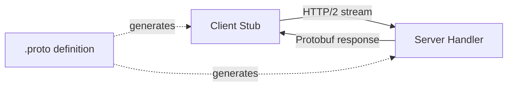

# Cloud-Native Internal Communication Protocols

**Summary:** Cloud-native infrastructure uses HTTP/2+gRPC for control planes (K8s API, service mesh), HTTP/1.1+gRPC for data planes (service-to-service), with underlying TCP/IP + overlay protocols (VXLAN/Geneve/WireGuard), plus specialized protocols for storage (iSCSI/NVMe-oF), observability (OTLP), and service discovery (DNS/mDNS).

---

## Layer 3/4: Network & Transport Protocols

### 1. **TCP (Transmission Control Protocol)**
**Usage:** 90%+ of cloud-native communication
- HTTP/1.1, HTTP/2, gRPC all run over TCP
- Database connections (PostgreSQL, MySQL)
- Message queues (Kafka, RabbitMQ)

**Characteristics:**
- Connection-oriented, reliable delivery
- Congestion control (BBR, CUBIC algorithms)
- Flow control, ordered delivery

**Security Considerations:**
- TCP SYN floods (mitigate with SYN cookies)
- Connection exhaustion attacks
- Slowloris (slow header/body attacks)

**Performance Tuning:**
```bash
# View current TCP settings
sysctl net.ipv4.tcp_congestion_control
sysctl net.core.somaxconn

# Optimize for cloud-native (high throughput, low latency)
sysctl -w net.ipv4.tcp_congestion_control=bbr
sysctl -w net.core.somaxconn=4096
sysctl -w net.ipv4.tcp_max_syn_backlog=8192
sysctl -w net.ipv4.tcp_fin_timeout=30
```

---

### 2. **UDP (User Datagram Protocol)**
**Usage:** Specific performance-critical use cases
- DNS queries (port 53)
- Service mesh health checks
- Observability metrics (StatsD)
- QUIC/HTTP/3 (newer adoption)
- VoIP, real-time streaming

**Characteristics:**
- Connectionless, no delivery guarantees
- Lower latency, lower overhead
- Application handles reliability

**Security Considerations:**
- UDP amplification attacks (DNS, NTP, memcached)
- No built-in congestion control
- Easier to spoof source IP

**Example: DNS Query Flow**
```
Pod → kube-dns/CoreDNS (UDP:53) → Response
      ↓ (if cache miss)
    Upstream DNS (UDP:53)
```

---

### 3. **IP (Internet Protocol)**
**IPv4:** Dominant in most clusters
- 32-bit addresses, NAT required for pod CIDR
- Cluster CIDR (e.g., 10.244.0.0/16)
- Service CIDR (e.g., 10.96.0.0/12)

**IPv6:** Growing adoption
- 128-bit addresses, no NAT needed
- Dual-stack clusters increasingly common
- Better for large-scale deployments

**Overlay Protocols:**

**VXLAN (Virtual Extensible LAN):**
- UDP port 4789
- 24-bit VNID (16M network segments)
- Encapsulates L2 frames in UDP
- Used by Flannel, Calico, Cilium

```
┌─────────────────────────────────────────┐
│ Inner: Pod IP packet                    │
├─────────────────────────────────────────┤
│ VXLAN Header (VNID: 100)               │
├─────────────────────────────────────────┤
│ Outer: UDP (port 4789)                 │
├─────────────────────────────────────────┤
│ Outer: Node IP packet                  │
└─────────────────────────────────────────┘
```

**Geneve (Generic Network Virtualization Encapsulation):**
- More flexible than VXLAN
- Variable-length options
- Better metadata support
- Used by OVN (Open Virtual Network)

**Performance Impact:**
| Protocol | Overhead | MTU Impact | Throughput Loss |
|----------|----------|------------|-----------------|
| Native | 0 bytes | 1500 | 0% |
| VXLAN | 50 bytes | 1450 | 3-5% |
| Geneve | 50+ bytes | 1450 | 3-5% |
| IPsec | 50-60 bytes | 1440 | 5-10% |
| WireGuard | 32 bytes | 1468 | 1-3% |

---

### 4. **ICMP (Internet Control Message Protocol)**
**Usage:** Network diagnostics, path discovery
- Ping (echo request/reply)
- Traceroute
- Path MTU discovery
- Network unreachable messages

**Security:**
- Often blocked by NetworkPolicies (should allow selectively)
- Used for reconnaissance (network mapping)
- Enable for health checks, disable broad ICMP

```yaml
# Allow ICMP for debugging (concept only)
apiVersion: networking.k8s.io/v1
kind: NetworkPolicy
metadata:
  name: allow-icmp
spec:
  podSelector: {}
  policyTypes: [Ingress]
  ingress:
  - from:
    - podSelector: {}
    ports:
    - protocol: ICMP  # K8s doesn't support this - CNI-specific
```

---

## Layer 7: Application Protocols

### 1. **HTTP/1.1**
**Usage:** Legacy apps, simple REST APIs, ingress traffic

**Characteristics:**
- Text-based protocol
- One request per connection (without keep-alive)
- Head-of-line blocking
- Simple debugging (curl, tcpdump)

**Typical Flow:**
```
GET /api/users HTTP/1.1
Host: user-service.app.svc.cluster.local
User-Agent: app-frontend/1.0
Connection: keep-alive

HTTP/1.1 200 OK
Content-Type: application/json
Content-Length: 128
```

**Problems at Scale:**
- Many connections → resource exhaustion
- No multiplexing → latency
- Plaintext headers → overhead

---

### 2. **HTTP/2**
**Usage:** Modern services, Kubernetes API, service mesh control planes

**Key Features:**
- **Multiplexing:** Multiple requests over single TCP connection
- **Header compression:** HPACK algorithm (50-80% reduction)
- **Server push:** Proactive response sending
- **Binary protocol:** More efficient parsing
- **Stream prioritization:** Critical requests first

**Kubernetes API Server:**
```bash
# K8s API uses HTTP/2 with long-lived watch connections
kubectl get pods -w  # Uses HTTP/2 streaming

# Verify HTTP/2 support
curl -I --http2 https://kubernetes.default.svc
```

**Performance Comparison:**
| Metric | HTTP/1.1 | HTTP/2 |
|--------|----------|--------|
| Connections (100 req) | 6-100 | 1 |
| Latency (p99) | ~500ms | ~100ms |
| Bandwidth | 100% | 60-70% |

**HTTP/2 Security:**
- TLS required for most implementations (h2 over TLS)
- HPACK compression attacks (CRIME, BREACH mitigated)
- Stream multiplexing → one slow stream affects all

---

### 3. **gRPC (Google Remote Procedure Call)**
**Usage:** Microservice communication, control planes, high-performance APIs

**Technology Stack:**
- Built on HTTP/2
- Protocol Buffers (protobuf) serialization
- Strongly typed contracts (.proto files)
- Bidirectional streaming

**Architecture:**


**gRPC Communication Patterns:**

**1. Unary RPC (request-response):**
```protobuf
service UserService {
  rpc GetUser(UserRequest) returns (UserResponse);
}
```

**2. Server streaming:**
```protobuf
rpc ListUsers(Empty) returns (stream User);
```

**3. Client streaming:**
```protobuf
rpc CreateUsers(stream User) returns (Summary);
```

**4. Bidirectional streaming:**
```protobuf
rpc Chat(stream Message) returns (stream Message);
```

**Advantages:**
- 5-10x smaller payloads vs JSON
- 2-5x faster serialization
- Type safety, code generation
- Built-in load balancing, retries, timeouts

**Disadvantages:**
- Not human-readable (debugging harder)
- Limited browser support
- Steeper learning curve

**gRPC in Service Mesh:**
```bash
# Istio uses gRPC for control plane communication
# Envoy ↔ Pilot (xDS protocol): gRPC streaming
istiod.istio-system:15010  # xDS over gRPC

# Check gRPC health
grpc_health_probe -addr=service:50051 -service=UserService
```

**Load Balancing Consideration:**
- HTTP/2 multiplexing → L4 LB sees 1 connection
- Need L7 load balancing (Envoy, Linkerd)
- K8s Service doesn't balance gRPC well
- Use headless service + client-side LB

---

### 4. **WebSocket**
**Usage:** Real-time bidirectional communication, streaming logs/events

**Protocol Upgrade:**
```
GET /stream HTTP/1.1
Host: api-server
Upgrade: websocket
Connection: Upgrade
Sec-WebSocket-Key: dGhlIHNhbXBsZSBub25jZQ==

HTTP/1.1 101 Switching Protocols
Upgrade: websocket
Connection: Upgrade
```

**Use Cases:**
- `kubectl exec` (pod terminal access)
- `kubectl logs -f` (streaming logs)
- `kubectl port-forward`
- Real-time dashboards, chat apps

**Security:**
- Same-origin policy doesn't apply
- CSRF attacks possible
- Validate Sec-WebSocket-Key
- Implement authentication/authorization
- Rate limit connections

---

## Control Plane Protocols

### 1. **Kubernetes API (RESTful + Watch)**
**Port:** 6443 (TLS)
**Protocol:** HTTP/2 + JSON/Protobuf

**Operations:**
- CRUD: GET, POST, PUT, PATCH, DELETE
- Watch: Long-lived HTTP/2 stream for resource changes
- List: Paginated resource listing

**Watch Mechanism:**
```bash
# Kubectl internally uses watch
kubectl get pods -w

# API call equivalent:
curl -k https://kube-apiserver:6443/api/v1/namespaces/default/pods?watch=true \
  -H "Authorization: Bearer $TOKEN"

# Returns chunked HTTP/2 stream:
{"type":"ADDED","object":{"metadata":{"name":"pod-1"}...}}
{"type":"MODIFIED","object":{"metadata":{"name":"pod-1"}...}}
{"type":"DELETED","object":{"metadata":{"name":"pod-1"}...}}
```

**Performance Optimization:**
- Use resourceVersion for efficient watches
- Limit/Continue for paginated lists
- Field selectors to reduce payload
- Protobuf encoding (30-40% smaller)

---

### 2. **etcd (Raft Consensus)**
**Ports:** 2379 (client), 2380 (peer)
**Protocol:** gRPC

**Communication:**
- Client ↔ etcd: gRPC (read/write operations)
- etcd ↔ etcd: Raft protocol over gRPC (consensus)

**Key Operations:**
```bash
# etcdctl uses gRPC
etcdctl get /registry/pods/default/my-pod

# Watch for changes (gRPC streaming)
etcdctl watch /registry/pods --prefix
```

**Raft Consensus Flow:**
```
Leader Election → Log Replication → Commitment
       ↓                ↓                ↓
  (gRPC votes)    (gRPC append)    (gRPC ack)
```

**Security:**
- Client TLS (peer authentication)
- Peer TLS (inter-etcd encryption)
- RBAC for API access
- Encryption at rest

---

### 3. **xDS (Discovery Service Protocol)**
**Usage:** Service mesh control plane (Istio, Envoy)
**Protocol:** gRPC streaming (bidirectional)

**xDS APIs:**
- **LDS (Listener):** Port bindings, filter chains
- **RDS (Route):** HTTP routing rules
- **CDS (Cluster):** Upstream services
- **EDS (Endpoint):** Service instance IPs
- **SDS (Secret):** Certificates, keys

**Communication Flow:**
```
Envoy Proxy → Istiod (Pilot)
   ↓ gRPC stream
Request: LDS (what ports to listen on?)
Response: Listeners [8080, 8443]
   ↓
Request: RDS (routing for listener 8080?)
Response: Routes [/api → service-a, /web → service-b]
   ↓
Request: CDS (what is service-a?)
Response: Cluster [service-a.ns.svc:8080]
   ↓
Request: EDS (endpoints for service-a?)
Response: Endpoints [10.1.1.5:8080, 10.1.1.6:8080]
```

**Incremental xDS:**
- Delta updates (not full state)
- Reduces bandwidth, faster propagation
- ACK/NACK mechanism for version tracking

---

## Service Discovery Protocols

### 1. **DNS (Domain Name System)**
**Port:** 53 (UDP/TCP)
**Usage:** Service discovery, pod-to-pod communication

**Kubernetes DNS:**
```bash
# Service DNS format
<service>.<namespace>.svc.<cluster-domain>
user-service.default.svc.cluster.local → 10.96.10.20 (ClusterIP)

# Pod DNS format
<pod-ip-dashed>.<namespace>.pod.<cluster-domain>
10-244-0-5.default.pod.cluster.local → 10.244.0.5

# Headless service (StatefulSet)
<statefulset-name>-<ordinal>.<service>.<namespace>.svc.<cluster-domain>
mysql-0.mysql.default.svc.cluster.local → 10.244.1.10
```

**CoreDNS Configuration:**
```
# Corefile concept
.:53 {
    errors
    health
    kubernetes cluster.local in-addr.arpa ip6.arpa {
      pods insecure
      fallthrough in-addr.arpa ip6.arpa
    }
    prometheus :9153
    forward . /etc/resolv.conf
    cache 30
    loop
    reload
    loadbalance
}
```

**DNS Query Flow:**
```
Pod → kubelet DNS config (10.96.0.10)
       ↓
    CoreDNS (in kube-system)
       ↓ (cache miss)
    Upstream DNS (cloud provider or custom)
```

**Security:**
- DNS spoofing/cache poisoning
- DNS tunneling (data exfil)
- DGA (Domain Generation Algorithm) detection
- DNSSEC validation

**Performance Tuning:**
```bash
# ndots setting (affects query behavior)
# Pod /etc/resolv.conf
search default.svc.cluster.local svc.cluster.local cluster.local
nameserver 10.96.0.10
options ndots:5

# ndots:5 → query "api" becomes:
# api.default.svc.cluster.local (failed)
# api.svc.cluster.local (failed)
# api.cluster.local (failed)
# api (upstream DNS)

# Reduce unnecessary queries by using FQDN:
curl http://user-service.default.svc.cluster.local
```

---

### 2. **mDNS (Multicast DNS)**
**Usage:** Local network service discovery, zero-config
**Protocol:** UDP port 5353, multicast 224.0.0.251

**Use Cases:**
- Service discovery without DNS server
- IoT, edge computing scenarios
- Not commonly used in K8s, more in bare-metal/edge

---

## Container Runtime Protocols

### 1. **CRI (Container Runtime Interface)**
**Protocol:** gRPC
**Port:** Unix socket or TCP (e.g., /var/run/containerd/containerd.sock)

**Operations:**
```protobuf
service RuntimeService {
  rpc RunPodSandbox(RunPodSandboxRequest) returns (RunPodSandboxResponse);
  rpc CreateContainer(CreateContainerRequest) returns (CreateContainerResponse);
  rpc StartContainer(StartContainerRequest) returns (StartContainerResponse);
  rpc StopContainer(StopContainerRequest) returns (StopContainerResponse);
}

service ImageService {
  rpc PullImage(PullImageRequest) returns (PullImageResponse);
  rpc ListImages(ListImagesRequest) returns (ListImagesResponse);
}
```

**Kubelet ↔ Containerd:**
```bash
# Kubelet calls CRI over gRPC
kubelet → /var/run/containerd/containerd.sock
         ↓ gRPC
      containerd → runc (OCI runtime)
```

---

### 2. **CNI (Container Network Interface)**
**Protocol:** JSON-RPC over stdin/stdout
**Invoked by:** Container runtime

**CNI Operation:**
```bash
# Runtime calls CNI plugin binary
/opt/cni/bin/bridge <<EOF
{
  "cniVersion": "1.0.0",
  "name": "k8s-pod-network",
  "type": "bridge",
  "bridge": "cni0",
  "ipam": {
    "type": "host-local",
    "subnet": "10.244.0.0/16"
  }
}
EOF

# CNI plugin responds with JSON
{
  "cniVersion": "1.0.0",
  "ips": [{"address": "10.244.0.5/16"}],
  "dns": {"nameservers": ["10.96.0.10"]}
}
```

---

### 3. **CSI (Container Storage Interface)**
**Protocol:** gRPC
**Components:**
- Controller Service (volume provisioning)
- Node Service (volume mounting)

**gRPC Services:**
```protobuf
service Controller {
  rpc CreateVolume(CreateVolumeRequest) returns (CreateVolumeResponse);
  rpc DeleteVolume(DeleteVolumeRequest) returns (DeleteVolumeResponse);
  rpc ControllerPublishVolume(...) returns (...);
}

service Node {
  rpc NodeStageVolume(NodeStageVolumeRequest) returns (NodeStageVolumeResponse);
  rpc NodePublishVolume(NodePublishVolumeRequest) returns (NodePublishVolumeResponse);
}
```

---

## Storage & Data Plane Protocols

### 1. **iSCSI (Internet Small Computer Systems Interface)**
**Usage:** Block storage over IP networks
**Protocol:** SCSI commands over TCP (port 3260)

**Architecture:**
```
Pod → PVC → CSI Driver → iSCSI initiator
                              ↓ TCP:3260
                          iSCSI target (SAN)
```

**Security:**
- CHAP authentication
- IPsec encryption for transit
- LUN masking, zoning

---

### 2. **NFS (Network File System)**
**Port:** 2049 (NFSv4 over TCP)
**Usage:** Shared file storage (ReadWriteMany PVs)

**Protocol Flow:**
```
MOUNT → LOOKUP → READ/WRITE → CLOSE
  ↓        ↓         ↓           ↓
 RPC     RPC       RPC         RPC
```

**Security:**
- No built-in encryption (use NFS over TLS/Kerberos)
- Export rules (IP-based ACLs)
- UID/GID mapping issues

---

### 3. **NVMe-oF (NVMe over Fabrics)**
**Usage:** High-performance block storage
**Protocols:**
- NVMe/TCP (port 4420)
- NVMe/RDMA (over InfiniBand/RoCE)

**Performance:**
- Sub-100μs latency
- Millions of IOPS
- Used in high-performance databases, AI/ML workloads

---

## Observability Protocols

### 1. **Prometheus (Pull Model)**
**Port:** Varies per service (e.g., 9090, 9091)
**Protocol:** HTTP/1.1 (scrape endpoint)

**Scrape Flow:**
```
Prometheus Server → HTTP GET /metrics
                        ↓
                    Service Metrics Endpoint
                        ↓
                    Text-based format
                    
# HELP http_requests_total Total HTTP requests
# TYPE http_requests_total counter
http_requests_total{method="GET",status="200"} 1234
```

---

### 2. **OpenTelemetry (OTLP)**
**Port:** 4317 (gRPC), 4318 (HTTP)
**Protocol:** gRPC or HTTP/JSON

**Signals:**
- Traces (distributed tracing)
- Metrics (time-series data)
- Logs (structured logs)

**Communication:**
```
App with OTEL SDK → OTLP exporter
                         ↓ gRPC
                    OTEL Collector
                         ↓
               Backend (Jaeger, Prometheus)
```

---

### 3. **Logging Protocols**

**Fluentd/Fluent Bit:**
- Forward protocol (TCP, msgpack encoding)
- HTTP input/output plugins

**Loki:**
- HTTP API (push logs via POST)
- LogQL query language

**Syslog:**
- UDP 514 (traditional)
- TCP 514 or 6514 (TLS)

---

## Messaging & Streaming Protocols

### 1. **Kafka Protocol**
**Port:** 9092 (plaintext), 9093 (TLS)
**Protocol:** Custom binary over TCP

**Operations:**
- Produce (send messages)
- Fetch (consume messages)
- Metadata (broker discovery)
- Offset commit

**High-level Flow:**
```
Producer → Kafka Broker (leader partition)
              ↓ replication
           Follower brokers
              ↓ fetch
           Consumer
```

---

### 2. **AMQP (Advanced Message Queuing Protocol)**
**Port:** 5672 (RabbitMQ)
**Protocol:** Binary, connection-oriented

**Concepts:**
- Exchanges, queues, bindings
- Reliable delivery, acknowledgments
- Used by RabbitMQ, Azure Service Bus

---

### 3. **NATS**
**Port:** 4222
**Protocol:** Text-based over TCP

**Features:**
- Pub/sub, request/reply
- Low latency (~100μs)
- Lightweight, simple protocol

---

## Protocol Selection Matrix

| Use Case | Protocol | Reason |
|----------|----------|--------|
| Service-to-service API | gRPC | Performance, type safety, streaming |
| Public API / browser | HTTP/1.1 or HTTP/2 | Compatibility |
| Real-time updates | WebSocket | Bidirectional, low latency |
| Control plane | gRPC | Efficient, streaming, type-safe |
| Service discovery | DNS | Universal, simple |
| Metrics collection | Prometheus scrape | Pull model, reliable |
| Distributed tracing | OTLP/gRPC | Efficient, standard |
| Message queue | Kafka protocol | Throughput, durability |
| Event streaming | NATS | Low latency, simple |
| Block storage | iSCSI or NVMe/TCP | Performance, compatibility |
| Shared storage | NFS | Multi-attach (RWX) |

---

## Security Protocol Comparison

| Protocol | Encryption | Authentication | Overhead |
|----------|------------|----------------|----------|
| HTTP/1.1 + TLS | ✓ | Client certs / JWT | Medium |
| HTTP/2 + TLS | ✓ | Client certs / JWT | Medium |
| gRPC (TLS) | ✓ | mTLS / JWT | Low |
| mTLS (mesh) | ✓ | X.509 SVID | Low-Med |
| IPsec | ✓ | Shared key / certs | Medium-High |
| WireGuard | ✓ | Public key | Low |

---

## Performance Testing

### gRPC vs HTTP/1.1 Benchmark
```bash
# Install ghz (gRPC benchmarking tool)
go install github.com/bojand/ghz/cmd/ghz@latest

# gRPC benchmark
ghz --insecure \
  --proto ./user.proto \
  --call user.UserService.GetUser \
  -d '{"id": "123"}' \
  -c 100 \
  -n 10000 \
  localhost:50051

# HTTP/1.1 benchmark
hey -n 10000 -c 100 http://localhost:8080/users/123

# Compare: latency, throughput, resource usage
```

### Protocol Overhead Measurement
```bash
# Capture packets
tcpdump -i eth0 -w capture.pcap port 50051

# Analyze with tshark
tshark -r capture.pcap -T fields -e frame.len -e ip.proto -e tcp.payload

# Calculate overhead
# Total bytes / Actual payload bytes = overhead ratio
```

---

## Troubleshooting Protocol Issues

### DNS Resolution Problems
```bash
# Test DNS from pod
kubectl run -it --rm debug --image=busybox --restart=Never -- nslookup user-service

# Check CoreDNS logs
kubectl logs -n kube-system -l k8s-app=kube-dns

# Verify DNS config in pod
kubectl exec pod-name -- cat /etc/resolv.conf

# Common issues:
# - ndots too high (excessive queries)
# - CoreDNS resource limits
# - Upstream DNS unreachable
```

### gRPC Connection Issues
```bash
# Test gRPC health
grpc_health_probe -addr=service:50051

# Check if service uses HTTP/2
curl -I --http2-prior-knowledge http://service:50051

# Enable gRPC debug logging
GRPC_VERBOSITY=debug GRPC_TRACE=all ./app

# Common issues:
# - L4 load balancing (use headless service)
# - Missing h2c (HTTP/2 cleartext) support
# - Certificate issues in TLS
```

### HTTP/2 Debugging
```bash
# Check HTTP/2 support
curl -I --http2 https://api-server

# Wireshark HTTP/2 analysis
# Filter: http2
# Look for: SETTINGS, HEADERS, DATA frames

# Common issues:
# - Server doesn't advertise h2 in ALPN
# - Client falls back to HTTP/1.1
# - GOAWAY frames (connection errors)
```

---

## Next 3 Steps

1. **Audit current protocol usage**: Run `kubectl get svc -A -o wide` and `ss -tulpn` on nodes to inventory active protocols. Check if services use gRPC (port conventions like 50051, 9090), HTTP/2 headers, or legacy HTTP/1.1.

2. **Enable protocol observability**: Deploy Hubble (`cilium hubble enable`) and configure L7 visibility for HTTP, gRPC, Kafka. Run `hubble observe --protocol http --port 8080` to see application-layer traffic patterns and identify optimization opportunities.

3. **Benchmark critical paths**: Pick your highest-traffic service pair, measure current latency/throughput with `hey` or `ghz`, then test optimizations (HTTP/2→gRPC migration, connection pooling tuning, MTU optimization for overlays). Document baseline vs optimized performance.

**Follow-up questions:**
- Do you use service mesh currently (affects HTTP/2, gRPC adoption)?
- Any specific protocol migrations planned (REST→gRPC, HTTP/1.1→HTTP/2)?
- Performance bottlenecks in specific services you want to optimize?
- Need deep-dive on a particular protocol (xDS, Kafka, NVMe-oF)?