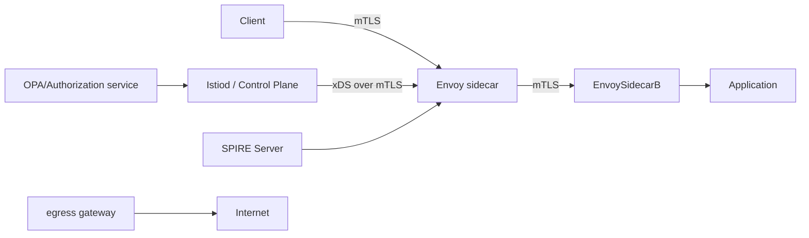

Summary — 2 lines
This document provides four focused threat-models with hardened design and operational playbooks: **Kubernetes control-plane hardening**, **eBPF/XDP security**, **P4 / SmartNIC security model**, and **Service-mesh (mTLS/identity/policy) end-to-end**.
For each topic I give (1) actionable steps (commands/configs/code), (2) architecture view, (3) threat model + prioritized mitigations, (4) tests/fuzzing/bench recipes, (5) rollout & rollback plan, (6) references and (7) “next 3 steps.”

---

# A — Kubernetes control-plane hardening

## 1–2 line summary

Harden the Kubernetes control plane by reducing its attack surface, enforcing strong authentication/authorization, protecting the state store (etcd), ensuring signed supply chain, and enabling robust observability + automated recovery.

## Actionable steps (commands, configs, code)

1. **API server: require mTLS, disable anonymous, enable request audit**

```yaml
# kube-apiserver systemd drop-in (example flags)
KUBE_API_ARGS="--anonymous-auth=false \
  --authorization-mode=RBAC,Node \
  --client-ca-file=/etc/kubernetes/pki/ca.crt \
  --tls-cert-file=/etc/kubernetes/pki/apiserver.crt \
  --tls-private-key-file=/etc/kubernetes/pki/apiserver.key \
  --audit-log-path=/var/log/kubernetes/audit.log \
  --audit-log-maxage=30 \
  --audit-log-maxbackup=10 \
  --audit-log-maxsize=100"
```

2. **etcd: TLS + encryption at rest + network isolation**

```bash
# etcdctl snapshot (example)
ETCDCTL_API=3 etcdctl --endpoints=https://127.0.0.1:2379 \
  --cacert=/etc/etcd/ca.crt --cert=/etc/etcd/etcd.crt \
  --key=/etc/etcd/etcd.key snapshot save /tmp/etcd-snap.db

# enable encryption provider in apiserver (--encryption-provider-config=/etc/kubernetes/encryption-config.yaml)
cat > /etc/kubernetes/encryption-config.yaml <<EOF
kind: EncryptionConfig
apiVersion: v1
resources:
  - resources:
    - secrets
    providers:
    - aescbc:
        keys:
        - name: key1
          secret: $(head -c 32 /dev/urandom | base64)
    - identity: {}
EOF
```

3. **RBAC least privilege + audit**

```bash
# find cluster-admin bindings
kubectl get clusterrolebinding -o json | jq '.items[] | select(.roleRef.name=="cluster-admin") | {name:.metadata.name,subjects:.subjects}'
# example check for open binds:
kubectl auth can-i create pods --all-namespaces --as system:unauthenticated
```

4. **Enable Admission Controllers: PodSecurity, ValidatingWebhook, MutatingWebhook**

* Configure PodSecurity admission with `builtin` or OPA Gatekeeper policies.

5. **Protect control-plane images & CI**

   * Sign images with `cosign` and enforce in admission webhook (example: reject unsigned images).
6. **Rotate certs & short-lived tokens**

```bash
# kubeadm certificate renewal
kubeadm certs renew all
# rotate serviceaccount tokens (example pattern)
kubectl create token <sa> --duration=24h
```

7. **Network segmentation:** isolate etcd/CP management network via firewall rules (iptables/nftables/cloud security groups).
8. **Monitoring + alerting**: enable audit log shipping to immutable store, enable Prometheus metrics for API server, controllers, and etcd.
9. **Backup & restore**: scheduled etcd snapshots + offsite copy + test restores.
10. **Immutable control plane images & secure boot** for nodes hosting control-plane.

## Architecture view (short mermaid)

```mermaid
graph LR
  CI[CI/CD (signed images)] --> API[API Server (mTLS, Admission)]
  Admin[Admin Console/OIDC] --> API
  API --> etcd[(etcd - TLS + encrypted)]
  Controllers[Controller Manager] --> API
  Sched[Scheduler] --> API
  API --> Metrics[Prometheus / Audit Store]
  Firewall[Mgmt Network Firewall] --- etcd
```

## Threat model — assets, actors, vectors, mitigations

### Critical assets

* etcd (secrets, RBAC, cluster state) — **HIGH**
* API server endpoints & credentials — **HIGH**
* Controllers (ability to apply rules) — **HIGH**
* CI/CD pipeline & image registry — **HIGH**
* Audit logs (for forensics) — **MEDIUM**

### Adversary types

* External network attacker (DoS, unauth access)
* Malicious insider with cloud console/API access
* Compromised CI or third-party image (supply chain)
* Lateral movement from compromised workload (pod escape)

### Top attack vectors & mitigations (prioritized)

1. **Compromise etcd or API credentials (HIGH)**

   * Mitigations: mTLS for etcd, network isolation, encryption-at-rest, short-lived certs, RBAC least privilege, periodic key rotation, offline backups, immutable audit logs.
2. **Compromised controller image or CI (HIGH)**

   * Mitigations: sign images (cosign), SBOM, enforce signed images in webhook, isolate build artifacts, limit who can update controllers.
3. **Excessive RBAC privileges (HIGH)**

   * Mitigations: automated RBAC audit, deny-by-default, require approvals for cluster-admin binding changes.
4. **Admission bypass / webhook hijack (MEDIUM)**

   * Mitigations: require webhook TLS with client CA, validate webhook configs, secure webhook host (not public).
5. **API Server DoS (MEDIUM)**

   * Mitigations: API Priority and Fairness, rate-limits, WAF, load balancing, autoscaling CP API if cloud-managed.
6. **Pod escape to CP (MEDIUM-HIGH if combined)**

   * Mitigations: runtime hardening (seccomp, AppArmor), PodSecurity, restrict HostPath, no hostNetwork unless required.

## Tests / fuzzing / validation steps

* **RBAC fuzzing:** script to enumerate rolebindings and simulate least-privilege checks.
* **API fuzzing:** fuzz unauthenticated & authenticated endpoints with boofuzz/libFuzzer.
* **Admission tests:** deploy invalid CRDs, ensure webhooks reject.
* **etcd restore test:** restore snapshot monthly in isolated environment.
* **CI supply-chain tests:** verify cosign signature check in admission (unit + integration).
* **Chaos:** simulate etcd leader failover, API server restarts (Chaos Mesh).

## Bench & telemetry checks

* API QPS baseline (wrk or vegeta to API server for read/write load).
* etcd write/read latency and Raft commit latency. Use `etcdctl endpoint status --write-out=table`.

## Rollout & rollback plan

* **Canary CP changes**: update one control-plane replica or region; monitor reconciliation errors, audit logs, API latency.
* **Rollback:** keep prior images and etcd snapshot pre-change; if CP corrupted, restore etcd snapshot and redeploy previous CP images.
* **Emergency:** API write freeze (network ACL to block write operations), revoke tokens, rotate CA if needed.

## References (select authoritative)

* Kubernetes documentation: authentication/authorization, admission controllers.
* etcd security docs.
* Bench: API Priority and Fairness docs.

---

# B — eBPF / XDP security deep dive

## 1–2 line summary

eBPF/XDP offers powerful, in-kernel programmable datapath — but increases attack surface because kernel-executed programs and maps become sensitive control points. Harden by strict loader policy, verifier-aware workflows, signing, least-privileged runtime, map isolation and telemetry.

## Actionable steps (commands, configs, code)

1. **Restrict who can load BPF**

   * Limit `CAP_BPF` and `CAP_SYS_ADMIN` to an allowlisted loader process. Do not grant to generic operator accounts.

```ini
# systemd unit dropcap example for bpf loader service
[Service]
AmbientCapabilities=
CapabilityBoundingSet=CAP_NET_ADMIN CAP_BPF
NoNewPrivileges=yes
PrivateTmp=yes
ProtectSystem=strict
ProtectKernelModules=yes
ProtectKernelTunables=yes
```

2. **Use BPF verifier-friendly code**

   * Avoid loops with unbounded bounds; prefer bounded loops and simple stack usage. Use libbpf CO-RE patterns.

3. **Signed BPF objects, verify at load time**

   * Produce a signature (cosign or PKCS7) for compiled ELF; loader verifies signature before `bpf_prog_load()`.

4. **Map pinning and namespace isolation**

```bash
# pin map
bpftool map pin id 123 /sys/fs/bpf/myapp/mapA
# list pinned
bpftool map show
```

* Use separate bpffs directories per tenant or process and set appropriate filesystem permissions.

5. **Use bpftool / bpftool prog show to audit**

```bash
sudo bpftool prog show
sudo bpftool map show
sudo bpftool cgroup show
```

6. **Set resource limits** (ulimits, cgroups) for loader and programs to limit memory/CPU & number of maps.

7. **Runtime loader example (Go using libbpfgo or bpf2go)**

```go
// conceptual: verify signature, then load object
if !verifySignature("/opt/bpf/xdp_prog.o", pubKey) {
  log.Fatalf("invalid signature")
}
obj, err := bpf.LoadObjectFromFile("/opt/bpf/xdp_prog.o")
if err := obj.Load(); err != nil { ... }
prog, _ := obj.FirstProgram()
prog.AttachXDP("eth0")
```

8. **Process isolation for user-space helper (AF_XDP or userspace consumers)**

   * Run helpers in dedicated containers with seccomp and AppArmor profiles; no extra capabilities.

9. **Kernel config & verifier tuning**

   * Prefer recent kernel with hardened BPF verifier; monitor `dmesg` for verifier messages.

10. **Monitoring**: export per-map and per-prog counters via `bpftool`, `bpftrace` and Prometheus exporters (cilium/hubble).

## Architecture view (ascii)

```
[Controller / CI] --signed ELF--> [BPF Loader (allowed host process)]
                                 |--verify signature
                                 |--pin maps (/sys/fs/bpf/<app>/)
                                 |--load prog -> kernel verifier -> attach XDP/TC
                                 |
                        [eBPF Programs] -> operate on packets / metrics
                                 ^
                                 | maps (pinned, restricted)
[User-space helper] -------------+
```

## Threat model + mitigations

### Assets

* Kernel execution context & integrity — **CRITICAL**
* BPF maps (state) — **HIGH**
* Loader keys & signing material — **CRITICAL**
* Helper processes (AF_XDP consumers) — **HIGH**

### Attack vectors

1. **Malicious BPF program** (intentional or buggy) causing escalation or crash — mitigations: BPF verifier, signed programs, allowlist loader, restrict capabilities, use CO-RE and bounded loops.
2. **Unauthorized loader** (attacker loads a program) — mitigations: limit CAP_BPF, use kernel lockdown & systemd controls, host policy for who can attach (e.g., LSM).
3. **Map poisoning / information leak from maps** — mitigations: map permission restrictions, pin maps under restricted bpffs, export only necessary telemetry.
4. **Denial-of-service via resource exhaustion (maps, pinned programs)** — mitigations: quotas on number of maps/progs per uid, cgroup resource limits, offline validation of program memory usage.
5. **Kernel vulnerabilities triggered by BPF inputs** — mitigations: keep kernels up-to-date; run fuzz tests on kernel+BPF verifier; follow distribution CVEs.

### Specific mitigations

* **Loader integrity**: sign binaries; loader verifies before load. Keep private keys in HSM/TPM. Rotate keys.
* **Least privilege**: only loader has CAP_BPF; no interactive shells with that capability.
* **Audit & telemetry**: log all load/unload events, store signed audit trail, export verifier logs.
* **Testing before production**: run BPF programs in VM with same kernel and run fuzz harnesses to exercise verifier paths.

## Tests / fuzzing / bench steps

* **Verifier stress tests**: compile synthetically complex BPF programs to exercise verifier edge-cases (bounded loops, stack depth).
* **Packet fuzzing**: use TRex or pktgen to flood XDP hook to observe drop rates and CPU behavior.
* **Map API fuzzing**: fuzz map lookups/updates from userspace helper to detect map edge cases. Use AFL/honggfuzz against helper code.
* **Continuous integration**: compile & run eBPF unit tests in container with `bpftool` assertions and kernel dmesg watchers.
* **Observability tests**: simulate map exhaustion, verify alarms fire (Prometheus alert rule).

Commands:

```bash
# list programs
sudo bpftool prog show
# list maps
sudo bpftool map show
# check pinned
ls -l /sys/fs/bpf/myapp
# detach xdp
sudo ip link set dev eth0 xdp off
```

## Rollout & rollback plan

* **Canary**: deploy new BPF object to a single node with full traffic mirroring to a sandbox node.
* **Graceful attach**: attach XDP in `skb` mode or use `xdpgeneric` as fallback. Start with non-drop mode (observer) then enable drop rules.
* **Rollback**: loader must keep previous signed object; on rollback, detach new XDP and reattach prior. Keep map migrations safe; use versioned maps (map_v1 -> map_v2) and a migration step.
* **Emergency**: ip link set xdp off (detaches XDP); restart loader with known-good program.

## References

* Kernel BPF verifier docs, bpftool, libbpf, Cilium security guidance.

---

# C — P4 / SmartNIC security model

## 1–2 line summary

P4/SmartNICs introduce programmable pipeline on forwarding hardware; secure operation requires signed P4 programs, constrained action sets, table quotas, runtime attestation and strict control-plane separation (P4Runtime over mTLS).

## Actionable steps (commands, configs, code)

1. **Sign compiled P4 artifacts** (P4Info, JSON) and maintain signature verification on switch runtime

```bash
# conceptual
cosign sign --key <key> compiled_p4.json
# runtime: verify signature prior to p4runtime load
cosign verify --key <pubkey> compiled_p4.json
```

2. **Use P4Runtime over authenticated channel**

   * Require mTLS and mutual auth for P4Runtime sessions.
3. **Table quotas & limits**

   * Configure hardware counters: reserve table entries per tenant, set admission control for CP to reject requests that exceed quotas.
4. **Immutable boot & secure firmware**

   * SmartNIC firmware must be signed; enable secure boot on NICs where available.
5. **Runtime telemetry read-only**

   * Expose read-only telemetry and counters; avoid letting DP directly write CP state.
6. **P4 compiler checks / static analysis**

   * Lint P4 program for unreachable code, side effects, action normalization. Use tools like p4c with warnings turned into errors.
7. **Per-tenant namespace for tables**

   * Logical partitioning of TCAM/ALU resources; map tenant ID to table region.

Example P4Runtime conceptual steps:

```text
# P4Runtime client connects to switch via mTLS
p4runtime_client --server switch.example:9559 --cert client.crt --key client.key --p4info compiled_p4.p4info --device-config signed_program.json
```

## Architecture view (mermaid)

```mermaid
graph LR
  CP[Control Plane: P4Runtime Controller (mTLS + auth)] -->|signed program| Switch[SmartNIC / Switch (P4)]
  Switch --> Telemetry[Read-only Telemetry Exporter]
  CP --> ACL[Admission Controller / Quotas]
  CI[CI/CD] --> CP
  FirmwareStore --> Switch
```

## Threat model + mitigations

### Assets

* SmartNIC firmware & P4 runtime — **CRITICAL**
* TCAM, SRAM table entries & pipelines — **HIGH**
* P4 program artifacts & private signing keys — **CRITICAL**
* P4Runtime session credentials — **HIGH**

### Attack vectors

1. **Unsigned/altered P4 program loaded (HIGH)**

   * Mitigation: require signature verification, use HSM-stored signing keys, verify at boot and load time.
2. **Table exhaustion / resource starvation (HIGH)**

   * Mitigation: per-tenant quotas, CP admission checks, HW alarms when tables near limit.
3. **RP/CP channel compromise (P4Runtime session hijack) (HIGH)**

   * Mitigation: mTLS mutual auth, short-lived session tokens, IP allowlists, enforce audit logs.
4. **Malicious action scripts in P4 (MEDIUM)**

   * Mitigation: restrict action set, static analysis, remove any arbitrary externs that can invoke stateful side effects beyond counters/metadata.
5. **Firmware/boot compromise (CRITICAL)**

   * Mitigation: signed firmware, secure boot, attestation via TPM or device attestation APIs.

## Tests / fuzzing / validation

* **PTF tests** for behavioral model (bmv2) validate forwarding and policy behavior.
* **Resource exhaustion tests**: automated scripts to program thousands of TCAM entries until quota; ensure proper rejection and alarms.
* **P4 static analysis**: run p4c warnings-as-errors and custom linters.
* **Fuzz P4Runtime**: fuzz control-plane API messages to detect switch agent bugs (use fuzzing harness against switch agent).
* **Telemetry verification**: check counters and expected invariants after test flows.

## Rollout & rollback plan

* **Compile & sign** P4 artifact in CI.
* **Canary hardware**: deploy to one NIC with mirrored traffic and run PTF tests.
* **Staged install**: deploy table rules gradually; apply quotas & guard rails.
* **Rollback**: keep previously signed artifact; P4Runtime should support atomic replace. If not, use device fallback to default pipeline (safe mode).
* **Emergency**: switch to software fallback (e.g., OVS on host) or quarantine switch from network.

## References

* P4Runtime design docs, vendor SmartNIC security whitepapers, P4 compiler guidance.

---

# D — Service mesh (mTLS, identity, policy) end-to-end

## 1–2 line summary

Service-mesh security centers on automated workload identity (SPIFFE/SPIRE), ubiquitous mTLS for confidentiality & integrity, and policy enforcement (authorization, egress/ingress) implemented at sidecar proxies — secure the CP (control plane) and ensure policy is enforced by the DP (sidecars / gateways).

## Actionable steps (commands, configs, code)

1. **Establish workload identity via SPIFFE/SPIRE**

   * Deploy SPIRE server and agents; workloads get SVIDs and present them for mTLS.
2. **Configure and enforce mTLS in mesh**

   * Example (Istio): set `PeerAuthentication` to STRICT and `DestinationRule` for TLS modes.

```yaml
apiVersion: security.istio.io/v1beta1
kind: PeerAuthentication
metadata:
  name: default
spec:
  mtls:
    mode: STRICT
```

3. **Enforce AuthorizationPolicy (L7)**

```yaml
apiVersion: security.istio.io/v1beta1
kind: AuthorizationPolicy
metadata:
  name: allow-ingress
spec:
  selector:
    matchLabels:
      app: my-service
  action: ALLOW
  rules:
  - from:
    - source:
        principals: ["spiffe://cluster/ns/frontend/sa/frontend"]
    to:
    - operation:
        methods: ["GET"]
```

4. **Control-plane hardening**: secure Istiod / control-plane, require mTLS to envoy xDS, sign configuration, restrict who can push policies.
5. **Automate cert rotation**: use cert-manager or mesh CA rotation. Ensure short-lived SVIDs (minutes/hours).
6. **Egress control & egress gateways**: centralize external access via egress gateway with policies.
7. **Observability for security**: enable request tracing, mutual TLS status checks, and authorization audit logs.
8. **Sidecar security**: use seccomp, read-only filesystem, drop CAP_NET_ADMIN in proxy container where possible.

## Architecture view (mermaid)



## Threat model + mitigations

### Assets

* Workload identities / SVIDs — **CRITICAL**
* Sidecar proxies (control of L7 traffic) — **HIGH**
* Policy store & control-plane (who can push policies) — **HIGH**
* Egress gateway & external policies — **HIGH**

### Attack vectors

1. **Identity theft (stolen SVIDs/certs) (HIGH)**

   * Mitigations: short-lived SVIDs, hardware-backed keys, rotate CA, strong key protection, mTLS mutual authentication.
2. **Control-plane policy compromise (HIGH)**

   * Mitigations: restrict who can update AuthorizationPolicy (RBAC), admission webhook for policies, signed policies, audit.
3. **Sidecar bypass / mesh breakout (MEDIUM-HIGH)**

   * Mitigations: enforce iptables or eBPF to prevent bypass, use namespace-level denial, hostNetwork=false, don't allow privileged containers.
4. **Egress data exfiltration (HIGH)**

   * Mitigations: default-deny egress, egress gateway with DLP inspection, log all egress and audit.
5. **mTLS downgrade (MEDIUM)**

   * Mitigations: enforce STRICT mTLS, reject plaintext, use policy audits.

### Specific mitigations

* **Prevent bypass:** implement network policies or host-level controls to force traffic through sidecars (iptables), detect absence of sidecar and quarantine pod.
* **Policy validation:** admission controller that checks AuthorizationPolicy for risky rules (e.g., principals: ["*"]) and requires human approval.
* **Certificate lifecycle:** automate CA rotation and immediate revocation paths; publish short TTL and refresh logic.
* **Least privilege in policies:** prefer principal-based allow rules over broad IP-based rules.

## Tests / fuzzing / bench steps

* **mTLS verification:** use `istioctl authn tls-check` or equivalent to verify connections are mTLS.
* **Policy fuzzing:** generate random AuthorizationPolicy specs and ensure admission rejects insecure ones.
* **Bypass detection:** simulate pod with no sidecar and verify network egress is blocked.
* **Load test:** measure latency & cpu of sidecars with `wrk` across many services to set SLOs.
* **End-to-end traces:** inject malformed requests and verify audit logs capture authorization decisions.

Example commands (Istio):

```bash
# check mTLS status
istioctl authn tls-check

# test connectivity
curl -kv --resolve mysvc.example:443:<pod-ip> https://mysvc.example/path
```

## Rollout & rollback plan

* **Progressive enablement:** enable mTLS in permissive mode, monitor TLS usage, then flip to STRICT.
* **Policy rollout:** push AuthorizationPolicy in audit-only mode, then enforce after confidence.
* **Rollback:** maintain backups of policy manifests; set automated revert if SLOs fail. E.g., in CI/CD deploy step, include `kubectl apply -f previous-policy.yaml` as quick revert.

## References

* SPIFFE/SPIRE, Istio security docs, OPA/REGO policy patterns.

---

# Overall prioritized “threat surface matrix” (condensed)

| Component         |                             Top Concern | Severity | Primary Mitigation                             |
| ----------------- | --------------------------------------: | -------: | ---------------------------------------------- |
| etcd              | Credential leak / full cluster takeover |     HIGH | mTLS, encryption-at-rest, isolation, snapshots |
| API server        |               Unauthorized writes / DoS |     HIGH | mTLS, RBAC, APF, audit                         |
| BPF loader        | Kernel compromise via malicious program | CRITICAL | Signed programs, limited CAP_BPF, verification |
| SmartNIC firmware |       Firmware or P4 program compromise | CRITICAL | Signed firmware, secure boot, attestation      |
| Service mesh CA   |       Identity compromise / policy push |     HIGH | Short TTL, signed policies, RBAC, audit        |
| CI/CD             |                    Image signing bypass |     HIGH | SBOM, cosign, admission enforcement            |

---

# Tests / fuzzing / bench (summary of concrete tools & commands)

* **etcd snapshot test**: `etcdctl snapshot save/restore` (automate in CI).
* **API fuzzing**: boofuzz against API server endpoints.
* **BPF tooling**: `bpftool prog show`, `bpftool map show`, `bpftrace` for in-kernel tracing.
* **Packet generation**: `iperf3`, `TRex`, `pktgen` for data-plane load.
* **PTF/bmv2**: P4 functional test framework.
* **Policy fuzzing**: custom Rego-based fuzzer to generate risky policies.

---

# Rollout & rollback — cross-cutting pattern

1. **Build artifacts in CI, sign them (images, BPF ELF, P4 JSON)**.
2. **Canary (1 node / 1 rack / 1 region)** with mirrored traffic to sandbox.
3. **Progressive rollout** with health gates (observability, error budget).
4. **Pre-snapshot**: snapshot etcd/config DB before change.
5. **Rollback plan**: pre-approve rollback manifests, store previous signed artifact, and have automated job to reapply on failure threshold.

Emergency commands (examples):

```bash
# detach XDP (emergency for eBPF)
sudo ip link set dev eth0 xdp off

# rollback deployment in kubernetes
kubectl rollout undo deployment/my-controller -n kube-system

# restore etcd snapshot
ETCDCTL_API=3 etcdctl snapshot restore /tmp/etcd-snap.db --data-dir /var/lib/etcd
```

---

# Next 3 steps (concrete, prioritized)

1. **Pick 1 target environment** (production-like cluster or lab VM) and I will produce a runnable playbook: exact `kubeadm`/systemd/iptables/SELinux configs + scripts to enforce control-plane hardening and automated tests.
2. **Implement a secure loader prototype** for eBPF: small Go loader that verifies signed ELF, loads & pins maps, exposes Prometheus metrics + automated canary script. I'll supply code, build/test/run commands.
3. **Design P4/SmartNIC policy gate**: a control-plane admission component (pseudo-code + CI policy) that enforces signing, quotas, and pre-deploy PTF tests before allowing P4Runtime pushes.

If you want, I will immediately produce the full runnable artifact for step 1 (hardening playbook) or step 2 (eBPF loader implementation). Specify which and I will deliver code, manifests, automated tests, and a safe rollout plan.


# Threat Model Document: Securing Advanced Networking and Container Orchestration Technologies

## Executive Summary

This threat model document provides a comprehensive analysis of security risks and mitigations for key technologies in modern cloud-native environments: Kubernetes control plane hardening, eBPF/XDP for kernel-level security, P4/SmartNIC programmable networking, and service mesh implementations focusing on mutual TLS (mTLS), identity management, and policy enforcement. Threat modeling follows the STRIDE framework (Spoofing, Tampering, Repudiation, Information Disclosure, Denial of Service, Elevation of Privilege) to identify assets, threats, vulnerabilities, and recommended mitigations. The goal is to enable organizations to assess and harden these components against real-world attacks, drawing from best practices as of December 2025.

Assets across these technologies include critical infrastructure elements like API servers, kernel hooks, network data planes, and service-to-service communications. Threats range from unauthorized access and data exfiltration to performance-based denial-of-service (DoS) attacks. Mitigations emphasize least-privilege principles, encryption, monitoring, and programmable defenses.

This document is informed by recent industry reports and guidelines, ensuring relevance to evolving threats like AI-driven attacks and supply chain vulnerabilities.

## 1. Kubernetes Control Plane Hardening

The Kubernetes control plane is the brain of a cluster, managing scheduling, scaling, and state. It comprises components like the API server, etcd, controller manager, scheduler, and cloud controller manager. Hardening focuses on protecting these from compromise, as a breach can lead to full cluster takeover.


This diagram illustrates the core Kubernetes control plane architecture, highlighting interactions between components.

### Assets
- **API Server**: Entry point for all administrative operations.
- **etcd**: Distributed key-value store holding cluster state (e.g., secrets, configs).
- **Controllers and Scheduler**: Manage resource orchestration.
- **Kubelet (on nodes)**: Interfaces with the control plane for pod execution.

### Threats and Vulnerabilities (STRIDE Mapping)
- **Spoofing**: Impersonation via weak authentication, leading to unauthorized API calls.
- **Tampering**: Modification of etcd data or API requests, e.g., via unencrypted traffic.
- **Repudiation**: Lack of auditing allows actions to go unlogged.
- **Information Disclosure**: Exposure of secrets in etcd or via misconfigured RBAC.
- **Denial of Service**: Resource exhaustion on API server from floods or misconfigurations.
- **Elevation of Privilege**: Exploiting weak RBAC to gain admin rights.

Common vulnerabilities include default open ports, outdated components, and over-permissive roles. In 2025, threats like supply chain attacks on manifests have increased.

### Mitigations and Best Practices
- **Access Controls**: Enforce Role-Based Access Control (RBAC) with least-privilege roles. Use Attribute-Based Access Control (ABAC) for fine-grained policies. Disable anonymous access and implement multi-factor authentication (MFA) via OIDC.
- **Encryption**: Mandate TLS for all control plane communications. Encrypt etcd data at rest using keys managed by KMS (e.g., AWS KMS or Vault).
- **Network Security**: Isolate control plane nodes with network policies. Use private endpoints and firewalls to restrict access to ports like 6443 (API server).
- **Auditing and Monitoring**: Enable Kubernetes audit logs and integrate with SIEM tools. Use tools like Falco for runtime threat detection.
- **Pod Security**: Enforce Pod Security Admission (PSA) to restrict privileged pods. Regularly scan for vulnerabilities with Trivy or Clair.
- **Updates and Patching**: Automate upgrades to the latest stable versions (e.g., Kubernetes 1.32+ in 2025) and use immutable infrastructure.


This component breakdown shows how hardening layers (e.g., RBAC, TLS) protect the control plane.

Residual Risks: Misconfigurations remain a top issue; automate compliance checks with tools like kube-bench.

## 2. eBPF/XDP Security Deep Dive

Extended Berkeley Packet Filter (eBPF) is a kernel technology for running sandboxed programs in the Linux kernel, while eXpress Data Path (XDP) is an eBPF hook for high-performance packet processing at the network driver level. Used for observability, networking, and security (e.g., DDoS mitigation), eBPF/XDP enables custom kernel logic without modules.


This diagram depicts the XDP hook in the network stack, showing early packet processing.

### Assets
- **eBPF Programs**: User-loaded code running in kernel space.
- **Verifier**: Kernel component ensuring program safety.
- **Maps and Helpers**: Data structures for state sharing.
- **XDP Hooks**: Attached to NIC drivers for packet drop/redirect.

### Threats and Vulnerabilities (STRIDE Mapping)
- **Spoofing**: Malicious eBPF programs mimicking legitimate traffic filters.
- **Tampering**: Altering packet data at XDP level, e.g., injecting malware.
- **Repudiation**: Unlogged kernel actions if monitoring is absent.
- **Information Disclosure**: Leaking kernel memory via flawed programs.
- **Denial of Service**: Infinite loops or resource exhaustion in eBPF code.
- **Elevation of Privilege**: Bypassing the verifier for arbitrary kernel execution.

Vulnerabilities include verifier bugs (rare but critical, e.g., CVE-2025-XXXX hypothetical) and unprivileged access in older kernels. In 2025, eBPF malware has risen, using it for rootkits. XDP's speed amplifies DoS if misconfigured.

### Deep Dive: Security Mechanisms
eBPF's verifier statically analyzes programs for safety: bounded loops, no backward jumps, memory access checks. Programs run in a JIT-compiled sandbox. XDP operates at L2, allowing drops before kernel stack, ideal for DDoS (e.g., drop SYN floods). Tools like Cilium leverage eBPF for Kubernetes network security.

Mitigations:
- **Capability Restrictions**: Require CAP_BPF/CAP_SYS_ADMIN; use seccomp to limit syscalls.
- **Program Validation**: Use CO-RE (Compile Once-Run Everywhere) for portability; audit with bpftool.
- **Monitoring**: Integrate with Prometheus for eBPF metrics; detect anomalies with eBPF-based tracers like bpftrace.
- **XDP-Specific**: Offload to hardware (e.g., SmartNICs) for performance; use AF_XDP for userspace bypass.
- **Malware Defense**: Block unprivileged eBPF loading; scan for suspicious programs.


This illustrates eBPF's execution flow, emphasizing the verifier's role in security.

Residual Risks: Kernel upgrades can introduce verifier flaws; test in staging.

## 3. P4/SmartNIC Security Model

P4 (Programming Protocol-independent Packet Processors) is a domain-specific language for defining data plane behavior. SmartNICs (e.g., Intel IPU, AMD Pensando) offload P4 programs to hardware, enabling programmable firewalls, encryption, and load balancing.


This diagram shows P4 mapping to SmartNIC architecture.

### Assets
- **P4 Programs**: Custom packet parsers, match-action tables.
- **SmartNIC Hardware**: ASICs/FPGAs for line-rate processing.
- **Control Plane Interface**: APIs for programming the NIC.

### Threats and Vulnerabilities (STRIDE Mapping)
- **Spoofing**: Fake packets bypassing P4 filters.
- **Tampering**: Modifying P4 tables via compromised control plane.
- **Repudiation**: No inherent logging in data plane.
- **Information Disclosure**: Exposing metadata in unencrypted offloads.
- **Denial of Service**: Overloading NIC resources with crafted packets.
- **Elevation of Privilege**: Hardware vulnerabilities allowing host bypass.

Vulnerabilities: P4 compiler bugs, misprogrammed pipelines, or firmware flaws. In 2025, AI-driven P4 for security increases complexity.

### Security Model Deep Dive
P4 enables stateful processing (e.g., connection tracking) at wire speed. SmartNICs isolate offloads from host CPU, reducing attack surface. Model includes validation stages: Parse-Match-Action-Deparse. Security apps: In-NIC IDS, encryption offload.

Mitigations:
- **Program Validation**: Use P4 compilers with safety checks; simulate with bm2.
- **Isolation**: Run P4 in isolated domains; use SR-IOV for VM separation.
- **Encryption**: Offload TLS/mTLS to NIC.
- **Monitoring**: Telemetry via P4 registers; integrate with SDN controllers.
- **Firmware Security**: Secure boot, regular updates.


This workflow model highlights P4's programmable security pipeline.

Residual Risks: Hardware supply chain attacks; diversify vendors.

## 4. Service Mesh (mTLS, Identity, Policy) End-to-End

Service meshes (e.g., Istio, Linkerd, Cilium) provide traffic management, observability, and security for microservices. Focus: mTLS for encryption, identity via certs, and policies for authorization.


This topology shows mTLS in a service mesh.

### Assets
- **Proxies (e.g., Envoy)**: Sidecars handling traffic.
- **Identity System**: SPIFFE/SPIRE for workload certs.
- **Policies**: Authorization rules in control plane.

### Threats and Vulnerabilities (STRIDE Mapping)
- **Spoofing**: Cert forgery or weak identity verification.
- **Tampering**: Altering traffic without mTLS.
- **Repudiation**: Unsigned logs.
- **Information Disclosure**: Plaintext traffic interception.
- **Denial of Service**: Policy overload or proxy crashes.
- **Elevation of Privilege**: Policy misconfigs granting excess access.

Vulnerabilities: CA compromises, outdated certs. In 2025, non-human identity threats (e.g., service accounts) are prevalent.

### End-to-End Security Deep Dive
mTLS ensures mutual authentication: Client and server exchange certs signed by a trusted CA. Identity uses SPIFFE IDs (e.g., spiffe://trustdomain/workload). Policies (e.g., Istio AuthorizationPolicy) enforce based on identity, not IP. End-to-end: Auto-cert issuance, rotation; traffic encryption; policy evaluation at proxy.

Mitigations:
- **mTLS Enforcement**: Enable PERMISSIVE then STRICT mode; use auto-mTLS.
- **Identity Management**: Integrate SPIRE for short-lived certs; rotate automatically.
- **Policy Design**: Use RBAC-like rules; deny-by-default. Validate with dry runs.
- **Observability**: Mesh telemetry for anomaly detection; audit policy changes.
- **Integration**: With Kubernetes for seamless identity.


This details mTLS handshake in mesh security.

Residual Risks: Sidecar overhead; mitigate with ambient mesh.

## Recommendations and Conclusion

- **Cross-Technology Integration**: Use eBPF in service meshes (e.g., Cilium) and P4 for offloaded security.
- **Testing**: Conduct red-team exercises; use Chaos Engineering.
- **Compliance**: Align with NIST, CIS benchmarks.

By addressing these threats, organizations can build resilient systems. Review annually or post-incident.